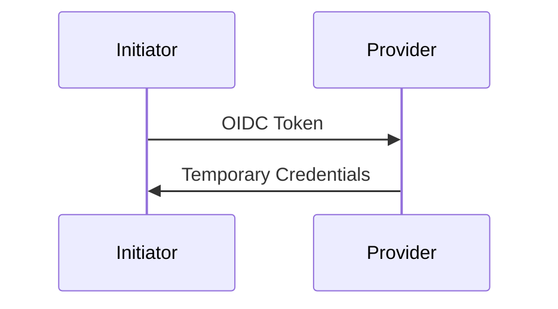

# Documentation Templates System

This document explains the template system for secretsless.org documentation.

## Overview

We've designed a comprehensive template system to ensure all documentation pages are:
- **Consistent** - Same structure for similar content types
- **Focused** - Only relevant information per page type
- **Complete** - All necessary sections included
- **Discoverable** - Easy to find related content
- **Maintainable** - Clear guidelines for updates

## Template Files

All templates are located in `docs/.templates/`:

### 1. `TEMPLATES.md`
Comprehensive documentation of all template structures, including:
- Provider page template with detailed structure
- Initiator page template with detailed structure
- Integration guide template with detailed structure
- Docusaurus typography feature examples
- Checklist for new pages

### 2. `README.md`
Quick-start guide for creating new pages:
- Template selection guide
- Content guidelines
- Frontmatter requirements
- Docusaurus feature usage
- Quality checklist

### 3. Template Files
Ready-to-use templates:
- `provider-template.md` - For services that accept auth
- `initiator-template.md` - For services that generate tokens
- `integration-guide-template.md` - For complete setups

## Design Philosophy

### Separation of Concerns

The template system enforces clear boundaries:

```
┌─────────────────────────────────────────────────────────┐
│  PROVIDER PAGES                                         │
│  Focus: How a service ACCEPTS authentication           │
│  Content:                                               │
│  - Trust policy configuration                           │
│  - Available selectors/claims to filter on             │
│  - SDK/CLI environment variables                        │
│  - Security best practices                              │
│  NO: Initiator-specific implementation examples        │
└─────────────────────────────────────────────────────────┘

┌─────────────────────────────────────────────────────────┐
│  INITIATOR PAGES                                        │
│  Focus: How a service GENERATES tokens                 │
│  Content:                                               │
│  - Token structure and claims                           │
│  - Configuration options                                │
│  - Environment variables set                            │
│  - Token access methods                                 │
│  NO: Provider-specific setup steps                     │
└─────────────────────────────────────────────────────────┘

┌─────────────────────────────────────────────────────────┐
│  INTEGRATION GUIDES                                     │
│  Focus: Complete end-to-end setup                      │
│  Content:                                               │
│  - Prerequisites                                        │
│  - Provider configuration (Terraform/CLI/Console)      │
│  - Initiator configuration                             │
│  - Testing and verification                            │
│  - Troubleshooting                                     │
│  YES: Both provider AND initiator specifics           │
└─────────────────────────────────────────────────────────┘
```

### Information Hierarchy

Users can navigate content in multiple ways:

**Top-Down (Learning):**
```
intro.md
    ↓
concepts/ (optional)
    ↓
providers/ OR initiators/ (learn components)
    ↓
guides/ (see complete integration)
```

**Goal-Oriented (Doing):**
```
guides/initiator-to-provider.md
    ↓
Follow step-by-step instructions
    ↓
Link to provider/initiator docs for details
```

**Reference (Troubleshooting):**
```
providers/provider-name/ OR initiators/initiator-name/
    ↓
Find specific attributes, claims, selectors
    ↓
Check troubleshooting section
    ↓
Link to integration guides for context
```

### Cross-Linking Strategy

Every page should link to related content at the bottom:

**Provider pages link to:**
- Integration guides grouped by initiator category:
  - CI/CD Tools
  - Infrastructure as Code
  - Runtime Environments

**Initiator pages link to:**
- Integration guides grouped by provider category:
  - Cloud Providers
  - Secret Management
  - Container Platforms

**Integration guides link to:**
- Component documentation (provider and initiator)
- Related guides (other integrations)
- Advanced topics

## Key Template Features

### 1. Structured Tables

Use tables for scannable reference information:

**Provider Attributes:**
```markdown
| Attribute | Description | Example | Required |
|-----------|-------------|---------|----------|
| `attr_name` | What it does | `value` | Yes/No |
```

**Initiator Claims:**
```markdown
| Claim | Description | Example Value | Use Case |
|-------|-------------|---------------|----------|
| `claim_name` | What it represents | `value` | When to use it |
```

**Environment Variables:**
```markdown
| Variable | Description | Example | SDK Support |
|----------|-------------|---------|-------------|
| `VAR_NAME` | What it configures | `value` | SDK list |
```

### 2. Multiple Implementation Paths

Integration guides use tabs to support different workflows:

```jsx
<Tabs groupId="implementation-method">
  <TabItem value="terraform" label="Terraform" default>
    # IaC approach
  </TabItem>
  <TabItem value="cli" label="CLI">
    # Command-line approach
  </TabItem>
  <TabItem value="console" label="Platform Console">
    # Web UI approach
  </TabItem>
</Tabs>
```

**Benefits:**
- Users choose their preferred method
- Tab selection persists across page (via `groupId`)
- All options documented in one place

### 3. Visual Architecture

Use Mermaid diagrams to explain flows:

```markdown

```

**When to use:**
- Authentication flows
- Token exchange sequences
- Multi-step processes

### 4. Security Callouts

Use Docusaurus admonitions for security:

```markdown
:::danger Critical Security
Always validate the audience claim
:::

:::warning Important
Use specific trust policies, not wildcards
:::
```

### 5. Troubleshooting Sections

Every guide includes structured troubleshooting:

```markdown
### Issue: Error Name

**Symptoms:**
- What the user sees

**Causes:**
1. Common cause 1
2. Common cause 2

**Solutions:**
1. Solution with code example
2. Alternative solution
```

## Content Guidelines

### Writing Style

**DO:**
- Write in second person ("you configure...")
- Use active voice ("Configure the trust policy")
- Keep sentences short and clear
- Define acronyms on first use
- Include code examples for every concept

**DON'T:**
- Use first person ("we recommend...")
- Write passive voice ("the trust policy should be configured")
- Create walls of text
- Assume prior knowledge
- Provide untested examples

### Code Examples

**Requirements:**
- Must be runnable/testable
- Use placeholders (`<ORG>`, `<REPO>`) for variables
- Include explanatory comments
- Show expected output when relevant
- Test before publishing

**Example:**
```bash
# Get caller identity to verify authentication
aws sts get-caller-identity

# Expected output:
# {
#   "UserId": "AROAEXAMPLEID:session-name",
#   "Account": "123456789012",
#   "Arn": "arn:aws:sts::123456789012:assumed-role/RoleName/session-name"
# }
```

### SEO Optimization

Every page must have complete frontmatter:

```yaml
---
sidebar_position: 1  # Optional, controls order
title: Clear, Descriptive Title (50-60 characters)
description: One-sentence summary for search engines (120-160 characters)
keywords: [keyword1, keyword2, keyword3, keyword4, keyword5]
slug: /optional/custom-url  # Optional, for shorter URLs
---
```

**Title guidelines:**
- Include primary keywords
- Be descriptive, not clever
- Match user search intent

**Description guidelines:**
- One clear sentence
- Include primary keyword
- Action-oriented

**Keywords:**
- 5-10 relevant terms
- Include variations (plurals, synonyms)
- Think about what users search for

## Using the Templates

### For Claude Code

When asked to create documentation:

1. **Identify the page type**
   - Is this a provider, initiator, or integration guide?

2. **Copy the appropriate template**
   ```bash
   cp docs/.templates/provider-template.md docs/providers/new-provider/setup.md
   ```

3. **Replace all placeholders**
   - Search for `[` to find all placeholders
   - Replace with specific values
   - Remove any non-applicable sections

4. **Fill in specific content**
   - Research the technology
   - Create accurate code examples
   - Test everything

5. **Add cross-links**
   - Link to related integration guides
   - Group by appropriate categories
   - Verify all links work

6. **Review against checklist**
   - See `docs/.templates/README.md` for quality checklist

### For Human Contributors

1. Read `docs/.templates/README.md` for quick start
2. Review `docs/.templates/TEMPLATES.md` for detailed guidance
3. Look at existing pages as examples
4. Follow the quality checklist
5. Submit for review

## Maintenance

### When to Update Templates

- **New Docusaurus features** - Add new capabilities
- **User feedback** - Improve based on usage patterns
- **Security updates** - Reflect new best practices
- **Consistency issues** - Fix discovered problems

### How to Update Templates

1. Edit template files in `docs/.templates/`
2. Update `docs/.templates/TEMPLATES.md` documentation
3. Update `docs/.templates/README.md` if needed
4. Consider whether existing pages need updates
5. Create migration guide for breaking changes

### Template Versioning

Templates are versioned by Git:
- Use Git blame to see when sections were added
- Check commit messages for context
- Reference "Last Updated" date in files

## Examples

### Good Documentation Examples

**Providers:**
- `docs/providers/aws/oidc-setup.md`
  - Complete coverage of IAM roles
  - Clear trust policy examples
  - Security best practices highlighted

- `docs/providers/gcp/workload-identity-federation.md`
  - Good attribute mapping section
  - Clear terraform examples
  - Troubleshooting section

**Initiators:**
- `docs/initiators/ci-tools/github-actions.md`
  - Comprehensive token claims table
  - Multiple configuration examples
  - Advanced usage patterns

- `docs/initiators/ci-tools/gitlab-ci.md`
  - Clear token structure
  - Good integration examples (minimal)
  - Troubleshooting section

**Integration Guides:**
- `docs/guides/github-actions-to-aws.md`
  - Step-by-step with tabs
  - Complete working examples
  - Production hardening section

### Common Patterns

**Pattern: Trust Policy Examples**

Always show both too-broad and correct examples:

```markdown
**DON'T** (too broad):
```json
{
  "Condition": {
    "StringLike": {
      "issuer:sub": "*"
    }
  }
}
```

**DO** (specific):
```json
{
  "Condition": {
    "StringEquals": {
      "issuer:sub": "repo:org/repo:ref:refs/heads/main"
    }
  }
}
```
```

**Pattern: Environment Variables**

Document what's available:

```markdown
| Variable | Description | Example | Set By |
|----------|-------------|---------|--------|
| `VAR_NAME` | Purpose | `value` | Platform |
```

**Pattern: Step-by-Step with Verification**

Always include verification:

```markdown
### Step 3: Configure Trust Policy

[Configuration here]

### Verify Configuration

```bash
# Verification command
provider-cli verify-config

# Expected output:
# ✓ Configuration valid
```
```

## Future Improvements

Potential enhancements to consider:

1. **Interactive Examples**
   - CodeSandbox or StackBlitz integrations
   - Interactive token claim builders

2. **Video Tutorials**
   - Screen recordings for complex setups
   - Embedded in relevant guides

3. **Template Generator CLI**
   - Command-line tool to scaffold new pages
   - Prompts for required information

4. **Automated Validation**
   - CI checks for template compliance
   - Link checking
   - Code example testing

5. **Versioned Docs**
   - Support multiple versions of providers/initiators
   - Version picker in UI

## Questions?

- **Template usage**: See `docs/.templates/README.md`
- **Template structure**: See `docs/.templates/TEMPLATES.md`
- **Docusaurus features**: See [Docusaurus docs](https://docusaurus.io/)
- **Content strategy**: Open an issue on GitHub

---

**Created:** 2025-11-12
**Status:** Active
**Maintainer:** Documentation team

This system should evolve based on user needs and documentation patterns that emerge over time.
