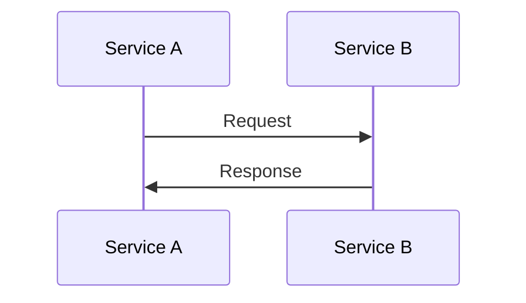

# Documentation Templates Guide

This directory contains templates for creating consistent, high-quality documentation pages for Secretless.cloud.

## Quick Start

1. **Choose the right template** based on what you're documenting:
   - `provider-template.md` - For services that accept secretless authentication
   - `initiator-template.md` - For services that generate OIDC tokens
   - `integration-guide-template.md` - For step-by-step integration guides

2. **Copy the template** to the appropriate location
3. **Replace all placeholder text** (marked with `[brackets]`)
4. **Follow the template structure** - don't skip sections
5. **Review the full** `TEMPLATES.md` for detailed guidance

## Template Philosophy

### 1. Focused Information Only

Each page type serves a specific purpose:

- **Provider pages** document HOW a provider accepts authentication
  - ❌ Don't include initiator-specific examples
  - ✅ Do explain trust policies, selectors, and SDK/CLI usage

- **Initiator pages** document HOW an initiator generates tokens
  - ❌ Don't include provider-specific setup steps
  - ✅ Do explain token claims, configuration, and environment variables

- **Integration guides** show COMPLETE end-to-end setup
  - ✅ Include both provider AND initiator configuration
  - ✅ Provide multiple implementation options (Terraform/CLI/Console)

### 2. Bottom-Linked Related Guides

All provider and initiator pages should end with a "Related Integration Guides" section that links to relevant integration guides, grouped by category.

**Example for a provider page:**

```markdown
## Related Integration Guides

Choose this provider for secretless authentication from:

### CI/CD Tools
- [GitHub Actions → AWS](../guides/github-actions-to-aws.md)
- [GitLab CI → AWS](../guides/gitlab-to-aws.md)

### Infrastructure as Code
- [Terraform Cloud → AWS](../guides/terraform-cloud-to-aws.md)
```

**Example for an initiator page:**

```markdown
## Related Integration Guides

Use GitHub Actions tokens to authenticate with:

### Cloud Providers
- [GitHub Actions → AWS](../guides/github-actions-to-aws.md)
- [GitHub Actions → GCP](../guides/github-actions-to-gcp.md)
- [GitHub Actions → Azure](../guides/github-actions-to-azure.md)

### Secret Management
- [GitHub Actions → Vault](../guides/github-actions-to-vault.md)
```

### 3. Consistent Structure

All pages of the same type follow identical section structures. This helps users:
- Find information quickly
- Compare different options
- Build mental models of how things work

### 4. Multiple Implementation Paths

Integration guides should provide users with options:
- **Terraform** (default tab) - Most popular IaC tool
- **CLI** - Cloud provider CLIs
- **Platform Console** - Web UI for manual setup

Use Docusaurus `Tabs` component with `groupId="implementation-method"` for consistency.

## When to Use Each Template

### Provider Template

Use when documenting:
- AWS, GCP, Azure, or other cloud providers
- Kubernetes clusters
- HashiCorp Vault
- Any service that ACCEPTS OIDC tokens

**Key sections:**
- How the provider validates tokens
- Required attributes and selectors
- SDK/CLI environment variables
- Trust policy configuration
- Security best practices

### Initiator Template

Use when documenting:
- GitHub Actions, GitLab CI, Buildkite
- Terraform Cloud
- CircleCI, Jenkins, or other CI/CD tools
- Any service that GENERATES OIDC tokens

**Key sections:**
- How tokens are generated
- Available claims in the token
- Configuration options
- Environment variables set by the platform
- Token access methods

### Integration Guide Template

Use when creating:
- Complete setup guides connecting an initiator to a provider
- Step-by-step tutorials with code examples
- Production-ready configurations

**Key sections:**
- Prerequisites and planning decisions
- Architecture diagrams
- Step-by-step implementation with tabs
- Testing and verification
- Production hardening
- Troubleshooting
- Complete working examples

## Content Guidelines

### ✅ DO

- **Use clear, descriptive headings** that match the template
- **Provide working code examples** that users can copy-paste
- **Include security warnings** for critical configuration decisions
- **Link to official documentation** for reference
- **Use tables** for structured data (attributes, selectors, claims)
- **Add Mermaid diagrams** to visualize authentication flows
- **Test all code examples** before publishing
- **Group related guides** in the "Related Integration Guides" section

### ❌ DON'T

- **Don't mix concerns** - keep provider and initiator docs separate
- **Don't include outdated information** - check version requirements
- **Don't use broken links** - verify all links work
- **Don't skip security sections** - they're critical
- **Don't hardcode values** - use placeholders like `<ORG>`, `<REPO>`
- **Don't create walls of text** - break up with headings, lists, and examples
- **Don't forget frontmatter** - SEO depends on it

## Frontmatter Requirements

Every page must include:

```yaml
---
sidebar_position: 1  # Order in sidebar (optional)
title: Page Title - Clear and Descriptive
description: One-sentence summary for SEO (50-160 characters ideal)
keywords: [keyword1, keyword2, keyword3, ...]  # 5-10 relevant terms
---
```

**Provider example:**
```yaml
---
sidebar_position: 1
title: AWS - Secretless Authentication
description: Configure AWS to accept OIDC-based secretless authentication from external services
keywords: [aws, oidc, secretless, authentication, iam, trust policy]
---
```

**Initiator example:**
```yaml
---
sidebar_position: 1
title: GitHub Actions - OIDC Token Generation
description: Use GitHub Actions to generate OIDC tokens for secretless authentication with cloud providers
keywords: [github actions, oidc, jwt, identity token, claims, ci cd]
---
```

**Integration guide example:**
```yaml
---
title: GitHub Actions to AWS - Secretless Authentication
description: Complete guide to set up OIDC authentication between GitHub Actions and AWS without storing long-lived credentials
keywords: [github actions, aws, oidc, secretless, authentication, integration]
---
```

## Using Docusaurus Features

### Admonitions

```markdown
:::note
Standard information
:::

:::tip Helpful Hint
Best practice or shortcut
:::

:::warning Important
Something to be careful about
:::

:::danger Critical Security
Security-critical information
:::
```

### Tabs for Multiple Options

```markdown
import Tabs from '@theme/Tabs';
import TabItem from '@theme/TabItem';

<Tabs groupId="implementation-method">
  <TabItem value="terraform" label="Terraform" default>

```hcl
# Terraform code here
```

  </TabItem>
  <TabItem value="cli" label="CLI">

```bash
# CLI commands here
```

  </TabItem>
  <TabItem value="console" label="AWS Console">

1. Console steps here
2. Step 2
3. Step 3

  </TabItem>
</Tabs>
```

### Code Blocks with Syntax Highlighting

````markdown
```bash
# Bash commands
aws sts get-caller-identity
```

```yaml
# YAML configuration
name: Deploy
on: push
```

```json
{
  "key": "value"
}
```

```hcl
# Terraform/HCL
resource "aws_iam_role" "example" {
  name = "example"
}
```
````

### Mermaid Diagrams

````markdown

````

## Example Workflow

### Creating a New Provider Page

1. Copy the provider template:
   ```bash
   cp docs/.templates/provider-template.md docs/providers/cloudflare/oidc-setup.md
   ```

2. Update frontmatter:
   ```yaml
   ---
   sidebar_position: 1
   title: Cloudflare - Secretless Authentication
   description: Configure Cloudflare to accept OIDC-based secretless authentication from external services
   keywords: [cloudflare, oidc, secretless, authentication, workers, access]
   ---
   ```

3. Replace placeholders:
   - `[Provider Name]` → `Cloudflare`
   - Update overview text
   - Add Cloudflare-specific attributes and selectors
   - Document environment variables
   - Create architecture diagram

4. Add related guides section:
   ```markdown
   ## Related Integration Guides

   Choose this provider for secretless authentication from:

   ### CI/CD Tools
   - [GitHub Actions → Cloudflare](../guides/github-actions-to-cloudflare.md)
   ```

5. Review checklist:
   - [ ] All placeholders replaced
   - [ ] Code examples tested
   - [ ] Links verified
   - [ ] Security warnings included
   - [ ] Frontmatter complete
   - [ ] Related guides linked

### Creating a New Integration Guide

1. Copy the integration guide template:
   ```bash
   cp docs/.templates/integration-guide-template.md docs/guides/github-actions-to-cloudflare.md
   ```

2. Replace placeholders throughout:
   - `[Initiator]` → `GitHub Actions`
   - `[Provider]` → `Cloudflare`

3. Create implementation tabs:
   - Research Terraform provider support
   - Document CLI commands
   - Screenshot console UI steps

4. Test the complete example:
   - Set up a test environment
   - Follow your own guide
   - Verify everything works
   - Fix any issues

5. Add troubleshooting section based on common errors

## Quality Checklist

Before publishing any documentation page:

- [ ] **Accuracy**: All information is current and tested
- [ ] **Completeness**: No template sections skipped (unless not applicable)
- [ ] **Clarity**: Clear language, no jargon without explanation
- [ ] **Code Quality**: All examples are runnable and tested
- [ ] **Links**: All internal and external links work
- [ ] **SEO**: Frontmatter includes title, description, and keywords
- [ ] **Security**: Security warnings are prominent and accurate
- [ ] **Structure**: Follows template structure exactly
- [ ] **Consistency**: Uses same terminology as other pages
- [ ] **Related Guides**: Links to relevant integration guides

## Getting Help

- **Template questions**: See full `TEMPLATES.md` document
- **Docusaurus features**: Check [Docusaurus documentation](https://docusaurus.io/)
- **MDX syntax**: See [MDX documentation](https://mdxjs.com/)
- **Content questions**: Review existing pages for examples

## Maintenance

Templates should be updated when:
- New Docusaurus features become available
- User feedback suggests structural improvements
- Common patterns emerge that should be standardized
- Security best practices evolve

To update templates:
1. Edit the template file
2. Update `TEMPLATES.md` documentation
3. Consider whether existing pages need updates
4. Create a migration guide if breaking changes

## Examples of Good Documentation

Refer to these existing pages as examples:

**Providers:**
- `docs/providers/aws/oidc-setup.md` - Comprehensive AWS provider page
- `docs/providers/gcp/workload-identity-federation.md` - GCP with good structure

**Initiators:**
- `docs/initiators/ci-tools/github-actions.md` - Detailed GitHub Actions page
- `docs/initiators/ci-tools/gitlab-ci.md` - GitLab CI with clear claims table

**Integration Guides:**
- `docs/guides/github-actions-to-aws.md` - Complete integration example
- `docs/guides/terraform-cloud-to-aws.md` - Multi-tab implementation guide

---

Last Updated: 2025-11-12

For questions or suggestions, please open an issue on GitHub.
