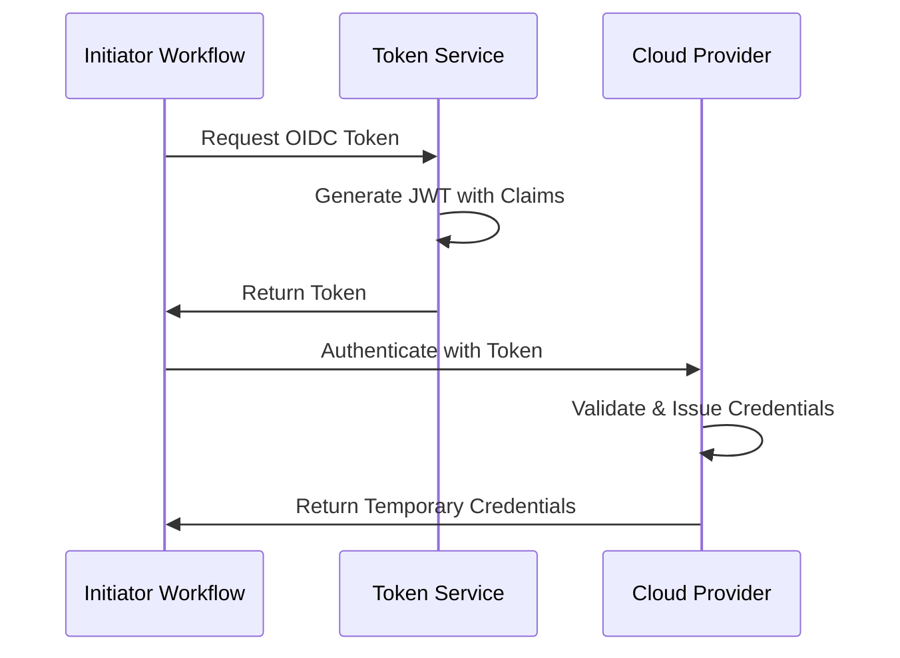

# [Initiator Name] - Secretless Authentication

[1-2 sentence overview of what this initiator is and what tokens it generates]

:::warning Documentation Principle
**IMPORTANT**: This initiator documentation should focus ONLY on how [Initiator Name] generates and provides OIDC tokens. Provider-specific setup (AWS IAM roles, GCP service accounts, Azure managed identities, etc.) belongs in **integration guides** (`/docs/guides/[initiator]-to-[provider].md`), NOT in this document.

**This doc should explain**: Token generation, claims, configuration, token access
**Integration guides should explain**: Provider OIDC setup, trust policies, permissions, end-to-end configuration
:::

## Overview

[2-3 paragraphs explaining]:
- What this initiator is
- How it generates identity tokens
- What providers can consume these tokens

## Token Generation

### How It Works

[Explanation of the token generation mechanism]



### Token Availability

When and where tokens are available:

- **Availability**: [Automatic / On-demand / Requires configuration]
- **Scope**: [Per workflow / Per job / Per step]
- **Lifetime**: [Duration, e.g., "Valid for 1 hour" or "Duration of workflow"]
- **Refresh**: [Can be refreshed / Single use only]

## Token Claims

### Standard Claims

Standard JWT claims included in all tokens:

| Claim | Description | Example Value |
|-------|-------------|---------------|
| `iss` | Token issuer URL | `https://token.issuer.url` |
| `sub` | Subject identifier (what's requesting auth) | `repo:org/repo:ref:refs/heads/main` |
| `aud` | Audience (intended recipient) | `https://provider.example.com` |
| `exp` | Expiration time (Unix timestamp) | `1735689600` |
| `iat` | Issued at time (Unix timestamp) | `1735686000` |
| `nbf` | Not before time (Unix timestamp) | `1735686000` |
| `jti` | JWT ID (unique identifier) | `uuid-string` |

### Custom Claims

Additional claims specific to this initiator:

| Claim | Description | Example Value | Use Case |
|-------|-------------|---------------|----------|
| `custom_claim_1` | What it represents | `value` | Filter by repository |
| `custom_claim_2` | What it represents | `value` | Filter by branch |
| `custom_claim_3` | What it represents | `value` | Filter by actor |

## Configuration

### Basic Setup

How to enable OIDC token generation:

```yaml
# Configuration example for enabling OIDC tokens
name: Example Workflow

on:
  push:

jobs:
  example:
    steps:
      - name: Get OIDC Token
        # Configuration here
```

### Advanced Options

Configure optional token parameters:

| Option | Description | Default | Valid Values |
|--------|-------------|---------|--------------|
| `option_name` | What it controls | `default-value` | `value1`, `value2`, `value3` |
| `option_name_2` | What it controls | `default-value` | `any-string` |

### Token Request Parameters

Parameters when requesting a token:

| Parameter | Description | Required | Example |
|-----------|-------------|----------|---------|
| `audience` | Token audience | Yes | `https://provider.example.com` |
| `parameter_2` | Description | No | `value` |

### Environment Variables

Variables automatically set by the initiator when tokens are available:

| Variable | Description | Example Value | Available When |
|----------|-------------|---------------|----------------|
| `ENV_VAR_TOKEN` | Contains or points to the token | `/path/to/token` | During workflow execution |
| `ENV_VAR_URL` | Token request URL | `https://token-service.url` | When OIDC is enabled |
| `ENV_VAR_CONFIG` | Configuration value | `value` | Always |

## Token Access

### Method 1: [Primary Access Method]

```language
# Code example showing how to access the token
# This is usually the recommended approach

# Example:
export TOKEN=$(cat $ENV_VAR_TOKEN)
echo "Token: $TOKEN"
```

### Method 2: [Alternative Access Method]

```language
# Alternative way to access the token
# Useful for specific use cases

# Example:
curl -H "Authorization: bearer $TOKEN" https://api.example.com
```

### Method 3: [SDK/Tool Integration]

```language
# Using the token with SDKs or tools
# They often read environment variables automatically

# Example:
provider-cli operation --use-oidc
```

## Inspecting Tokens

How to decode and inspect the token locally:

```bash
# Decode the JWT to see claims
echo $TOKEN | cut -d '.' -f2 | base64 -d 2>/dev/null | jq .

# Expected output:
# {
#   "iss": "https://token.issuer.url",
#   "sub": "repo:org/repo:ref:refs/heads/main",
#   "aud": "https://provider.example.com",
#   "exp": 1735689600,
#   "custom_claim_1": "value"
# }
```

:::tip Token Inspection
Use [jwt.io](https://jwt.io) to decode and inspect tokens in a browser. Never paste production tokens into third-party sites - only use for development/testing with non-sensitive tokens.
:::

## Token Security

### Best Practices

- **Scope Audience Appropriately**: Use specific audience values for different providers
- **Validate Token Lifetime**: Ensure tokens expire appropriately for your use case
- **Protect Token Content**: Treat tokens as secrets - never log or expose them
- **Use Specific Subject Claims**: Configure trust policies to validate subject patterns

### Token Handling

:::danger Critical Security
- Tokens are bearer tokens - anyone with the token can use it during its validity period
- Never commit tokens to source control
- Never log full token values
- Avoid passing tokens in URLs
:::

## Best Practices

1. **Request Minimal Token Lifetime**: Use the shortest token lifetime that works for your use case
2. **Specify Explicit Audiences**: Always specify the intended provider as the audience
3. **Leverage Custom Claims for Filtering**: Use platform-specific claims to create precise trust policies
4. **Test Token Claims**: Inspect tokens during development to verify claims match expectations
5. **Document Required Claims**: Clearly document which claims your trust policies depend on

## Limitations

- **Limitation 1**: Description and workaround
- **Limitation 2**: Description and workaround
- **Limitation 3**: Description and workaround

## Examples

### Basic Token Request

```yaml
# Minimal example
name: Basic Token Example

on:
  push:

jobs:
  example:
    steps:
      - name: Request Token
        run: |
          # Token request code
```

### Advanced Token Request

```yaml
# Example with custom audience and advanced options
name: Advanced Token Example

on:
  push:

jobs:
  example:
    steps:
      - name: Request Custom Token
        # Advanced configuration
```

## Related Integration Guides

Use [Initiator Name] tokens to authenticate with:

### Cloud Providers
- [Initiator → AWS](../guides/initiator-to-aws.md)
- [Initiator → GCP](../guides/initiator-to-gcp.md)
- [Initiator → Azure](../guides/initiator-to-azure.md)

### Secret Management
- [Initiator → HashiCorp Vault](../guides/initiator-to-vault.md)

### Container Platforms
- [Initiator → Kubernetes](../guides/initiator-to-kubernetes.md)

## Additional Resources

- [Official Initiator Documentation](https://initiator.example.com/docs)
- [OIDC Integration Guide](https://initiator.example.com/docs/oidc)
- [Token Reference](https://initiator.example.com/api/tokens)
- [JWT Specification (RFC 7519)](https://tools.ietf.org/html/rfc7519)
- [OIDC Core Specification](https://openid.net/specs/openid-connect-core-1_0.html)
