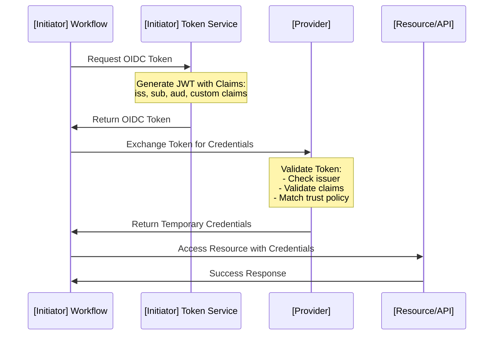

# [Initiator] to [Provider] - Secretless Authentication

Connect [Initiator] to [Provider] using secretless authentication via OpenID Connect (OIDC) - no long-lived credentials required.

## Overview

[2-3 sentences explaining what this guide accomplishes and the benefits]

**Time Required**: [X-Y] minutes
**Difficulty**: Beginner / Intermediate / Advanced

### What You'll Accomplish

- ✓ Configure [Provider] to trust [Initiator] OIDC tokens
- ✓ Set up trust policies with appropriate claim filters
- ✓ Implement the authentication flow in [Initiator] workflows
- ✓ Test and verify the end-to-end configuration
- ✓ Apply production hardening and security best practices

### Benefits

- **No Stored Credentials**: Zero long-lived credentials stored in [Initiator]
- **Automatic Rotation**: Tokens are generated on-demand and expire automatically
- **Fine-Grained Access**: Trust policies provide precise control over who can authenticate
- **Audit Trail**: Complete authentication history in [Provider] logs
- **Compliance**: Meets security requirements for credential-free authentication

## Prerequisites

### [Provider] Requirements

- Active [Provider] account with administrative access
- Permission to create [specific resources, e.g., IAM roles, service accounts]
- [Any specific provider requirements]

### [Initiator] Requirements

- Access to [Initiator] with permission to configure workflows
- [Specific initiator requirements]
- [Access requirements]

### Knowledge Requirements

- Basic understanding of OIDC authentication flows
- Familiarity with [Provider] [specific service, e.g., IAM, Workload Identity]
- Experience with [Initiator] configuration files

## Planning Your Implementation

Before starting, decide on:

### 1. Trust Policy Scope

Choose how narrowly to scope your trust policy:

| Scope Level | Example Filter | Security | Flexibility |
|-------------|----------------|----------|-------------|
| **Organization-wide** | `org:[org-name]` | ⚠️ Low | High |
| **Repository-specific** | `repo:[org]/[repo]` | ✓ Medium | Medium |
| **Branch-specific** | `repo:[org]/[repo]:ref:refs/heads/main` | ✓✓ High | Low |
| **Environment-specific** | `repo:[org]/[repo]:environment:[env]` | ✓✓✓ Highest | Custom |

:::tip Recommended Approach
Start with repository-specific scope for good security and reasonable flexibility. Narrow further for production.
:::

### 2. Permissions Level

Determine the minimum permissions needed:

- **Read-only**: For accessing resources without modifications
- **Deploy permissions**: For deployment workflows
- **Administrative**: Only when absolutely necessary

### 3. Token Audience

Decide on the audience value:

- Use provider-specific audience (recommended)
- Use custom audience for multi-provider scenarios
- Document the chosen audience for team reference

## Architecture



**Flow Explanation:**

1. **Token Request**: Workflow requests an OIDC token from [Initiator]'s token service
2. **Token Generation**: Token service generates a JWT with standard and custom claims
3. **Token Exchange**: Workflow presents the token to [Provider] for credential exchange
4. **Validation**: [Provider] validates the token against configured trust policies
5. **Credential Issuance**: [Provider] issues short-lived credentials
6. **Resource Access**: Workflow uses credentials to access [Provider] resources

## Implementation

### Step 1: Configure [Provider] OIDC Trust

Set up [Provider] to trust tokens from [Initiator].

import Tabs from '@theme/Tabs';
import TabItem from '@theme/TabItem';

<Tabs groupId="implementation-method">
  <TabItem value="terraform" label="Terraform" default>

```hcl
# Configure OIDC provider in [Provider]
resource "provider_oidc_provider" "initiator" {
  name        = "[initiator-name]"
  issuer_url  = "https://token.initiator.url"
  audience    = ["https://provider.example.com"]

  # Additional provider-specific configuration
}

# Create role/identity that trusts the OIDC provider
resource "provider_role" "initiator_role" {
  name        = "[role-name]"
  description = "Role for [Initiator] secretless authentication"

  # Reference to OIDC provider
  oidc_provider_id = provider_oidc_provider.initiator.id
}
```

**Configuration Explanation:**
- `issuer_url`: Must exactly match the token issuer (check trailing slashes)
- `audience`: Should match the `aud` claim in your [Initiator] tokens
- `name`: Choose a descriptive name for easy identification

  </TabItem>
  <TabItem value="cli" label="CLI">

```bash
# Create OIDC provider
provider-cli oidc create \
  --name "[initiator-name]" \
  --issuer-url "https://token.initiator.url" \
  --audience "https://provider.example.com"

# Create role/identity
provider-cli role create \
  --name "[role-name]" \
  --description "Role for [Initiator] secretless authentication" \
  --oidc-provider "[initiator-name]"

# Get the role identifier for later use
provider-cli role get [role-name] --format json
```

**Command Explanation:**
- First command registers [Initiator] as a trusted OIDC provider
- Second command creates a role that can be assumed via OIDC
- Third command retrieves the role details (save the ARN/ID for Step 3)

  </TabItem>
  <TabItem value="console" label="[Provider] Console">

**Create OIDC Provider:**

1. Navigate to [Provider Console Section]
2. Click **"Add Identity Provider"** or similar
3. Select **"OpenID Connect"** as the provider type
4. Enter the following details:
   - **Provider URL**: `https://token.initiator.url`
   - **Audience**: `https://provider.example.com`
5. Click **"Add"** or **"Create"**
6. Note the provider identifier for the next step

**Create Role/Identity:**

1. Navigate to [Roles/Identities Section]
2. Click **"Create Role"** or **"New Identity"**
3. Select **"Web Identity"** or **"OIDC"** as the trust type
4. Choose the OIDC provider created above
5. Enter a descriptive name: `[role-name]`
6. Click **"Next"** to configure trust policy

  </TabItem>
</Tabs>

### Step 2: Configure Trust Policy

Define which [Initiator] workflows can assume the role using claim-based filters.

<Tabs groupId="implementation-method">
  <TabItem value="terraform" label="Terraform" default>

```hcl
# Define trust policy with claim filters
resource "provider_trust_policy" "initiator_trust" {
  role_id = provider_role.initiator_role.id

  conditions {
    # Filter by subject claim (repository)
    claim = "sub"
    operator = "StringEquals"
    values = [
      "repo:[org]/[repo]:ref:refs/heads/main",
      "repo:[org]/[repo]:ref:refs/heads/develop"
    ]
  }

  conditions {
    # Filter by custom claim (optional)
    claim = "[custom_claim]"
    operator = "StringEquals"
    values = ["[expected-value]"]
  }

  conditions {
    # Validate audience
    claim = "aud"
    operator = "StringEquals"
    values = ["https://provider.example.com"]
  }
}
```

**Key Trust Policy Selectors:**

| Selector | Description | Example Value | Recommended Filter |
|----------|-------------|---------------|-------------------|
| `sub` | Subject identifier | `repo:org/repo:ref:refs/heads/main` | Repository + branch |
| `aud` | Token audience | `https://provider.example.com` | Always validate |
| `[claim_1]` | Custom claim 1 | `value` | Optional, for finer control |
| `[claim_2]` | Custom claim 2 | `value` | Optional, for finer control |

  </TabItem>
  <TabItem value="cli" label="CLI">

```bash
# Create trust policy with claim conditions
provider-cli trust-policy create \
  --role "[role-name]" \
  --condition "claim=sub,operator=StringEquals,value=repo:[org]/[repo]:ref:refs/heads/main" \
  --condition "claim=sub,operator=StringEquals,value=repo:[org]/[repo]:ref:refs/heads/develop" \
  --condition "claim=aud,operator=StringEquals,value=https://provider.example.com" \
  --condition "claim=[custom_claim],operator=StringEquals,value=[expected-value]"

# Verify trust policy
provider-cli trust-policy get --role "[role-name]"
```

**Condition Syntax:**
- Each `--condition` flag adds a new filter
- `claim`: The JWT claim to filter on
- `operator`: Comparison operator (StringEquals, StringLike, etc.)
- `value`: Expected value(s)

  </TabItem>
  <TabItem value="console" label="[Provider] Console">

**Edit Trust Policy:**

1. Find the role created in Step 1
2. Click **"Edit Trust Policy"** or **"Trust Relationships"**
3. Add conditions for claim validation:

**Subject (Repository) Filter:**
- **Claim**: `sub`
- **Operator**: `StringEquals`
- **Values**:
  - `repo:[org]/[repo]:ref:refs/heads/main`
  - `repo:[org]/[repo]:ref:refs/heads/develop`

**Audience Validation:**
- **Claim**: `aud`
- **Operator**: `StringEquals`
- **Value**: `https://provider.example.com`

**Custom Claim Filter (Optional):**
- **Claim**: `[custom_claim]`
- **Operator**: `StringEquals`
- **Value**: `[expected-value]`

4. Save the trust policy

:::tip Trust Policy Testing
After saving, use the policy simulator (if available) to test that your filters work as expected.
:::

  </TabItem>
</Tabs>

### Step 3: Assign Permissions

Grant the necessary permissions to the role for accessing resources.

<Tabs groupId="implementation-method">
  <TabItem value="terraform" label="Terraform" default>

```hcl
# Attach permissions policy to the role
resource "provider_policy_attachment" "initiator_permissions" {
  role_id   = provider_role.initiator_role.id
  policy_id = provider_policy.custom_policy.id
}

# Define custom policy with least-privilege permissions
resource "provider_policy" "custom_policy" {
  name        = "[policy-name]"
  description = "Permissions for [Initiator] workflows"

  statement {
    effect = "Allow"
    actions = [
      "[service]:[action1]",
      "[service]:[action2]",
    ]
    resources = [
      "[resource-arn-1]",
      "[resource-arn-2]",
    ]
  }
}
```

**Permission Best Practices:**
- Start with minimal permissions and expand as needed
- Use resource-level restrictions when possible
- Document why each permission is required

  </TabItem>
  <TabItem value="cli" label="CLI">

```bash
# Create a custom policy
provider-cli policy create \
  --name "[policy-name]" \
  --description "Permissions for [Initiator] workflows" \
  --actions "[service]:[action1],[service]:[action2]" \
  --resources "[resource-arn-1],[resource-arn-2]"

# Attach policy to role
provider-cli policy attach \
  --role "[role-name]" \
  --policy "[policy-name]"

# Verify permissions
provider-cli role get-permissions [role-name]
```

  </TabItem>
  <TabItem value="console" label="[Provider] Console">

**Attach Permissions:**

1. Navigate to the role created in Step 1
2. Click **"Attach Policies"** or **"Add Permissions"**
3. Choose existing policies or create a custom policy:

**For Custom Policy:**
- Click **"Create Policy"**
- Select the service(s) you need access to
- Choose specific actions (avoid wildcards like `*`)
- Specify resource ARNs/paths
- Add conditions if needed
- Review and create

4. Attach the policy to your role
5. Verify the permissions are correctly assigned

  </TabItem>
</Tabs>

### Step 4: Configure [Initiator]

Update your [Initiator] workflow to request tokens and authenticate with [Provider].

```yaml
name: [Initiator] to [Provider] Authentication

on:
  push:
    branches: [main, develop]

# Grant OIDC token permission (if required by initiator)
permissions:
  id-token: write
  contents: read

jobs:
  deploy:
    runs-on: [runner-type]

    steps:
      - name: Checkout code
        uses: [checkout-action]

      - name: Configure [Provider] Credentials
        uses: [provider-auth-action] # or run custom script
        with:
          role-id: [role-arn-or-id-from-step-1]
          audience: https://provider.example.com # Must match trust policy
          # Additional initiator-specific configuration

      - name: Verify Authentication
        run: |
          # Provider-specific verification command
          provider-cli identity get

      - name: Use [Provider] Resources
        run: |
          # Your deployment or operation commands
          provider-cli [command] [args]
```

**Configuration Details:**

| Field | Description | Value |
|-------|-------------|-------|
| `permissions.id-token` | Required for OIDC token generation | `write` |
| `role-id` | Role created in Step 1 | From provider console/CLI output |
| `audience` | Must match trust policy | `https://provider.example.com` |

:::tip Testing Locally
When testing locally, you won't have access to [Initiator] tokens. Use [Provider] CLI with traditional auth for local development.
:::

## Testing and Verification

### Test the Integration

1. **Trigger a Test Workflow**

   ```bash
   # Push to trigger the workflow
   git commit --allow-empty -m "Test OIDC authentication"
   git push origin main
   ```

2. **Monitor the Workflow Logs**

   Check for successful authentication messages:

   ```
   ✓ OIDC token generated successfully
   ✓ Token exchanged for [Provider] credentials
   ✓ Successfully authenticated as [role-name]
   ```

3. **Verify [Provider] Access**

   Confirm the workflow can access [Provider] resources:

   ```bash
   # In workflow logs, look for successful operations
   provider-cli [command] --output json
   ```

### Expected Output

**Successful Authentication:**

```
Configuring [Provider] credentials...
✓ Requested OIDC token from [Initiator]
✓ Token received with audience: https://provider.example.com
✓ Exchanged token for temporary credentials
✓ Assumed role: [role-arn-or-id]
✓ Credentials valid for: [duration]

Verifying identity...
{
  "identity": "[role-name]",
  "type": "assumed-role",
  "method": "web-identity",
  "expires": "[timestamp]"
}

✓ Authentication successful!
```

### Common Test Failures

| Error | Cause | Solution |
|-------|-------|----------|
| "Token validation failed" | Trust policy mismatch | Verify `sub` and `aud` claims match trust policy |
| "Access denied" | Insufficient permissions | Review and expand role permissions |
| "Provider not found" | OIDC provider misconfigured | Check issuer URL is exactly correct |
| "Invalid audience" | Audience mismatch | Ensure audience in workflow matches trust policy |

## Production Hardening

### Security Best Practices

#### 1. Narrow Trust Policies

**Don't do this:**
```hcl
# Too broad - trusts entire organization
claim = "sub"
operator = "StringLike"
values = ["repo:[org]/*"]
```

**Do this:**
```hcl
# Specific to repository and branch
claim = "sub"
operator = "StringEquals"
values = [
  "repo:[org]/[repo]:ref:refs/heads/main",
  "repo:[org]/[repo]:environment:production"
]
```

#### 2. Implement Least Privilege

Start with minimal permissions and expand only as needed:

```hcl
# Good: Specific actions and resources
statement {
  effect = "Allow"
  actions = [
    "[service]:Get*",
    "[service]:List*",
    "[service]:SpecificWriteAction"
  ]
  resources = [
    "[specific-resource-arn]"
  ]
}
```

#### 3. Validate Audience

Always validate the `aud` claim in your trust policy:

```hcl
conditions {
  claim = "aud"
  operator = "StringEquals"
  values = ["https://provider.example.com"]
}
```

#### 4. Use Environment-Based Policies

For production environments, use environment-specific filters:

```hcl
conditions {
  claim = "[environment_claim]"
  operator = "StringEquals"
  values = ["production"]
}
```

### Recommended Trust Policy Filters

For maximum security, use multiple filters:

| Filter Type | Claim | Example | Security Benefit |
|-------------|-------|---------|------------------|
| **Repository** | `sub` | `repo:org/repo:*` | Limits to specific repo |
| **Branch** | `sub` | `:ref:refs/heads/main` | Limits to specific branches |
| **Environment** | `[env_claim]` | `production` | Separates prod from dev |
| **Actor** | `[actor_claim]` | `trusted-user` | Limits to specific users |
| **Audience** | `aud` | `https://provider.example.com` | Prevents token reuse |

### Monitoring and Auditing

#### Enable Audit Logging

<Tabs groupId="implementation-method">
  <TabItem value="terraform" label="Terraform" default>

```hcl
# Enable audit logging for the role
resource "provider_audit_config" "initiator_audit" {
  role_id = provider_role.initiator_role.id

  log_types = [
    "authentication",
    "authorization",
    "policy-changes"
  ]

  destination = "[log-destination]"
}
```

  </TabItem>
  <TabItem value="cli" label="CLI">

```bash
provider-cli audit enable \
  --role "[role-name]" \
  --log-types authentication,authorization,policy-changes \
  --destination "[log-destination]"
```

  </TabItem>
  <TabItem value="console" label="[Provider] Console">

1. Navigate to audit/logging settings
2. Enable logging for the role
3. Select authentication and authorization events
4. Configure log destination (CloudWatch, Cloud Logging, etc.)
5. Set up alerts for suspicious activity

  </TabItem>
</Tabs>

#### What to Monitor

- **Authentication attempts**: Track successful and failed OIDC authentications
- **Permission errors**: Monitor for access denied errors (may indicate insufficient permissions)
- **Policy changes**: Alert on any modifications to trust policies
- **Unusual patterns**: Set up alerts for authentication from unexpected repositories or branches

#### Set Up Alerts

Create alerts for security-relevant events:

- Failed authentication attempts (3+ in 5 minutes)
- Authentication from unexpected `sub` claims
- Policy modifications
- Permission escalation attempts

## Troubleshooting

### Issue: OIDC Token Not Generated

**Symptoms:**
- Error: "Unable to get OIDC token"
- Workflow fails at authentication step
- No token in environment variables

**Solutions:**

1. **Check OIDC Permissions** (Initiator-specific)
   ```yaml
   permissions:
     id-token: write  # Required for token generation
   ```

2. **Verify Token Service Availability**
   ```bash
   # Check if token endpoint is accessible
   curl [initiator-token-endpoint]
   ```

3. **Review Initiator Configuration**
   - Ensure OIDC is enabled for your organization/project
   - Verify no policies block OIDC token generation

### Issue: Token Validation Failed

**Symptoms:**
- Error: "Token validation failed"
- Error: "Invalid issuer"
- Error: "Audience validation failed"
- [Provider] rejects the token

**Solutions:**

1. **Verify Issuer URL Match**
   ```bash
   # Decode token to check issuer
   echo $TOKEN | cut -d '.' -f2 | base64 -d | jq .iss

   # Compare with provider configuration
   provider-cli oidc-provider get [provider-name] --format json | jq .issuer_url
   ```

   :::warning Trailing Slashes Matter
   `https://token.example.com` ≠ `https://token.example.com/`
   :::

2. **Check Audience Claim**
   ```bash
   # Verify aud claim matches trust policy
   echo $TOKEN | cut -d '.' -f2 | base64 -d | jq .aud
   ```

3. **Validate Token Expiration**
   ```bash
   # Check if token is expired
   echo $TOKEN | cut -d '.' -f2 | base64 -d | jq '.exp,.iat' | while read exp; read iat; do
     echo "Issued: $(date -r $iat)"
     echo "Expires: $(date -r $exp)"
   done
   ```

4. **Inspect Trust Policy Configuration**
   ```bash
   # Review current trust policy
   provider-cli trust-policy get --role [role-name] --format json
   ```

### Issue: Authentication Succeeds but Operations Fail

**Symptoms:**
- OIDC authentication succeeds
- Error: "Access denied" or "Permission denied"
- Operations fail with authorization errors

**Solutions:**

1. **Review Role Permissions**
   ```bash
   # List current permissions
   provider-cli role get-permissions [role-name]
   ```

2. **Check Resource Permissions**
   - Verify the role has permissions for the specific resources
   - Check for resource-level conditions in policies

3. **Verify Resource ARNs/Paths**
   - Ensure resource identifiers in policies are correct
   - Check for typos or incorrect formats

4. **Test with Broader Permissions (Temporarily)**
   ```hcl
   # Temporarily grant broader permissions to isolate the issue
   # NEVER use in production
   actions = ["[service]:*"]
   resources = ["*"]
   ```

   Once you identify which permission is needed, narrow it back down.

### Issue: Trust Policy Not Matching

**Symptoms:**
- Error: "Subject claim does not match trust policy"
- Error: "Trust policy evaluation failed"
- Token claims don't match expected filters

**Solutions:**

1. **Inspect Token Claims**
   ```bash
   # View all claims in the token
   echo $TOKEN | cut -d '.' -f2 | base64 -d | jq .
   ```

2. **Compare with Trust Policy**
   - Check the exact format of the `sub` claim
   - Verify custom claims match expected values
   - Ensure string comparison operators are appropriate

3. **Use Wildcards Carefully**
   ```hcl
   # If using StringLike for wildcards
   claim = "sub"
   operator = "StringLike"
   values = ["repo:[org]/[repo]:*"]  # Matches any ref
   ```

4. **Debug Trust Policy Evaluation**
   ```bash
   # Some providers offer policy simulation
   provider-cli policy simulate \
     --role [role-name] \
     --token-claims '{"sub":"repo:org/repo:ref:refs/heads/main","aud":"https://provider.example.com"}'
   ```

### Issue: OIDC Provider Not Found

**Symptoms:**
- Error: "OIDC provider does not exist"
- Error: "Unknown identity provider"
- [Provider] doesn't recognize the issuer

**Solutions:**

1. **Verify Provider Registration**
   ```bash
   # List registered OIDC providers
   provider-cli oidc-provider list
   ```

2. **Check Provider Configuration**
   ```bash
   # Get details of the OIDC provider
   provider-cli oidc-provider get [provider-name] --format json
   ```

3. **Re-create the Provider (if necessary)**
   ```bash
   # Delete and recreate if configuration is corrupted
   provider-cli oidc-provider delete [provider-name]
   provider-cli oidc-provider create --name [provider-name] --issuer-url [url] --audience [aud]
   ```

4. **Wait for Propagation**
   - Some providers take time to propagate OIDC configurations
   - Wait 5-10 minutes and retry

## Complete Example

### Complete Terraform Configuration

<Tabs groupId="implementation-method">
  <TabItem value="terraform" label="Complete Terraform Example" default>

```hcl
# complete-oidc-setup.tf
# Full working example for [Initiator] to [Provider] integration

terraform {
  required_providers {
    provider-name = {
      source  = "provider/provider-name"
      version = "~> 1.0"
    }
  }
}

# Configure provider
provider "provider-name" {
  region = "[region]" # If applicable
}

# Step 1: Create OIDC provider
resource "provider_oidc_provider" "initiator" {
  name        = "initiator-oidc"
  issuer_url  = "https://token.initiator.url"
  audience    = ["https://provider.example.com"]
  description = "OIDC provider for [Initiator] secretless authentication"
}

# Step 2: Create role for OIDC authentication
resource "provider_role" "initiator_role" {
  name        = "initiator-deployment-role"
  description = "Role assumed by [Initiator] for deployments"

  oidc_provider_id = provider_oidc_provider.initiator.id
}

# Step 3: Define trust policy with claim filters
resource "provider_trust_policy" "initiator_trust" {
  role_id = provider_role.initiator_role.id

  # Filter by repository
  conditions {
    claim    = "sub"
    operator = "StringEquals"
    values   = [
      "repo:my-org/my-repo:ref:refs/heads/main",
      "repo:my-org/my-repo:environment:production"
    ]
  }

  # Validate audience
  conditions {
    claim    = "aud"
    operator = "StringEquals"
    values   = ["https://provider.example.com"]
  }

  # Optional: Filter by actor (user)
  conditions {
    claim    = "[actor_claim]"
    operator = "StringLike"
    values   = ["trusted-*"]
  }
}

# Step 4: Create custom policy with least-privilege permissions
resource "provider_policy" "deployment_permissions" {
  name        = "initiator-deployment-permissions"
  description = "Permissions for [Initiator] deployment workflows"

  statement {
    effect = "Allow"
    actions = [
      "[service]:GetObject",
      "[service]:PutObject",
      "[service]:ListBucket"
    ]
    resources = [
      "[resource-arn-1]",
      "[resource-arn-2]"
    ]
  }

  statement {
    effect = "Allow"
    actions = [
      "[service]:Deploy",
      "[service]:Update"
    ]
    resources = [
      "[deployment-resource-arn]"
    ]

    conditions {
      key      = "[condition-key]"
      operator = "StringEquals"
      values   = ["[expected-value]"]
    }
  }
}

# Step 5: Attach policy to role
resource "provider_policy_attachment" "initiator_permissions" {
  role_id   = provider_role.initiator_role.id
  policy_id = provider_policy.deployment_permissions.id
}

# Step 6: Enable audit logging
resource "provider_audit_config" "initiator_audit" {
  role_id = provider_role.initiator_role.id

  log_types = [
    "authentication",
    "authorization"
  ]

  destination = "[log-destination-arn]"
}

# Outputs
output "role_arn" {
  description = "ARN/ID of the role to use in [Initiator] workflows"
  value       = provider_role.initiator_role.arn
}

output "oidc_provider_arn" {
  description = "ARN/ID of the OIDC provider"
  value       = provider_oidc_provider.initiator.arn
}
```

**Apply the Configuration:**

```bash
# Initialize Terraform
terraform init

# Review the plan
terraform plan

# Apply the configuration
terraform apply

# Save the role ARN/ID for Step 4 (Initiator configuration)
terraform output -raw role_arn
```

  </TabItem>
  <TabItem value="cli" label="Complete CLI Example">

```bash
#!/bin/bash
# complete-oidc-setup.sh
# Complete CLI setup for [Initiator] to [Provider] integration

set -e  # Exit on error

# Configuration variables
OIDC_PROVIDER_NAME="initiator-oidc"
ISSUER_URL="https://token.initiator.url"
AUDIENCE="https://provider.example.com"
ROLE_NAME="initiator-deployment-role"
POLICY_NAME="initiator-deployment-permissions"
ORG="my-org"
REPO="my-repo"

echo "Step 1: Creating OIDC provider..."
provider-cli oidc-provider create \
  --name "$OIDC_PROVIDER_NAME" \
  --issuer-url "$ISSUER_URL" \
  --audience "$AUDIENCE" \
  --description "OIDC provider for [Initiator] secretless authentication"

echo "✓ OIDC provider created"

echo "Step 2: Creating role..."
provider-cli role create \
  --name "$ROLE_NAME" \
  --description "Role assumed by [Initiator] for deployments" \
  --oidc-provider "$OIDC_PROVIDER_NAME"

echo "✓ Role created"

echo "Step 3: Configuring trust policy..."
provider-cli trust-policy create \
  --role "$ROLE_NAME" \
  --condition "claim=sub,operator=StringEquals,value=repo:$ORG/$REPO:ref:refs/heads/main" \
  --condition "claim=sub,operator=StringEquals,value=repo:$ORG/$REPO:environment:production" \
  --condition "claim=aud,operator=StringEquals,value=$AUDIENCE"

echo "✓ Trust policy configured"

echo "Step 4: Creating permissions policy..."
provider-cli policy create \
  --name "$POLICY_NAME" \
  --description "Permissions for [Initiator] deployment workflows" \
  --actions "[service]:GetObject,[service]:PutObject,[service]:ListBucket,[service]:Deploy" \
  --resources "[resource-arn-1],[resource-arn-2]"

echo "✓ Permissions policy created"

echo "Step 5: Attaching policy to role..."
provider-cli policy attach \
  --role "$ROLE_NAME" \
  --policy "$POLICY_NAME"

echo "✓ Policy attached"

echo "Step 6: Enabling audit logging..."
provider-cli audit enable \
  --role "$ROLE_NAME" \
  --log-types authentication,authorization \
  --destination "[log-destination]"

echo "✓ Audit logging enabled"

echo ""
echo "==================================="
echo "Setup Complete!"
echo "==================================="
echo ""
echo "Next steps:"
echo "1. Copy the role ARN below to your [Initiator] workflow configuration"
echo "2. Update your workflow file as shown in the documentation"
echo "3. Test the integration by pushing to your repository"
echo ""
echo "Role ARN/ID:"
provider-cli role get "$ROLE_NAME" --format json | jq -r '.arn'
```

**Run the Script:**

```bash
# Make script executable
chmod +x complete-oidc-setup.sh

# Run the setup
./complete-oidc-setup.sh

# Save the output role ARN/ID for your workflow configuration
```

  </TabItem>
</Tabs>

### Complete [Initiator] Workflow

```yaml
# .initiator/workflows/deploy-with-oidc.yml
# Complete working example of [Initiator] workflow using OIDC

name: Deploy with OIDC Authentication

on:
  push:
    branches:
      - main
  workflow_dispatch:

# Required for OIDC token generation
permissions:
  id-token: write
  contents: read

env:
  # Provider-specific environment variables
  PROVIDER_REGION: [region]

jobs:
  deploy:
    runs-on: [runner-type]

    steps:
      - name: Checkout repository
        uses: [checkout-action]

      - name: Configure [Provider] credentials via OIDC
        uses: [provider-auth-action]
        with:
          # Role ARN/ID from Terraform/CLI output
          role-id: ${{ secrets.PROVIDER_ROLE_ARN }}
          # Audience must match trust policy
          audience: https://provider.example.com
          # Additional configuration
          region: ${{ env.PROVIDER_REGION }}

      - name: Verify authentication
        run: |
          echo "Verifying [Provider] identity..."
          provider-cli identity get
          echo "✓ Successfully authenticated!"

      - name: List available resources (test permissions)
        run: |
          echo "Testing permissions..."
          provider-cli [resource] list
          echo "✓ Permissions verified!"

      - name: Deploy application
        run: |
          echo "Deploying application..."
          provider-cli deploy \
            --source ./dist \
            --destination [deployment-target]
          echo "✓ Deployment complete!"

      - name: Verify deployment
        run: |
          echo "Verifying deployment status..."
          provider-cli deployment status [deployment-id]
          echo "✓ Deployment successful!"
```

## Next Steps

Now that you have OIDC authentication working:

### Expand Your Implementation

- **Add more repositories**: Update trust policy to include additional repos
- **Support multiple environments**: Create separate roles for dev/staging/production
- **Implement monitoring**: Set up alerts for authentication failures
- **Document for your team**: Create internal docs with your specific ARNs/IDs

### Related Guides

- [Another Provider Integration](./initiator-to-another-provider.md)
- [Advanced Trust Policy Patterns](../concepts/advanced-trust-policies.md)
- [Security Best Practices](../concepts/security-best-practices.md)

### Learn More

- [Provider Documentation]: Deep dive into [Provider]-specific features
- [Initiator Documentation]: Learn about advanced [Initiator] capabilities
- [OIDC Best Practices]: Industry standards for OIDC implementations

## Additional Resources

### Official Documentation

- [Provider OIDC Documentation](https://provider.example.com/docs/oidc)
- [Provider IAM/Identity Guide](https://provider.example.com/docs/identity)
- [Initiator OIDC Documentation](https://initiator.example.com/docs/oidc)
- [Initiator Security Guide](https://initiator.example.com/docs/security)

### Specifications

- [OpenID Connect Core 1.0](https://openid.net/specs/openid-connect-core-1_0.html)
- [JSON Web Token (JWT) - RFC 7519](https://tools.ietf.org/html/rfc7519)
- [OAuth 2.0 - RFC 6749](https://tools.ietf.org/html/rfc6749)

### Community Resources

- [Provider Community Forum](https://community.provider.example.com)
- [Initiator Community Forum](https://community.initiator.example.com)
- [Stack Overflow Tag: provider-oidc](https://stackoverflow.com/questions/tagged/provider-oidc)

### Tools

- [JWT.io](https://jwt.io) - JWT decoder and validator
- [OIDC Debugger](https://oidcdebugger.com) - OIDC flow testing tool
- [Provider Policy Simulator](https://provider.example.com/policy-simulator) - Test IAM policies
