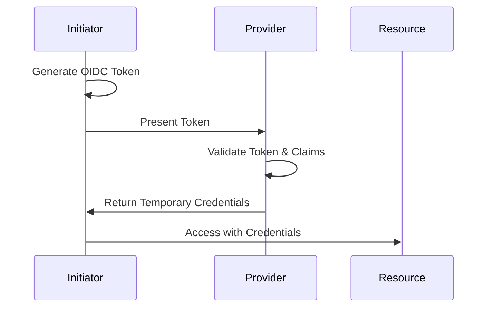

# [Provider Name] - Secretless Authentication

[1-2 sentence overview of what this provider is and why secretless auth matters for it]

## Overview

[2-3 paragraphs explaining]:
- What secretless authentication means for this provider
- The authentication mechanism used (OIDC, Workload Identity, etc.)
- Key benefits specific to this provider

## How It Works

[Architecture explanation]



**Key Components:**
- **Component 1**: Description
- **Component 2**: Description
- **Component 3**: Description

## Configuration Requirements

### Prerequisites

- Prerequisite 1
- Prerequisite 2
- Prerequisite 3

### Required Attributes

Document the key attributes/properties that must be configured:

| Attribute | Description | Example | Required |
|-----------|-------------|---------|----------|
| `attribute_name` | What it does | `example-value` | Yes |
| `attribute_name_2` | What it does | `example-value` | No |

### Trust Policy Selectors

Document available selectors/claims that can be used in trust policies:

| Selector | Description | Example Value | Use Case |
|----------|-------------|---------------|----------|
| `claim.iss` | Token issuer | `https://token.issuer.url` | Verify token source |
| `claim.sub` | Subject identifier | `repo:org/repo:ref:refs/heads/main` | Filter by repository/workflow |
| `claim.aud` | Audience | `https://provider.example.com` | Validate intended recipient |

## SDK and CLI Usage

### Environment Variables

Document environment variables that SDKs/CLIs use:

| Variable | Description | Example | SDK Support |
|----------|-------------|---------|-------------|
| `ENV_VAR_NAME` | What it configures | `value` | SDK Name v2+, CLI v1+ |
| `ENV_VAR_NAME_2` | What it configures | `value` | SDK Name v2+ |

### SDK Configuration

```javascript
// Code example showing SDK usage
const client = new ProviderSDK({
  // SDK configuration using environment variables
});

// Example operation
await client.operation();
```

### CLI Configuration

```bash
# Set environment variables
export ENV_VAR_NAME="value"

# Run CLI command
provider-cli command --option value
```

## Setup Guide

### Step 1: [First Configuration Step]

Detailed instructions for the first step:

```bash
# Commands or code
```

### Step 2: [Second Configuration Step]

Detailed instructions for the second step:

```bash
# Commands or code
```

### Step 3: [Third Configuration Step]

Detailed instructions for the third step:

```bash
# Commands or code
```

## Verification

How to verify the configuration is working:

```bash
# Test commands
provider-cli test-auth

# Expected output:
# Authentication successful
# Token accepted
```

## Best Practices

- **Use Specific Trust Conditions**: Narrow trust policies to specific repositories, branches, or workflows
- **Implement Least Privilege**: Grant only the minimum required permissions
- **Set Appropriate Token Lifetimes**: Use short-lived tokens when possible
- **Monitor Authentication Events**: Enable audit logging and set up alerts
- **Regular Policy Reviews**: Periodically review and update trust policies

## Security Considerations

:::danger Critical Security Settings
- **Validate Token Audience**: Always specify and validate the `aud` claim
- **Use Strong Subject Filters**: Don't use wildcard trust policies
- **Enable MFA When Available**: Require additional authentication factors for sensitive operations
:::

:::warning Important Reminders
- Tokens are bearer tokens - anyone with the token can use it
- Trust policies are evaluated during token exchange
- Misconfigured policies can grant unauthorized access
:::

## Troubleshooting

### Common Issue 1: Token Validation Fails

**Symptoms:**
- Error message: "Token validation failed"
- Authentication denied

**Solutions:**
1. Verify the issuer URL in trust policy matches the token issuer
2. Check that the audience claim matches expected value
3. Ensure token is not expired

### Common Issue 2: Insufficient Permissions

**Symptoms:**
- Authentication succeeds but operations fail
- Permission denied errors

**Solutions:**
1. Review and expand the permissions granted to the role
2. Check that trust policy allows the specific subject
3. Verify resource-level permissions

### Common Issue 3: Configuration Not Found

**Symptoms:**
- Provider doesn't recognize the identity provider
- Missing configuration errors

**Solutions:**
1. Ensure OIDC provider is properly registered
2. Verify issuer URL is exactly correct (trailing slashes matter)
3. Check that configuration has propagated (may take a few minutes)

## Related Integration Guides

Choose this provider for secretless authentication from:

### CI/CD Tools
- [GitHub Actions → Provider](../guides/github-actions-to-provider.md)
- [GitLab CI → Provider](../guides/gitlab-to-provider.md)
- [Buildkite → Provider](../guides/buildkite-to-provider.md)

### Infrastructure as Code
- [Terraform Cloud → Provider](../guides/terraform-cloud-to-provider.md)

### Runtime Environments
- [Kubernetes → Provider](../guides/kubernetes-to-provider.md)

## Additional Resources

- [Official Provider Documentation](https://provider.example.com/docs)
- [API Reference](https://provider.example.com/api)
- [OIDC Specification](https://openid.net/specs/openid-connect-core-1_0.html)
- [Security Best Practices Guide](https://provider.example.com/security)
