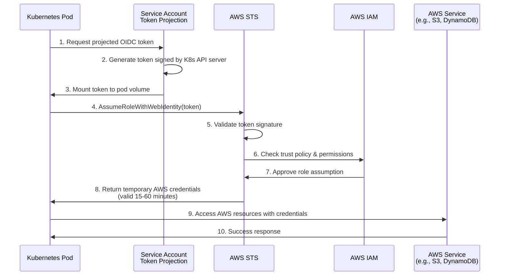

# Kubernetes to AWS - Secretless Authentication

Connect Kubernetes workloads to AWS using IAM Roles for Service Accounts (IRSA) for secretless authentication - no long-lived credentials required.

## Overview

This guide shows how to configure Kubernetes pods to authenticate with AWS services using OIDC tokens instead of storing AWS access keys. This works with both Amazon EKS clusters (which have built-in IRSA support) and self-managed Kubernetes clusters (with additional configuration).

**Time Required**: 20-30 minutes (EKS), 45-60 minutes (self-managed)
**Difficulty**: Intermediate

### What You'll Accomplish

- ✓ Configure AWS IAM to trust your Kubernetes cluster's OIDC tokens
- ✓ Create an IAM role that pods can assume
- ✓ Set up Kubernetes ServiceAccount with AWS role annotation
- ✓ Deploy a pod that can access AWS services without credentials
- ✓ Test and verify the end-to-end authentication flow

### Benefits

- **No Stored Credentials**: Zero AWS access keys stored in Kubernetes secrets
- **Automatic Rotation**: Tokens are generated on-demand and expire automatically
- **Fine-Grained Access**: IAM policies provide precise control over AWS resource access
- **Audit Trail**: Complete authentication history in AWS CloudTrail
- **Pod-Level Security**: Different pods can have different AWS permissions

## Prerequisites

### AWS Requirements

- AWS account with IAM administrator access
- EKS cluster (for built-in IRSA) **OR** self-managed Kubernetes cluster with OIDC issuer configured
- AWS CLI installed and configured
- `eksctl` (optional, for EKS simplified setup)

### Kubernetes Requirements

- Kubernetes cluster version 1.12+ (1.20+ recommended)
- `kubectl` configured to access your cluster
- Cluster admin permissions
- For self-managed clusters: API server configured with `--service-account-issuer`, `--service-account-signing-key-file`, and `--service-account-api-audiences` flags

### Knowledge Requirements

- Understanding of Kubernetes ServiceAccounts and RBAC
- Familiarity with AWS IAM roles and policies
- Basic understanding of OIDC authentication flows

## Architecture



**Flow Explanation:**

1. **Token Request**: Pod requests an OIDC token via projected ServiceAccount token
2. **Token Generation**: Kubernetes API server generates and signs a JWT with ServiceAccount claims
3. **Token Mounting**: Token is automatically mounted into the pod at a known path
4. **AWS Authentication**: AWS SDK uses token to call `AssumeRoleWithWebIdentity`
5. **Token Validation**: AWS STS validates the token using Kubernetes OIDC provider's public keys
6. **IAM Check**: AWS verifies the trust policy allows this ServiceAccount to assume the role
7. **Credential Issuance**: AWS STS returns temporary credentials (access key, secret key, session token)
8. **Resource Access**: Pod uses temporary credentials to access AWS services
9. **Automatic Refresh**: AWS SDK automatically refreshes credentials before expiration

## Implementation

### Option A: Amazon EKS with IRSA (Recommended)

Amazon EKS clusters have built-in support for IRSA, making setup much simpler.

#### Step 1: Verify EKS OIDC Provider

Check if your EKS cluster already has an OIDC provider:

```bash
# Get your cluster's OIDC issuer URL
aws eks describe-cluster --name my-cluster --query "cluster.identity.oidc.issuer" --output text

# Example output:
# https://oidc.eks.us-east-1.amazonaws.com/id/EXAMPLED539D4633E53DE1B71EXAMPLE
```

List OIDC providers in IAM:

```bash
aws iam list-open-id-connect-providers
```

If your cluster's issuer URL is not in the list, create it:

**Using eksctl (easiest):**

```bash
eksctl utils associate-iam-oidc-provider \
  --cluster my-cluster \
  --region us-east-1 \
  --approve
```

**Using AWS CLI:**

```bash
# Extract OIDC ID from issuer URL
OIDC_ID=$(aws eks describe-cluster --name my-cluster --query "cluster.identity.oidc.issuer" --output text | cut -d '/' -f 5)

# Get thumbprint
THUMBPRINT=$(echo | openssl s_client -servername oidc.eks.us-east-1.amazonaws.com -connect oidc.eks.us-east-1.amazonaws.com:443 2>/dev/null | openssl x509 -fingerprint -noout -sha1 | sed 's/://g' | awk -F= '{print tolower($2)}')

# Create OIDC provider
aws iam create-open-id-connect-provider \
  --url https://oidc.eks.us-east-1.amazonaws.com/id/$OIDC_ID \
  --client-id-list sts.amazonaws.com \
  --thumbprint-list $THUMBPRINT
```

#### Step 2: Create IAM Trust Policy

Create `trust-policy.json`:

```json
{
  "Version": "2012-10-17",
  "Statement": [
    {
      "Effect": "Allow",
      "Principal": {
        "Federated": "arn:aws:iam::123456789012:oidc-provider/oidc.eks.us-east-1.amazonaws.com/id/EXAMPLED539D4633E53DE1B71EXAMPLE"
      },
      "Action": "sts:AssumeRoleWithWebIdentity",
      "Condition": {
        "StringEquals": {
          "oidc.eks.us-east-1.amazonaws.com/id/EXAMPLED539D4633E53DE1B71EXAMPLE:sub": "system:serviceaccount:default:my-app",
          "oidc.eks.us-east-1.amazonaws.com/id/EXAMPLED539D4633E53DE1B71EXAMPLE:aud": "sts.amazonaws.com"
        }
      }
    }
  ]
}
```

**Important**: Replace:
- `123456789012` with your AWS account ID
- `EXAMPLED539D4633E53DE1B71EXAMPLE` with your actual OIDC provider ID
- `default` with your namespace
- `my-app` with your ServiceAccount name

**Subject Claim Patterns:**

| Pattern | Description | Security Level |
|---------|-------------|----------------|
| `system:serviceaccount:default:my-app` | Specific ServiceAccount in specific namespace | ✓✓✓ Highest (Recommended) |
| `system:serviceaccount:default:*` | All ServiceAccounts in namespace | ✓✓ Medium |
| `system:serviceaccount:*:my-app` | ServiceAccount across all namespaces | ✓ Low |

:::warning Security Best Practice
Always use the most specific subject claim pattern. Never use wildcards for both namespace and ServiceAccount name in production.
:::

#### Step 3: Create IAM Role

```bash
# Create the role with trust policy
aws iam create-role \
  --role-name my-app-role \
  --assume-role-policy-document file://trust-policy.json \
  --description "Role for my-app pod to access AWS services"

# Get the role ARN (save this for Step 4)
aws iam get-role --role-name my-app-role --query 'Role.Arn' --output text
```

#### Step 4: Attach IAM Permissions

Create `permissions-policy.json` with least-privilege permissions:

```json
{
  "Version": "2012-10-17",
  "Statement": [
    {
      "Effect": "Allow",
      "Action": [
        "s3:GetObject",
        "s3:PutObject",
        "s3:ListBucket"
      ],
      "Resource": [
        "arn:aws:s3:::my-bucket",
        "arn:aws:s3:::my-bucket/*"
      ]
    }
  ]
}
```

Attach policy to role:

```bash
# Create policy
aws iam put-role-policy \
  --role-name my-app-role \
  --policy-name my-app-permissions \
  --policy-document file://permissions-policy.json

# Or attach an existing managed policy
aws iam attach-role-policy \
  --role-name my-app-role \
  --policy-arn arn:aws:iam::aws:policy/AmazonS3ReadOnlyAccess
```

#### Step 5: Create Kubernetes ServiceAccount

Create `serviceaccount.yaml`:

```yaml
apiVersion: v1
kind: ServiceAccount
metadata:
  name: my-app
  namespace: default
  annotations:
    eks.amazonaws.com/role-arn: arn:aws:iam::123456789012:role/my-app-role
```

Apply it:

```bash
kubectl apply -f serviceaccount.yaml
```

**Using eksctl (alternative):**

```bash
eksctl create iamserviceaccount \
  --name my-app \
  --namespace default \
  --cluster my-cluster \
  --role-name my-app-role \
  --attach-policy-arn arn:aws:iam::aws:policy/AmazonS3ReadOnlyAccess \
  --approve
```

#### Step 6: Deploy Pod Using ServiceAccount

Create `pod.yaml`:

```yaml
apiVersion: v1
kind: Pod
metadata:
  name: my-app-pod
  namespace: default
spec:
  serviceAccountName: my-app
  containers:
  - name: app
    image: amazon/aws-cli:latest
    command:
      - sleep
      - "3600"
    # AWS SDK automatically uses IRSA via environment variables
    # No additional configuration needed!
```

Deploy:

```bash
kubectl apply -f pod.yaml
```

### Option B: Self-Managed Kubernetes Cluster

For self-managed clusters, additional setup is required.

#### Step 1: Configure Kubernetes API Server

Ensure your API server has these flags:

```bash
--service-account-issuer=https://your-cluster-oidc-issuer.example.com
--service-account-signing-key-file=/path/to/sa-signing-key.pem
--service-account-api-audiences=sts.amazonaws.com
```

The issuer URL must be:
- Publicly accessible via HTTPS
- Serve the OIDC discovery document at `/.well-known/openid-configuration`
- Serve the public signing keys (JWKS) at `/openid/v1/jwks`

#### Step 2: Set Up OIDC Discovery Endpoint

You need to expose your cluster's OIDC discovery endpoints. Options:

**Option 1: Use AWS S3 + CloudFront**

```bash
# Create S3 bucket for OIDC discovery
aws s3 mb s3://my-cluster-oidc --region us-east-1
aws s3api put-bucket-acl --bucket my-cluster-oidc --acl public-read

# Generate OIDC discovery document
cat > discovery.json <<EOF
{
  "issuer": "https://my-cluster-oidc.s3.us-east-1.amazonaws.com",
  "jwks_uri": "https://my-cluster-oidc.s3.us-east-1.amazonaws.com/openid/v1/jwks",
  "authorization_endpoint": "urn:kubernetes:programmatic_authorization",
  "response_types_supported": ["id_token"],
  "subject_types_supported": ["public"],
  "id_token_signing_alg_values_supported": ["RS256"],
  "claims_supported": ["sub", "iss"]
}
EOF

# Extract JWKS from API server
kubectl get --raw /openid/v1/jwks > jwks.json

# Upload to S3
aws s3 cp discovery.json s3://my-cluster-oidc/.well-known/openid-configuration --acl public-read
aws s3 cp jwks.json s3://my-cluster-oidc/openid/v1/jwks --acl public-read
```

**Option 2: Use a dedicated service**

Tools like [kube-oidc-proxy](https://github.com/jetstack/kube-oidc-proxy) can help expose OIDC endpoints.

#### Step 3-6: Follow EKS Steps

Once your OIDC discovery endpoint is set up, follow Steps 2-6 from the EKS section above, using your custom issuer URL instead of the EKS OIDC URL.

## Testing and Verification

### Verify ServiceAccount Configuration

```bash
# Check ServiceAccount annotation
kubectl get serviceaccount my-app -n default -o yaml | grep eks.amazonaws.com/role-arn

# Expected output:
# eks.amazonaws.com/role-arn: arn:aws:iam::123456789012:role/my-app-role
```

### Verify Pod Environment Variables

```bash
# Check environment variables injected by IRSA webhook
kubectl exec my-app-pod -- env | grep AWS

# Expected output:
# AWS_ROLE_ARN=arn:aws:iam::123456789012:role/my-app-role
# AWS_WEB_IDENTITY_TOKEN_FILE=/var/run/secrets/eks.amazonaws.com/serviceaccount/token
# AWS_REGION=us-east-1 (if configured)
```

### Verify Token Projection

```bash
# Check if token file exists
kubectl exec my-app-pod -- ls -la /var/run/secrets/eks.amazonaws.com/serviceaccount/

# View token (DO NOT do this in production - for testing only)
kubectl exec my-app-pod -- cat /var/run/secrets/eks.amazonaws.com/serviceaccount/token
```

### Test AWS Authentication

```bash
# Get AWS caller identity (verifies authentication)
kubectl exec my-app-pod -- aws sts get-caller-identity

# Expected output:
# {
#     "UserId": "AROAEXAMPLE:botocore-session-1234567890",
#     "Account": "123456789012",
#     "Arn": "arn:aws:sts::123456789012:assumed-role/my-app-role/botocore-session-1234567890"
# }
```

### Test Resource Access

```bash
# Test S3 access (adjust based on your permissions)
kubectl exec my-app-pod -- aws s3 ls s3://my-bucket/

# Expected: List of objects in bucket
```

### Expected Success Output

```
✓ ServiceAccount has role-arn annotation
✓ Pod has AWS_ROLE_ARN environment variable
✓ Pod has AWS_WEB_IDENTITY_TOKEN_FILE environment variable
✓ Token file exists at /var/run/secrets/eks.amazonaws.com/serviceaccount/token
✓ aws sts get-caller-identity returns assumed-role ARN
✓ Pod can access AWS resources per IAM policy
```

## Production Hardening

### Security Best Practices

#### 1. Use Namespace Isolation

Create dedicated namespaces for different environments:

```yaml
apiVersion: v1
kind: Namespace
metadata:
  name: production
---
apiVersion: v1
kind: ServiceAccount
metadata:
  name: my-app
  namespace: production  # Isolated namespace
  annotations:
    eks.amazonaws.com/role-arn: arn:aws:iam::123456789012:role/my-app-prod-role
```

#### 2. Implement Least Privilege IAM Policies

**Don't do this:**
```json
{
  "Effect": "Allow",
  "Action": "s3:*",
  "Resource": "*"
}
```

**Do this:**
```json
{
  "Effect": "Allow",
  "Action": [
    "s3:GetObject",
    "s3:PutObject"
  ],
  "Resource": "arn:aws:s3:::my-bucket/my-app/*"
}
```

#### 3. Validate Subject Claim Precisely

**Trust policy conditions:**

```json
{
  "StringEquals": {
    "oidc.eks.region.amazonaws.com/id/XXXXXX:sub": "system:serviceaccount:production:my-app",
    "oidc.eks.region.amazonaws.com/id/XXXXXX:aud": "sts.amazonaws.com"
  }
}
```

#### 4. Use Kubernetes RBAC

Restrict which users/services can create pods using privileged ServiceAccounts:

```yaml
apiVersion: rbac.authorization.k8s.io/v1
kind: Role
metadata:
  name: use-my-app-sa
  namespace: production
rules:
- apiGroups: [""]
  resources: ["serviceaccounts"]
  resourceNames: ["my-app"]
  verbs: ["use"]
---
apiVersion: rbac.authorization.k8s.io/v1
kind: RoleBinding
metadata:
  name: developers-use-my-app-sa
  namespace: production
roleRef:
  apiGroup: rbac.authorization.k8s.io
  kind: Role
  name: use-my-app-sa
subjects:
- kind: Group
  name: developers
  apiGroup: rbac.authorization.k8s.io
```

#### 5. Enable AWS CloudTrail

Monitor IRSA usage:

```bash
# Enable CloudTrail for STS events
aws cloudtrail create-trail \
  --name irsa-audit-trail \
  --s3-bucket-name my-audit-bucket

# Start logging
aws cloudtrail start-logging --name irsa-audit-trail
```

### Recommended Trust Policy Template

```json
{
  "Version": "2012-10-17",
  "Statement": [
    {
      "Effect": "Allow",
      "Principal": {
        "Federated": "arn:aws:iam::ACCOUNT_ID:oidc-provider/oidc.eks.REGION.amazonaws.com/id/OIDC_ID"
      },
      "Action": "sts:AssumeRoleWithWebIdentity",
      "Condition": {
        "StringEquals": {
          "oidc.eks.REGION.amazonaws.com/id/OIDC_ID:sub": "system:serviceaccount:NAMESPACE:SERVICEACCOUNT_NAME",
          "oidc.eks.REGION.amazonaws.com/id/OIDC_ID:aud": "sts.amazonaws.com"
        },
        "StringLike": {
          "oidc.eks.REGION.amazonaws.com/id/OIDC_ID:sub": "system:serviceaccount:NAMESPACE:*"
        }
      }
    }
  ]
}
```

### Monitoring and Alerting

Set up CloudWatch alarms for:

```bash
# Unusual AssumeRoleWithWebIdentity activity
aws cloudwatch put-metric-alarm \
  --alarm-name unusual-irsa-activity \
  --alarm-description "Alert on unusual IRSA usage" \
  --metric-name AssumeRoleWithWebIdentity \
  --namespace AWS/STS \
  --statistic Sum \
  --period 300 \
  --threshold 100 \
  --comparison-operator GreaterThanThreshold
```

Monitor:
- Failed `AssumeRoleWithWebIdentity` attempts
- Access denied errors from pods
- Unusual spikes in credential requests
- ServiceAccount modifications

## Troubleshooting

### Issue: Pod Cannot Assume Role

**Symptoms:**
- Error: "An error occurred (AccessDenied) when calling the AssumeRoleWithWebIdentity operation"
- Environment variables missing

**Solutions:**

1. **Verify OIDC Provider Registration:**
   ```bash
   aws iam list-open-id-connect-providers
   # Ensure your cluster's OIDC issuer is listed
   ```

2. **Check Trust Policy:**
   ```bash
   aws iam get-role --role-name my-app-role --query 'Role.AssumeRolePolicyDocument'
   # Verify subject claim matches: system:serviceaccount:NAMESPACE:SA_NAME
   ```

3. **Verify ServiceAccount Annotation:**
   ```bash
   kubectl get sa my-app -n default -o jsonpath='{.metadata.annotations.eks\.amazonaws\.com/role-arn}'
   # Should return the IAM role ARN
   ```

4. **Check Webhook Mutation:**
   ```bash
   kubectl describe pod my-app-pod | grep -A 5 "Environment:"
   # Should show AWS_ROLE_ARN and AWS_WEB_IDENTITY_TOKEN_FILE
   ```

5. **Verify Pod Mutation Webhook is Running:**
   ```bash
   kubectl get mutatingwebhookconfigurations
   # Look for pod-identity-webhook
   ```

### Issue: Token File Not Found

**Symptoms:**
- Error: "Unable to locate credentials"
- Token file doesn't exist

**Solutions:**

1. **Check Token Volume Mount:**
   ```bash
   kubectl get pod my-app-pod -o yaml | grep -A 10 "volumes:"
   # Should show projected ServiceAccount token volume
   ```

2. **Verify Kubernetes Version:**
   ```bash
   kubectl version --short
   # Requires 1.12+ for token projection
   ```

3. **Manual Token Projection (if needed):**
   ```yaml
   volumes:
   - name: aws-iam-token
     projected:
       sources:
       - serviceAccountToken:
           path: token
           expirationSeconds: 86400
           audience: sts.amazonaws.com
   ```

### Issue: Access Denied to AWS Resources

**Symptoms:**
- Authentication succeeds but operations fail
- Error: "User: arn:aws:sts::123456789012:assumed-role/my-app-role/... is not authorized to perform: ..."

**Solutions:**

1. **Verify IAM Policy:**
   ```bash
   aws iam list-attached-role-policies --role-name my-app-role
   aws iam get-role-policy --role-name my-app-role --policy-name my-app-permissions
   ```

2. **Test Permissions:**
   ```bash
   # Simulate IAM policy
   aws iam simulate-principal-policy \
     --policy-source-arn arn:aws:iam::123456789012:role/my-app-role \
     --action-names s3:GetObject \
     --resource-arns arn:aws:s3:::my-bucket/myfile.txt
   ```

3. **Check Resource Policies:**
   ```bash
   # For S3, check bucket policy
   aws s3api get-bucket-policy --bucket my-bucket
   ```

### Issue: Token Expired Too Quickly

**Symptoms:**
- Credentials expire during long-running operations
- Frequent "Token expired" errors

**Solutions:**

1. **Increase Token Duration (Kubernetes side):**
   ```yaml
   volumes:
   - name: aws-iam-token
     projected:
       sources:
       - serviceAccountToken:
           expirationSeconds: 7200  # 2 hours
   ```

2. **Configure AWS SDK Token Refresh:**
   Most AWS SDKs automatically refresh, but verify:
   ```python
   # Python boto3 example
   import boto3
   # boto3 automatically refreshes tokens from AWS_WEB_IDENTITY_TOKEN_FILE
   s3 = boto3.client('s3')
   ```

## Complete Example

### Complete Terraform Configuration

```hcl
# complete-irsa-setup.tf

terraform {
  required_providers {
    aws = {
      source  = "hashicorp/aws"
      version = "~> 5.0"
    }
    kubernetes = {
      source  = "hashicorp/kubernetes"
      version = "~> 2.0"
    }
  }
}

provider "aws" {
  region = "us-east-1"
}

# Get EKS cluster info
data "aws_eks_cluster" "cluster" {
  name = "my-cluster"
}

data "aws_eks_cluster_auth" "cluster" {
  name = "my-cluster"
}

provider "kubernetes" {
  host                   = data.aws_eks_cluster.cluster.endpoint
  cluster_ca_certificate = base64decode(data.aws_eks_cluster.cluster.certificate_authority[0].data)
  token                  = data.aws_eks_cluster_auth.cluster.token
}

# Extract OIDC provider info
locals {
  oidc_issuer_url = data.aws_eks_cluster.cluster.identity[0].oidc[0].issuer
  oidc_provider_arn = "arn:aws:iam::${data.aws_caller_identity.current.account_id}:oidc-provider/${replace(local.oidc_issuer_url, "https://", "")}"
  oidc_provider = replace(local.oidc_issuer_url, "https://", "")
}

data "aws_caller_identity" "current" {}

# Create IAM role
resource "aws_iam_role" "my_app" {
  name = "my-app-role"

  assume_role_policy = jsonencode({
    Version = "2012-10-17"
    Statement = [
      {
        Effect = "Allow"
        Principal = {
          Federated = local.oidc_provider_arn
        }
        Action = "sts:AssumeRoleWithWebIdentity"
        Condition = {
          StringEquals = {
            "${local.oidc_provider}:sub" = "system:serviceaccount:default:my-app"
            "${local.oidc_provider}:aud" = "sts.amazonaws.com"
          }
        }
      }
    ]
  })
}

# Attach permissions policy
resource "aws_iam_role_policy" "my_app_permissions" {
  name = "my-app-permissions"
  role = aws_iam_role.my_app.id

  policy = jsonencode({
    Version = "2012-10-17"
    Statement = [
      {
        Effect = "Allow"
        Action = [
          "s3:GetObject",
          "s3:PutObject",
          "s3:ListBucket"
        ]
        Resource = [
          "arn:aws:s3:::my-bucket",
          "arn:aws:s3:::my-bucket/*"
        ]
      }
    ]
  })
}

# Create Kubernetes ServiceAccount
resource "kubernetes_service_account" "my_app" {
  metadata {
    name      = "my-app"
    namespace = "default"
    annotations = {
      "eks.amazonaws.com/role-arn" = aws_iam_role.my_app.arn
    }
  }
}

# Create test pod
resource "kubernetes_pod" "my_app_test" {
  metadata {
    name      = "my-app-test-pod"
    namespace = "default"
  }

  spec {
    service_account_name = kubernetes_service_account.my_app.metadata[0].name

    container {
      name  = "aws-cli"
      image = "amazon/aws-cli:latest"
      command = ["sleep", "3600"]
    }
  }
}

# Outputs
output "role_arn" {
  value = aws_iam_role.my_app.arn
}

output "serviceaccount_name" {
  value = kubernetes_service_account.my_app.metadata[0].name
}
```

Apply:

```bash
terraform init
terraform plan
terraform apply
```

### Complete kubectl Configuration

```bash
#!/bin/bash
# complete-irsa-setup.sh

set -e

CLUSTER_NAME="my-cluster"
REGION="us-east-1"
NAMESPACE="default"
SA_NAME="my-app"
ROLE_NAME="my-app-role"
ACCOUNT_ID=$(aws sts get-caller-identity --query Account --output text)

echo "Step 1: Creating OIDC provider for EKS cluster..."
eksctl utils associate-iam-oidc-provider \
  --cluster $CLUSTER_NAME \
  --region $REGION \
  --approve

OIDC_ID=$(aws eks describe-cluster --name $CLUSTER_NAME --query "cluster.identity.oidc.issuer" --output text | cut -d '/' -f 5)
echo "✓ OIDC Provider ID: $OIDC_ID"

echo "Step 2: Creating IAM trust policy..."
cat > trust-policy.json <<EOF
{
  "Version": "2012-10-17",
  "Statement": [
    {
      "Effect": "Allow",
      "Principal": {
        "Federated": "arn:aws:iam::${ACCOUNT_ID}:oidc-provider/oidc.eks.${REGION}.amazonaws.com/id/${OIDC_ID}"
      },
      "Action": "sts:AssumeRoleWithWebIdentity",
      "Condition": {
        "StringEquals": {
          "oidc.eks.${REGION}.amazonaws.com/id/${OIDC_ID}:sub": "system:serviceaccount:${NAMESPACE}:${SA_NAME}",
          "oidc.eks.${REGION}.amazonaws.com/id/${OIDC_ID}:aud": "sts.amazonaws.com"
        }
      }
    }
  ]
}
EOF

echo "Step 3: Creating IAM role..."
aws iam create-role \
  --role-name $ROLE_NAME \
  --assume-role-policy-document file://trust-policy.json \
  --description "IRSA role for $SA_NAME" || echo "Role may already exist"

ROLE_ARN="arn:aws:iam::${ACCOUNT_ID}:role/${ROLE_NAME}"
echo "✓ Role ARN: $ROLE_ARN"

echo "Step 4: Attaching permissions policy..."
cat > permissions-policy.json <<EOF
{
  "Version": "2012-10-17",
  "Statement": [
    {
      "Effect": "Allow",
      "Action": [
        "s3:GetObject",
        "s3:PutObject",
        "s3:ListBucket"
      ],
      "Resource": [
        "arn:aws:s3:::my-bucket",
        "arn:aws:s3:::my-bucket/*"
      ]
    }
  ]
}
EOF

aws iam put-role-policy \
  --role-name $ROLE_NAME \
  --policy-name "${ROLE_NAME}-permissions" \
  --policy-document file://permissions-policy.json

echo "✓ Permissions attached"

echo "Step 5: Creating Kubernetes ServiceAccount..."
kubectl create serviceaccount $SA_NAME -n $NAMESPACE --dry-run=client -o yaml | \
  kubectl annotate --local -f - -o yaml \
    eks.amazonaws.com/role-arn=$ROLE_ARN | \
  kubectl apply -f -

echo "✓ ServiceAccount created"

echo "Step 6: Deploying test pod..."
cat <<EOF | kubectl apply -f -
apiVersion: v1
kind: Pod
metadata:
  name: my-app-test-pod
  namespace: $NAMESPACE
spec:
  serviceAccountName: $SA_NAME
  containers:
  - name: aws-cli
    image: amazon/aws-cli:latest
    command: ["sleep", "3600"]
EOF

echo "✓ Test pod deployed"

echo ""
echo "==================================="
echo "Setup Complete!"
echo "==================================="
echo ""
echo "Test the integration:"
echo "  kubectl exec my-app-test-pod -- aws sts get-caller-identity"
echo "  kubectl exec my-app-test-pod -- aws s3 ls s3://my-bucket/"
```

## Next Steps

### Expand Your Implementation

- **Multiple environments**: Create separate ServiceAccounts and roles for dev/staging/production
- **Different AWS services**: Add IAM policies for RDS, DynamoDB, SNS, etc.
- **Cross-account access**: Configure trust policies for accessing resources in other AWS accounts
- **Monitoring**: Set up CloudWatch dashboards for IRSA usage

### Related Guides

- [Kubernetes → GCP](./kubernetes-to-gcp.md)
- [Kubernetes → Azure](./kubernetes-to-azure.md)
- [Kubernetes → Vault](./kubernetes-to-vault.md)

### Learn More

- **Kubernetes Initiator Documentation**: [Learn about Kubernetes workload identity](../initiators/compute-runtime/kubernetes.md)
- **AWS Provider Documentation**: [Learn about AWS OIDC setup](../providers/aws/oidc-setup.md)

## Additional Resources

### Official Documentation

- [AWS - EKS IAM Roles for Service Accounts](https://docs.aws.amazon.com/eks/latest/userguide/iam-roles-for-service-accounts.html)
- [AWS - Using IAM Roles with OIDC](https://docs.aws.amazon.com/IAM/latest/UserGuide/id_roles_providers_create_oidc.html)
- [Kubernetes - Service Account Token Projection](https://kubernetes.io/docs/tasks/configure-pod-container/configure-service-account/#service-account-token-volume-projection)
- [AWS SDK - AssumeRoleWithWebIdentity](https://docs.aws.amazon.com/STS/latest/APIReference/API_AssumeRoleWithWebIdentity.html)

### Tools

- [eksctl](https://eksctl.io/) - EKS cluster management tool
- [AWS IAM Policy Simulator](https://policysim.aws.amazon.com/) - Test IAM policies
- [jwt.io](https://jwt.io) - JWT decoder and validator

### Blog Posts & Tutorials

- [AWS Blog: Introducing IAM Roles for Service Accounts](https://aws.amazon.com/blogs/opensource/introducing-fine-grained-iam-roles-service-accounts/)
- [AWS Workshop: EKS Security Best Practices](https://www.eksworkshop.com/beginner/110_irsa/)
