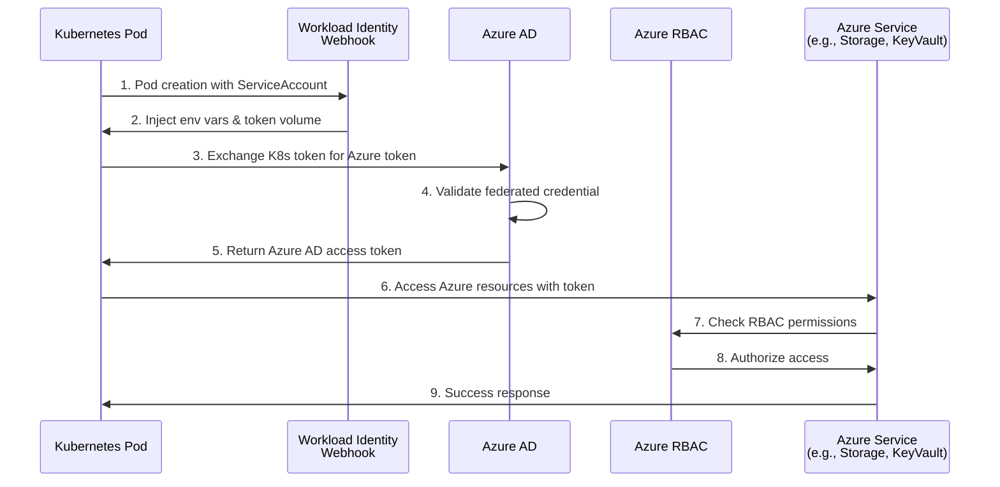

# Kubernetes to Azure - Secretless Authentication

Connect Kubernetes workloads to Azure using AKS Workload Identity for secretless authentication - no service principal secrets required.

## Overview

This guide shows how to configure Kubernetes pods running on AKS to authenticate with Azure services using Workload Identity instead of storing service principal credentials.

**Time Required**: 25-35 minutes
**Difficulty**: Intermediate

### What You'll Accomplish

- ✓ Enable AKS Workload Identity on your cluster
- ✓ Create an Azure Managed Identity with appropriate permissions
- ✓ Configure federated credentials linking K8s ServiceAccount to Azure identity
- ✓ Deploy a pod that can access Azure services without credentials
- ✓ Test and verify the end-to-end authentication flow

### Benefits

- **No Stored Secrets**: Zero service principal passwords/certificates stored in Kubernetes
- **Automatic Token Refresh**: Identity tokens are generated on-demand and expire automatically
- **Fine-Grained Access**: Azure RBAC provides precise control over resource access
- **Audit Trail**: Complete authentication history in Azure Activity Log
- **Pod-Level Security**: Different pods can have different Azure permissions

## Prerequisites

### Azure Requirements

- Azure subscription with appropriate permissions
- AKS cluster (version 1.22+ recommended)
- Azure CLI (`az`) installed and configured
- Permissions to create managed identities and assign RBAC roles

### Kubernetes Requirements

- AKS cluster with OIDC issuer and workload identity enabled
- `kubectl` configured to access your cluster
- Cluster admin permissions

### Knowledge Requirements

- Understanding of Kubernetes ServiceAccounts
- Familiarity with Azure Managed Identities and RBAC
- Basic understanding of OIDC authentication flows

## Architecture



## Implementation

### Step 1: Enable Workload Identity on AKS Cluster

#### For New Clusters

```bash
az aks create \
  --resource-group myResourceGroup \
  --name myAKSCluster \
  --location eastus \
  --node-count 1 \
  --enable-oidc-issuer \
  --enable-workload-identity \
  --generate-ssh-keys
```

#### For Existing Clusters

```bash
# Enable OIDC issuer
az aks update \
  --resource-group myResourceGroup \
  --name myAKSCluster \
  --enable-oidc-issuer \
  --enable-workload-identity
```

Get the OIDC issuer URL (save for later):

```bash
az aks show \
  --resource-group myResourceGroup \
  --name myAKSCluster \
  --query "oidcIssuerProfile.issuerUrl" \
  --output tsv

# Example output:
# https://eastus.oic.prod-aks.azure.com/00000000-0000-0000-0000-000000000000/aaaaaaaa-aaaa-aaaa-aaaa-aaaaaaaaaaaa/
```

### Step 2: Install Workload Identity Webhook (if not auto-installed)

Check if webhook is installed:

```bash
kubectl get pods -n kube-system | grep workload-identity
```

If not present, install:

```bash
# The webhook is typically installed automatically with --enable-workload-identity
# For manual installation:
helm repo add azure-workload-identity https://azure.github.io/azure-workload-identity/charts
helm repo update
helm install workload-identity-webhook azure-workload-identity/workload-identity-webhook \
   --namespace azure-workload-identity-system \
   --create-namespace
```

### Step 3: Create Azure Managed Identity

```bash
# Set variables
export RESOURCE_GROUP="myResourceGroup"
export LOCATION="eastus"
export IDENTITY_NAME="my-app-identity"
export SUBSCRIPTION="$(az account show --query id --output tsv)"

# Create managed identity
az identity create \
  --resource-group $RESOURCE_GROUP \
  --name $IDENTITY_NAME \
  --location $LOCATION

# Get identity client ID (save for later)
export IDENTITY_CLIENT_ID=$(az identity show \
  --resource-group $RESOURCE_GROUP \
  --name $IDENTITY_NAME \
  --query clientId \
  --output tsv)

echo "Identity Client ID: $IDENTITY_CLIENT_ID"
```

### Step 4: Assign Azure RBAC Permissions

Grant the managed identity permissions to access Azure resources:

```bash
# Example: Grant Storage Blob Data Reader role
az role assignment create \
  --assignee $IDENTITY_CLIENT_ID \
  --role "Storage Blob Data Reader" \
  --scope "/subscriptions/$SUBSCRIPTION/resourceGroups/$RESOURCE_GROUP"

# Example: Grant Key Vault Secrets User role
az role assignment create \
  --assignee $IDENTITY_CLIENT_ID \
  --role "Key Vault Secrets User" \
  --scope "/subscriptions/$SUBSCRIPTION/resourceGroups/$RESOURCE_GROUP/providers/Microsoft.KeyVault/vaults/my-keyvault"
```

**Common Azure roles:**

| Use Case | Role | Description |
|----------|------|-------------|
| Read blob storage | `Storage Blob Data Reader` | Read blobs and containers |
| Write blob storage | `Storage Blob Data Contributor` | Read/write blobs |
| Access Key Vault secrets | `Key Vault Secrets User` | Read secret values |
| Query Cosmos DB | `Cosmos DB Account Reader Role` | Read Cosmos DB account |
| Read SQL Database | `SQL DB Contributor` | Manage SQL databases |

### Step 5: Create Federated Credential

Link the Kubernetes ServiceAccount to the Azure Managed Identity:

```bash
# Set K8s ServiceAccount details
export SERVICE_ACCOUNT_NAME="my-app-ksa"
export SERVICE_ACCOUNT_NAMESPACE="default"

# Get AKS OIDC issuer URL
export AKS_OIDC_ISSUER="$(az aks show \
  --resource-group $RESOURCE_GROUP \
  --name myAKSCluster \
  --query "oidcIssuerProfile.issuerUrl" \
  --output tsv)"

# Create federated credential
az identity federated-credential create \
  --name my-app-federated-credential \
  --identity-name $IDENTITY_NAME \
  --resource-group $RESOURCE_GROUP \
  --issuer $AKS_OIDC_ISSUER \
  --subject system:serviceaccount:${SERVICE_ACCOUNT_NAMESPACE}:${SERVICE_ACCOUNT_NAME} \
  --audience api://AzureADTokenExchange
```

Verify:

```bash
az identity federated-credential list \
  --identity-name $IDENTITY_NAME \
  --resource-group $RESOURCE_GROUP \
  --output table
```

### Step 6: Create Kubernetes ServiceAccount

```yaml
# serviceaccount.yaml
apiVersion: v1
kind: ServiceAccount
metadata:
  name: my-app-ksa
  namespace: default
  annotations:
    azure.workload.identity/client-id: YOUR_IDENTITY_CLIENT_ID
  labels:
    azure.workload.identity/use: "true"
```

Apply:

```bash
# Replace with actual client ID
sed "s/YOUR_IDENTITY_CLIENT_ID/$IDENTITY_CLIENT_ID/g" serviceaccount.yaml | kubectl apply -f -
```

### Step 7: Deploy Pod Using ServiceAccount

```yaml
# pod.yaml
apiVersion: v1
kind: Pod
metadata:
  name: my-app-pod
  namespace: default
  labels:
    azure.workload.identity/use: "true"  # Required for webhook injection
spec:
  serviceAccountName: my-app-ksa
  containers:
  - name: azure-cli
    image: mcr.microsoft.com/azure-cli:latest
    command: ["sleep", "3600"]
    # Azure SDK automatically uses Workload Identity via injected env vars
```

Deploy:

```bash
kubectl apply -f pod.yaml
```

## Testing and Verification

### Verify ServiceAccount Configuration

```bash
# Check annotations and labels
kubectl get serviceaccount my-app-ksa -n default -o yaml

# Expected output includes:
# annotations:
#   azure.workload.identity/client-id: YOUR_CLIENT_ID
# labels:
#   azure.workload.identity/use: "true"
```

### Verify Pod Environment Variables

The workload identity webhook should inject these:

```bash
kubectl exec my-app-pod -- env | grep AZURE

# Expected output:
# AZURE_CLIENT_ID=YOUR_CLIENT_ID
# AZURE_TENANT_ID=YOUR_TENANT_ID
# AZURE_FEDERATED_TOKEN_FILE=/var/run/secrets/azure/tokens/azure-identity-token
# AZURE_AUTHORITY_HOST=https://login.microsoftonline.com/
```

### Verify Token File

```bash
kubectl exec my-app-pod -- ls -la /var/run/secrets/azure/tokens/

# Should show azure-identity-token file
```

### Test Azure Authentication

```bash
# Login using managed identity
kubectl exec my-app-pod -- az login --identity

# Get current identity
kubectl exec my-app-pod -- az account show

# Expected output shows managed identity details
```

### Test Resource Access

```bash
# List storage accounts
kubectl exec my-app-pod -- az storage account list

# Access Key Vault secret
kubectl exec my-app-pod -- az keyvault secret show \
  --vault-name my-keyvault \
  --name my-secret

# List resource groups (if permissions granted)
kubectl exec my-app-pod -- az group list
```

### Expected Success Output

```
✓ ServiceAccount has azure.workload.identity annotations
✓ Pod has azure.workload.identity/use label
✓ Pod has AZURE_CLIENT_ID, AZURE_TENANT_ID, AZURE_FEDERATED_TOKEN_FILE env vars
✓ Token file exists at /var/run/secrets/azure/tokens/azure-identity-token
✓ az login --identity succeeds
✓ Pod can access Azure resources per RBAC assignments
```

## Production Hardening

### Security Best Practices

#### 1. Use Namespace Isolation

```yaml
apiVersion: v1
kind: Namespace
metadata:
  name: production
---
apiVersion: v1
kind: ServiceAccount
metadata:
  name: my-app-ksa
  namespace: production  # Isolated namespace
  annotations:
    azure.workload.identity/client-id: PROD_CLIENT_ID
  labels:
    azure.workload.identity/use: "true"
```

#### 2. Implement Least Privilege RBAC

**Don't do this:**
```bash
# Too broad - grants Contributor at subscription level
az role assignment create \
  --assignee $IDENTITY_CLIENT_ID \
  --role "Contributor" \
  --scope "/subscriptions/$SUBSCRIPTION"
```

**Do this:**
```bash
# Specific resource-level permissions
az role assignment create \
  --assignee $IDENTITY_CLIENT_ID \
  --role "Storage Blob Data Reader" \
  --scope "/subscriptions/$SUBSCRIPTION/resourceGroups/$RESOURCE_GROUP/providers/Microsoft.Storage/storageAccounts/mystorageaccount/blobServices/default/containers/mycontainer"
```

#### 3. Use Custom Azure Roles

```bash
# Create custom role JSON
cat > custom-role.json <<EOF
{
  "Name": "My App Custom Role",
  "Description": "Custom role for my-app with minimal permissions",
  "Actions": [
    "Microsoft.Storage/storageAccounts/blobServices/containers/read",
    "Microsoft.Storage/storageAccounts/blobServices/containers/blobs/read"
  ],
  "NotActions": [],
  "AssignableScopes": [
    "/subscriptions/$SUBSCRIPTION/resourceGroups/$RESOURCE_GROUP"
  ]
}
EOF

# Create role
az role definition create --role-definition custom-role.json

# Assign role
az role assignment create \
  --assignee $IDENTITY_CLIENT_ID \
  --role "My App Custom Role" \
  --scope "/subscriptions/$SUBSCRIPTION/resourceGroups/$RESOURCE_GROUP"
```

#### 4. Restrict Federated Credential Subject

```bash
# Specific namespace and ServiceAccount
az identity federated-credential create \
  --name production-only-credential \
  --identity-name $IDENTITY_NAME \
  --resource-group $RESOURCE_GROUP \
  --issuer $AKS_OIDC_ISSUER \
  --subject system:serviceaccount:production:my-app-ksa \
  --audience api://AzureADTokenExchange

# ✅ SECURE: Specific namespace and SA name
# ❌ INSECURE: system:serviceaccount:*:* (never use wildcards)
```

#### 5. Enable Azure Activity Log

```bash
# Create diagnostic setting for activity logs
az monitor diagnostic-settings create \
  --name workload-identity-audit \
  --resource "/subscriptions/$SUBSCRIPTION" \
  --logs '[{"category": "Administrative", "enabled": true}]' \
  --workspace "/subscriptions/$SUBSCRIPTION/resourceGroups/$RESOURCE_GROUP/providers/Microsoft.OperationalInsights/workspaces/my-workspace"
```

## Troubleshooting

### Issue: Pod Cannot Authenticate to Azure

**Symptoms:**
- Error: "DefaultAzureCredential failed to retrieve a token"
- Missing environment variables

**Solutions:**

1. **Verify Workload Identity is Enabled:**
   ```bash
   az aks show \
     --resource-group $RESOURCE_GROUP \
     --name myAKSCluster \
     --query "oidcIssuerProfile.enabled" \
     --output tsv
   # Should return: true
   ```

2. **Check Webhook is Running:**
   ```bash
   kubectl get pods -n azure-workload-identity-system
   # Should show workload-identity-webhook pods running
   ```

3. **Verify Pod Labels:**
   ```bash
   kubectl get pod my-app-pod -o yaml | grep -A 1 "labels:"
   # Must have: azure.workload.identity/use: "true"
   ```

4. **Check Environment Variable Injection:**
   ```bash
   kubectl exec my-app-pod -- env | grep AZURE_
   # Should show AZURE_CLIENT_ID, AZURE_TENANT_ID, AZURE_FEDERATED_TOKEN_FILE
   ```

### Issue: Federated Credential Validation Failed

**Symptoms:**
- Error: "AADSTS70021: No matching federated identity record found"
- Authentication fails despite correct setup

**Solutions:**

1. **Verify Federated Credential Configuration:**
   ```bash
   az identity federated-credential show \
     --name my-app-federated-credential \
     --identity-name $IDENTITY_NAME \
     --resource-group $RESOURCE_GROUP
   ```

2. **Check Subject Claim Match:**
   ```bash
   # Subject must exactly match: system:serviceaccount:NAMESPACE:SA_NAME
   kubectl get sa my-app-ksa -n default -o jsonpath='{.metadata.namespace}/{.metadata.name}'
   # Compare with federated credential subject
   ```

3. **Verify OIDC Issuer URL:**
   ```bash
   az aks show \
     --resource-group $RESOURCE_GROUP \
     --name myAKSCluster \
     --query "oidcIssuerProfile.issuerUrl"
   # Must match issuer in federated credential
   ```

4. **Check Audience:**
   ```bash
   # Audience must be: api://AzureADTokenExchange
   az identity federated-credential show \
     --name my-app-federated-credential \
     --identity-name $IDENTITY_NAME \
     --resource-group $RESOURCE_GROUP \
     --query audiences
   ```

### Issue: Access Denied to Azure Resources

**Symptoms:**
- Authentication succeeds but operations fail
- Error: "does not have authorization to perform action"

**Solutions:**

1. **Verify RBAC Assignments:**
   ```bash
   az role assignment list \
     --assignee $IDENTITY_CLIENT_ID \
     --output table
   ```

2. **Check Role Scope:**
   ```bash
   # Ensure role is assigned at appropriate scope
   az role assignment list \
     --assignee $IDENTITY_CLIENT_ID \
     --all \
     --query "[].{Role:roleDefinitionName, Scope:scope}"
   ```

3. **Test Specific Permission:**
   ```bash
   # Check if identity has specific permission
   az role assignment list \
     --assignee $IDENTITY_CLIENT_ID \
     --query "[?roleDefinitionName=='Storage Blob Data Reader']"
   ```

4. **Grant Missing Role:**
   ```bash
   az role assignment create \
     --assignee $IDENTITY_CLIENT_ID \
     --role "Storage Blob Data Reader" \
     --scope "/subscriptions/$SUBSCRIPTION/resourceGroups/$RESOURCE_GROUP/providers/Microsoft.Storage/storageAccounts/mystorageaccount"
   ```

## Complete Example

### Complete Terraform Configuration

```hcl
# complete-workload-identity-setup.tf

terraform {
  required_providers {
    azurerm = {
      source  = "hashicorp/azurerm"
      version = "~> 3.0"
    }
    kubernetes = {
      source  = "hashicorp/kubernetes"
      version = "~> 2.0"
    }
  }
}

provider "azurerm" {
  features {}
}

variable "resource_group_name" {
  default = "myResourceGroup"
}

variable "location" {
  default = "eastus"
}

variable "cluster_name" {
  default = "myAKSCluster"
}

# Get AKS cluster data
data "azurerm_kubernetes_cluster" "cluster" {
  name                = var.cluster_name
  resource_group_name = var.resource_group_name
}

provider "kubernetes" {
  host                   = data.azurerm_kubernetes_cluster.cluster.kube_config.0.host
  client_certificate     = base64decode(data.azurerm_kubernetes_cluster.cluster.kube_config.0.client_certificate)
  client_key             = base64decode(data.azurerm_kubernetes_cluster.cluster.kube_config.0.client_key)
  cluster_ca_certificate = base64decode(data.azurerm_kubernetes_cluster.cluster.kube_config.0.cluster_ca_certificate)
}

# Get subscription data
data "azurerm_subscription" "current" {}
data "azurerm_resource_group" "rg" {
  name = var.resource_group_name
}

# Create managed identity
resource "azurerm_user_assigned_identity" "my_app" {
  name                = "my-app-identity"
  resource_group_name = var.resource_group_name
  location            = var.location
}

# Assign RBAC role
resource "azurerm_role_assignment" "my_app_storage" {
  scope                = data.azurerm_resource_group.rg.id
  role_definition_name = "Storage Blob Data Reader"
  principal_id         = azurerm_user_assigned_identity.my_app.principal_id
}

# Create federated credential
resource "azurerm_federated_identity_credential" "my_app" {
  name                = "my-app-federated-credential"
  resource_group_name = var.resource_group_name
  parent_id           = azurerm_user_assigned_identity.my_app.id
  audience            = ["api://AzureADTokenExchange"]
  issuer              = data.azurerm_kubernetes_cluster.cluster.oidc_issuer_url
  subject             = "system:serviceaccount:default:my-app-ksa"
}

# Create Kubernetes ServiceAccount
resource "kubernetes_service_account" "my_app" {
  metadata {
    name      = "my-app-ksa"
    namespace = "default"
    annotations = {
      "azure.workload.identity/client-id" = azurerm_user_assigned_identity.my_app.client_id
    }
    labels = {
      "azure.workload.identity/use" = "true"
    }
  }
}

# Deploy test pod
resource "kubernetes_pod" "my_app_test" {
  metadata {
    name      = "my-app-test-pod"
    namespace = "default"
    labels = {
      "azure.workload.identity/use" = "true"
    }
  }

  spec {
    service_account_name = kubernetes_service_account.my_app.metadata[0].name

    container {
      name    = "azure-cli"
      image   = "mcr.microsoft.com/azure-cli:latest"
      command = ["sleep", "3600"]
    }
  }
}

# Outputs
output "identity_client_id" {
  value = azurerm_user_assigned_identity.my_app.client_id
}

output "serviceaccount_name" {
  value = kubernetes_service_account.my_app.metadata[0].name
}
```

## Next Steps

### Expand Your Implementation

- **Multiple environments**: Create separate managed identities for dev/staging/production
- **Different Azure services**: Assign roles for Key Vault, Cosmos DB, SQL Database, etc.
- **Cross-subscription access**: Configure RBAC for accessing resources in other subscriptions
- **Monitoring**: Set up Azure Monitor workbooks for Workload Identity usage

### Related Guides

- [Kubernetes → AWS](./kubernetes-to-aws.md)
- [Kubernetes → GCP](./kubernetes-to-gcp.md)
- [Kubernetes → Vault](./kubernetes-to-vault.md)

### Learn More

- **Kubernetes Initiator Documentation**: [Learn about Kubernetes workload identity](../initiators/compute-runtime/kubernetes.md)
- **Azure Provider Documentation**: [Learn about Azure Federated Credentials](../providers/azure/federated-credentials.md)

## Additional Resources

### Official Documentation

- [AKS Workload Identity Overview](https://learn.microsoft.com/en-us/azure/aks/workload-identity-overview)
- [Azure Workload Identity for Kubernetes](https://azure.github.io/azure-workload-identity/)
- [Azure Managed Identities](https://learn.microsoft.com/en-us/azure/active-directory/managed-identities-azure-resources/overview)
- [Kubernetes Service Accounts](https://kubernetes.io/docs/tasks/configure-pod-container/configure-service-account/)

### Tools

- [Azure CLI](https://learn.microsoft.com/en-us/cli/azure/) - Azure command-line interface
- [kubectl](https://kubernetes.io/docs/tasks/tools/) - Kubernetes command-line tool

### Blog Posts

- [Microsoft Blog: Workload Identity for AKS](https://techcommunity.microsoft.com/t5/apps-on-azure-blog/azure-ad-workload-identity-for-kubernetes/ba-p/3654928)
