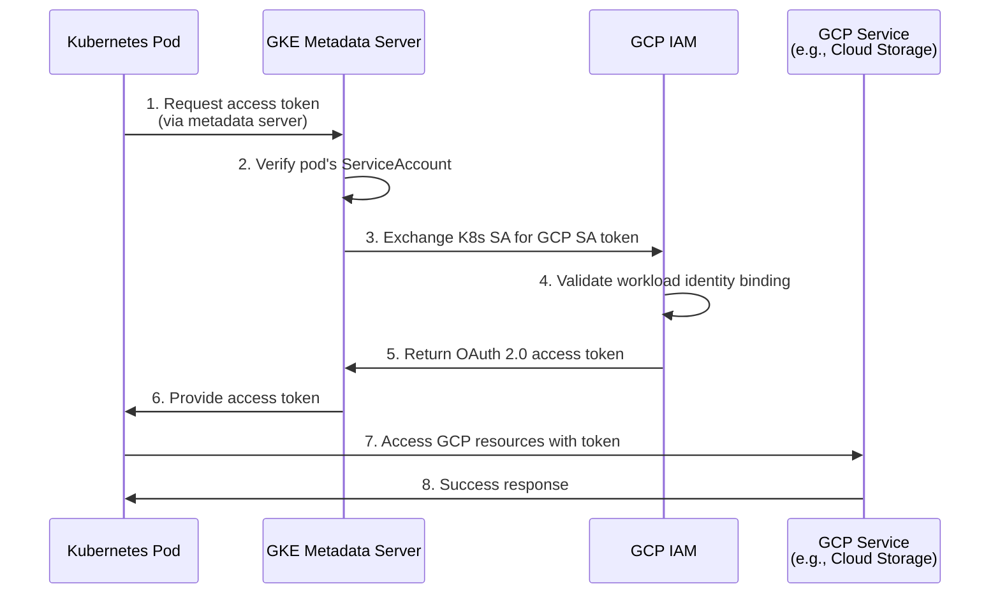

# Kubernetes to GCP - Secretless Authentication

Connect Kubernetes workloads to Google Cloud using GKE Workload Identity for secretless authentication - no service account keys required.

## Overview

This guide shows how to configure Kubernetes pods running on GKE to authenticate with Google Cloud services using Workload Identity instead of storing service account JSON keys.

**Time Required**: 20-30 minutes
**Difficulty**: Intermediate

### What You'll Accomplish

- ✓ Enable GKE Workload Identity on your cluster
- ✓ Create a Google Cloud Service Account with appropriate permissions
- ✓ Bind Kubernetes ServiceAccount to GCP Service Account
- ✓ Deploy a pod that can access GCP services without credentials
- ✓ Test and verify the end-to-end authentication flow

### Benefits

- **No Stored Keys**: Zero service account JSON keys stored in Kubernetes secrets
- **Automatic Rotation**: Identity tokens are generated on-demand and expire automatically
- **Fine-Grained Access**: IAM policies provide precise control over GCP resource access
- **Audit Trail**: Complete authentication history in Cloud Audit Logs
- **Pod-Level Security**: Different pods can have different GCP permissions

## Prerequisites

### GCP Requirements

- Google Cloud project with billing enabled
- GKE cluster (version 1.14+ recommended)
- `gcloud` CLI installed and configured
- IAM permissions: `iam.serviceAccounts.create`, `iam.serviceAccountKeys.create`, `iam.serviceAccounts.setIamPolicy`

### Kubernetes Requirements

- GKE cluster with Workload Identity enabled
- `kubectl` configured to access your cluster
- Cluster admin permissions

### Knowledge Requirements

- Understanding of Kubernetes ServiceAccounts
- Familiarity with GCP IAM service accounts and roles
- Basic understanding of OIDC authentication flows

## Architecture



## Implementation

### Step 1: Enable Workload Identity on GKE Cluster

#### For New Clusters

```bash
gcloud container clusters create my-cluster \
  --region=us-central1 \
  --workload-pool=PROJECT_ID.svc.id.goog \
  --enable-autoupgrade \
  --enable-autorepair

# Replace PROJECT_ID with your actual project ID
```

#### For Existing Clusters

```bash
# Enable Workload Identity
gcloud container clusters update my-cluster \
  --region=us-central1 \
  --workload-pool=PROJECT_ID.svc.id.goog

# Update node pools (required for existing clusters)
gcloud container node-pools update default-pool \
  --cluster=my-cluster \
  --region=us-central1 \
  --workload-metadata=GKE_METADATA
```

Verify:

```bash
gcloud container clusters describe my-cluster \
  --region=us-central1 \
  --format="value(workloadIdentityConfig.workloadPool)"

# Expected output: PROJECT_ID.svc.id.goog
```

### Step 2: Create Google Cloud Service Account

```bash
# Set variables
export PROJECT_ID="your-project-id"
export GSA_NAME="my-app-gsa"
export GSA_EMAIL="${GSA_NAME}@${PROJECT_ID}.iam.gserviceaccount.com"

# Create service account
gcloud iam service-accounts create $GSA_NAME \
  --display-name="Service account for my-app" \
  --project=$PROJECT_ID
```

### Step 3: Grant GCP Permissions

Grant the service account permissions to access GCP resources:

```bash
# Example: Grant Cloud Storage access
gcloud projects add-iam-policy-binding $PROJECT_ID \
  --member="serviceAccount:${GSA_EMAIL}" \
  --role="roles/storage.objectViewer"

# Example: Grant Compute Engine access
gcloud projects add-iam-policy-binding $PROJECT_ID \
  --member="serviceAccount:${GSA_EMAIL}" \
  --role="roles/compute.viewer"

# For bucket-specific access (more secure)
gsutil iam ch serviceAccount:${GSA_EMAIL}:objectViewer gs://my-bucket
```

**Recommended roles for common use cases:**

| Use Case | Role | Description |
|----------|------|-------------|
| Read Cloud Storage | `roles/storage.objectViewer` | Read objects from buckets |
| Write Cloud Storage | `roles/storage.objectCreator` | Create/update objects |
| BigQuery access | `roles/bigquery.dataViewer` | Query BigQuery datasets |
| Pub/Sub publish | `roles/pubsub.publisher` | Publish messages to topics |
| Secret Manager | `roles/secretmanager.secretAccessor` | Access secret values |

### Step 4: Create Kubernetes ServiceAccount

```yaml
# serviceaccount.yaml
apiVersion: v1
kind: ServiceAccount
metadata:
  name: my-app-ksa
  namespace: default
  annotations:
    iam.gke.io/gcp-service-account: my-app-gsa@PROJECT_ID.iam.gserviceaccount.com
```

Apply:

```bash
kubectl apply -f serviceaccount.yaml
```

### Step 5: Bind Kubernetes SA to GCP SA

Create the IAM policy binding:

```bash
# Set variables
export KSA_NAME="my-app-ksa"
export NAMESPACE="default"

# Create binding
gcloud iam service-accounts add-iam-policy-binding $GSA_EMAIL \
  --role=roles/iam.workloadIdentityUser \
  --member="serviceAccount:${PROJECT_ID}.svc.id.goog[${NAMESPACE}/${KSA_NAME}]"
```

Verify the binding:

```bash
gcloud iam service-accounts get-iam-policy $GSA_EMAIL
```

Expected output includes:

```yaml
bindings:
- members:
  - serviceAccount:PROJECT_ID.svc.id.goog[default/my-app-ksa]
  role: roles/iam.workloadIdentityUser
```

### Step 6: Deploy Pod Using ServiceAccount

```yaml
# pod.yaml
apiVersion: v1
kind: Pod
metadata:
  name: my-app-pod
  namespace: default
spec:
  serviceAccountName: my-app-ksa
  containers:
  - name: gcloud
    image: google/cloud-sdk:slim
    command: ["sleep", "3600"]
    # GCP SDK automatically uses Workload Identity
    # No additional configuration needed!
```

Deploy:

```bash
kubectl apply -f pod.yaml
```

## Testing and Verification

### Verify ServiceAccount Configuration

```bash
# Check annotation
kubectl get serviceaccount my-app-ksa -n default -o yaml | grep iam.gke.io

# Expected output:
# iam.gke.io/gcp-service-account: my-app-gsa@PROJECT_ID.iam.gserviceaccount.com
```

### Verify IAM Binding

```bash
gcloud iam service-accounts get-iam-policy $GSA_EMAIL \
  --format="table(bindings.members)"
```

### Test GCP Authentication

```bash
# Get GCP identity
kubectl exec my-app-pod -- gcloud auth list

# Expected output shows GCP service account email
# * my-app-gsa@PROJECT_ID.iam.gserviceaccount.com
```

### Test Resource Access

```bash
# List Cloud Storage buckets
kubectl exec my-app-pod -- gcloud storage buckets list

# List Compute Engine instances
kubectl exec my-app-pod -- gcloud compute instances list

# Access a specific bucket
kubectl exec my-app-pod -- gcloud storage ls gs://my-bucket/
```

### Expected Success Output

```
✓ ServiceAccount has iam.gke.io/gcp-service-account annotation
✓ IAM binding exists for workloadIdentityUser role
✓ gcloud auth list shows GCP service account
✓ Pod can access GCP resources per IAM permissions
```

## Production Hardening

### Security Best Practices

#### 1. Use Namespace Isolation

```yaml
apiVersion: v1
kind: Namespace
metadata:
  name: production
---
apiVersion: v1
kind: ServiceAccount
metadata:
  name: my-app-ksa
  namespace: production  # Isolated namespace
  annotations:
    iam.gke.io/gcp-service-account: my-app-prod-gsa@PROJECT_ID.iam.gserviceaccount.com
```

#### 2. Implement Least Privilege IAM

**Don't do this:**
```bash
# Too broad - grants project-level owner access
gcloud projects add-iam-policy-binding $PROJECT_ID \
  --member="serviceAccount:${GSA_EMAIL}" \
  --role="roles/owner"
```

**Do this:**
```bash
# Specific resource-level permissions
gsutil iam ch serviceAccount:${GSA_EMAIL}:objectViewer gs://specific-bucket
```

#### 3. Use Custom IAM Roles

Create custom roles with minimal permissions:

```bash
# Create custom role YAML
cat > custom-role.yaml <<EOF
title: "My App Custom Role"
description: "Custom role for my-app with minimal permissions"
stage: "GA"
includedPermissions:
- storage.buckets.get
- storage.objects.get
- storage.objects.list
EOF

# Create role
gcloud iam roles create myAppRole \
  --project=$PROJECT_ID \
  --file=custom-role.yaml

# Bind custom role
gcloud projects add-iam-policy-binding $PROJECT_ID \
  --member="serviceAccount:${GSA_EMAIL}" \
  --role="projects/$PROJECT_ID/roles/myAppRole"
```

#### 4. Enable Audit Logging

```bash
# Enable Cloud Audit Logs for IAM
gcloud logging read "protoPayload.serviceName=\"iam.googleapis.com\"" \
  --limit=10 \
  --format=json
```

Set up log-based metrics and alerts:

```bash
# Create alert for unusual service account activity
gcloud alpha monitoring policies create \
  --notification-channels=CHANNEL_ID \
  --display-name="Unusual Workload Identity Activity" \
  --condition-display-name="High SA token requests" \
  --condition-threshold-value=100 \
  --condition-threshold-duration=300s
```

### Recommended IAM Binding Pattern

```bash
# Bind to specific namespace and ServiceAccount
gcloud iam service-accounts add-iam-policy-binding $GSA_EMAIL \
  --role=roles/iam.workloadIdentityUser \
  --member="serviceAccount:${PROJECT_ID}.svc.id.goog[production/my-app-ksa]"

# Verify no wildcards are used
gcloud iam service-accounts get-iam-policy $GSA_EMAIL \
  | grep -E "\[.*\*.*\]" && echo "WARNING: Wildcard binding found!"
```

## Troubleshooting

### Issue: Pod Cannot Access GCP Resources

**Symptoms:**
- Error: "Default credentials error"
- Error: "Application Default Credentials not found"

**Solutions:**

1. **Verify Workload Identity is Enabled:**
   ```bash
   gcloud container clusters describe my-cluster \
     --region=us-central1 \
     --format="value(workloadIdentityConfig.workloadPool)"
   ```

2. **Check Node Pool Configuration:**
   ```bash
   gcloud container node-pools describe default-pool \
     --cluster=my-cluster \
     --region=us-central1 \
     --format="value(config.workloadMetadataConfig.mode)"
   
   # Should return: GKE_METADATA
   ```

3. **Verify ServiceAccount Annotation:**
   ```bash
   kubectl get sa my-app-ksa -n default -o jsonpath='{.metadata.annotations.iam\.gke\.io/gcp-service-account}'
   ```

4. **Check IAM Binding:**
   ```bash
   gcloud iam service-accounts get-iam-policy $GSA_EMAIL \
     --format=json | jq '.bindings[] | select(.role=="roles/iam.workloadIdentityUser")'
   ```

### Issue: Access Denied to GCP Resources

**Symptoms:**
- Authentication succeeds but operations fail
- Error: "Permission denied" or "403 Forbidden"

**Solutions:**

1. **Verify GCP Service Account Permissions:**
   ```bash
   gcloud projects get-iam-policy $PROJECT_ID \
     --flatten="bindings[].members" \
     --filter="bindings.members:serviceAccount:${GSA_EMAIL}" \
     --format="table(bindings.role)"
   ```

2. **Test Specific Permission:**
   ```bash
   # Test if SA can access bucket
   gcloud storage buckets get-iam-policy gs://my-bucket \
     --flatten="bindings[].members" \
     --filter="bindings.members:serviceAccount:${GSA_EMAIL}"
   ```

3. **Grant Missing Permissions:**
   ```bash
   # Add required role
   gcloud projects add-iam-policy-binding $PROJECT_ID \
     --member="serviceAccount:${GSA_EMAIL}" \
     --role="roles/storage.objectViewer"
   ```

### Issue: Metadata Server Not Accessible

**Symptoms:**
- Error: "Could not reach metadata server"
- Timeout connecting to 169.254.169.254

**Solutions:**

1. **Verify Pod is on Workload Identity-enabled Node:**
   ```bash
   kubectl get pod my-app-pod -o wide
   # Check which node it's on
   
   kubectl describe node NODE_NAME | grep workload-metadata
   # Should show: GKE_METADATA
   ```

2. **Recreate Node Pool with Workload Identity:**
   ```bash
   gcloud container node-pools create new-pool \
     --cluster=my-cluster \
     --region=us-central1 \
     --workload-metadata=GKE_METADATA
   ```

3. **Migrate Pods to New Node Pool:**
   ```bash
   kubectl cordon NODE_NAME
   kubectl drain NODE_NAME --ignore-daemonsets --delete-emptydir-data
   ```

## Complete Example

### Complete Terraform Configuration

```hcl
# complete-workload-identity-setup.tf

terraform {
  required_providers {
    google = {
      source  = "hashicorp/google"
      version = "~> 5.0"
    }
    kubernetes = {
      source  = "hashicorp/kubernetes"
      version = "~> 2.0"
    }
  }
}

variable "project_id" {
  description = "GCP Project ID"
  type        = string
}

variable "region" {
  description = "GCP Region"
  type        = string
  default     = "us-central1"
}

variable "cluster_name" {
  description = "GKE Cluster Name"
  type        = string
  default     = "my-cluster"
}

provider "google" {
  project = var.project_id
  region  = var.region
}

# Get GKE cluster credentials
data "google_client_config" "default" {}

data "google_container_cluster" "cluster" {
  name     = var.cluster_name
  location = var.region
}

provider "kubernetes" {
  host                   = "https://${data.google_container_cluster.cluster.endpoint}"
  token                  = data.google_client_config.default.access_token
  cluster_ca_certificate = base64decode(data.google_container_cluster.cluster.master_auth[0].cluster_ca_certificate)
}

# Create GCP Service Account
resource "google_service_account" "my_app" {
  account_id   = "my-app-gsa"
  display_name = "Service Account for my-app"
  project      = var.project_id
}

# Grant GCP permissions
resource "google_project_iam_member" "my_app_storage" {
  project = var.project_id
  role    = "roles/storage.objectViewer"
  member  = "serviceAccount:${google_service_account.my_app.email}"
}

# Create Kubernetes ServiceAccount
resource "kubernetes_service_account" "my_app" {
  metadata {
    name      = "my-app-ksa"
    namespace = "default"
    annotations = {
      "iam.gke.io/gcp-service-account" = google_service_account.my_app.email
    }
  }
}

# Bind K8s SA to GCP SA
resource "google_service_account_iam_member" "workload_identity_binding" {
  service_account_id = google_service_account.my_app.name
  role               = "roles/iam.workloadIdentityUser"
  member             = "serviceAccount:${var.project_id}.svc.id.goog[default/${kubernetes_service_account.my_app.metadata[0].name}]"
}

# Deploy test pod
resource "kubernetes_pod" "my_app_test" {
  metadata {
    name      = "my-app-test-pod"
    namespace = "default"
  }

  spec {
    service_account_name = kubernetes_service_account.my_app.metadata[0].name

    container {
      name    = "gcloud"
      image   = "google/cloud-sdk:slim"
      command = ["sleep", "3600"]
    }
  }
}

# Outputs
output "gcp_service_account_email" {
  value = google_service_account.my_app.email
}

output "kubernetes_service_account_name" {
  value = kubernetes_service_account.my_app.metadata[0].name
}
```

Apply:

```bash
terraform init
terraform plan -var="project_id=YOUR_PROJECT_ID"
terraform apply -var="project_id=YOUR_PROJECT_ID"
```

### Complete Shell Script

```bash
#!/bin/bash
# complete-workload-identity-setup.sh

set -e

PROJECT_ID="your-project-id"
REGION="us-central1"
CLUSTER_NAME="my-cluster"
GSA_NAME="my-app-gsa"
KSA_NAME="my-app-ksa"
NAMESPACE="default"

echo "Step 1: Enabling Workload Identity on cluster..."
gcloud container clusters update $CLUSTER_NAME \
  --region=$REGION \
  --workload-pool=${PROJECT_ID}.svc.id.goog

echo "Step 2: Updating node pool..."
gcloud container node-pools update default-pool \
  --cluster=$CLUSTER_NAME \
  --region=$REGION \
  --workload-metadata=GKE_METADATA

echo "Step 3: Creating GCP Service Account..."
gcloud iam service-accounts create $GSA_NAME \
  --display-name="Service account for my-app" \
  --project=$PROJECT_ID || echo "SA may already exist"

GSA_EMAIL="${GSA_NAME}@${PROJECT_ID}.iam.gserviceaccount.com"
echo "✓ GCP SA Email: $GSA_EMAIL"

echo "Step 4: Granting GCP permissions..."
gcloud projects add-iam-policy-binding $PROJECT_ID \
  --member="serviceAccount:${GSA_EMAIL}" \
  --role="roles/storage.objectViewer"

echo "Step 5: Creating Kubernetes ServiceAccount..."
kubectl create serviceaccount $KSA_NAME -n $NAMESPACE --dry-run=client -o yaml | \
  kubectl annotate --local -f - -o yaml \
    iam.gke.io/gcp-service-account=$GSA_EMAIL | \
  kubectl apply -f -

echo "Step 6: Binding K8s SA to GCP SA..."
gcloud iam service-accounts add-iam-policy-binding $GSA_EMAIL \
  --role=roles/iam.workloadIdentityUser \
  --member="serviceAccount:${PROJECT_ID}.svc.id.goog[${NAMESPACE}/${KSA_NAME}]"

echo "Step 7: Deploying test pod..."
cat <<EOF | kubectl apply -f -
apiVersion: v1
kind: Pod
metadata:
  name: my-app-test-pod
  namespace: $NAMESPACE
spec:
  serviceAccountName: $KSA_NAME
  containers:
  - name: gcloud
    image: google/cloud-sdk:slim
    command: ["sleep", "3600"]
EOF

echo ""
echo "==================================="
echo "Setup Complete!"
echo "==================================="
echo ""
echo "Test the integration:"
echo "  kubectl exec my-app-test-pod -- gcloud auth list"
echo "  kubectl exec my-app-test-pod -- gcloud storage buckets list"
```

## Next Steps

### Expand Your Implementation

- **Multiple environments**: Create separate ServiceAccounts and GCP SAs for dev/staging/production
- **Cross-project access**: Configure IAM bindings for accessing resources in other GCP projects
- **Different GCP services**: Grant permissions for BigQuery, Pub/Sub, Cloud SQL, etc.
- **Monitoring**: Set up Cloud Monitoring dashboards for Workload Identity usage

### Related Guides

- [Kubernetes → AWS](./kubernetes-to-aws.md)
- [Kubernetes → Azure](./kubernetes-to-azure.md)

### Learn More

- **Kubernetes Initiator Documentation**: [Learn about Kubernetes workload identity](../initiators/compute-runtime/kubernetes.md)
- **GCP Provider Documentation**: [Learn about GCP Workload Identity Federation](../providers/cloud-platforms/gcp/workload-identity-federation.md)

## Additional Resources

### Official Documentation

- [GKE Workload Identity](https://cloud.google.com/kubernetes-engine/docs/how-to/workload-identity)
- [GCP IAM Service Accounts](https://cloud.google.com/iam/docs/service-accounts)
- [Kubernetes Service Accounts](https://kubernetes.io/docs/tasks/configure-pod-container/configure-service-account/)

### Tools

- [gcloud CLI](https://cloud.google.com/sdk/gcloud) - Google Cloud command-line tool
- [kubectl](https://kubernetes.io/docs/tasks/tools/) - Kubernetes command-line tool

### Blog Posts

- [Google Cloud Blog: Workload Identity](https://cloud.google.com/blog/products/containers-kubernetes/introducing-workload-identity-better-authentication-for-your-gke-applications)
