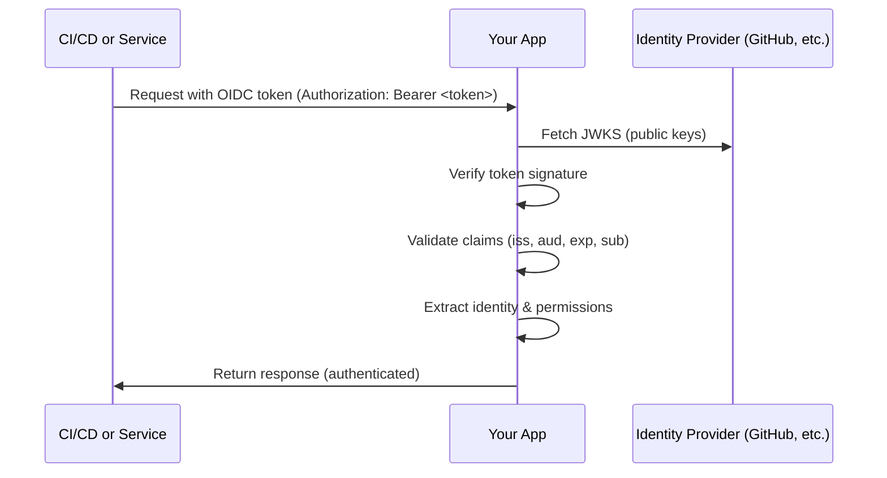

# Building Applications with Secretless Authentication

Learn how to build applications that **accept OIDC tokens** for authentication, enabling your users to access your services without managing long-lived credentials.

## Overview

This section is for **application developers** who want to build services that accept secretless authentication from CI/CD systems, cloud workloads, or other services.

While other sections of this site focus on:
- **Initiators**: Services that *issue* OIDC tokens (GitHub Actions, Kubernetes, etc.)
- **Providers**: Services that *accept* OIDC tokens (AWS, GCP, Azure, etc.)
- **Guides**: Connecting specific initiators to providers

This section teaches you how to **become a provider** - how to build your own applications that validate and accept OIDC tokens.

## Why Implement OIDC in Your Application?

### Security Benefits

**Eliminate API Keys**: Instead of issuing long-lived API keys to your users, accept short-lived OIDC tokens that expire automatically.

**No Credential Storage**: Users don't need to store secrets in environment variables, secret managers, or configuration files.

**Automatic Rotation**: Tokens expire and rotate automatically - no manual key rotation required.

**Fine-Grained Access Control**: Token claims contain rich identity information (repository, branch, namespace, etc.) that you can use for authorization decisions.

### Developer Experience

**Easier Integration**: Users can authenticate using their existing GitHub Actions, GitLab CI, or Kubernetes identities.

**Self-Service**: No need to manually provision API keys for each CI/CD pipeline or environment.

**Better Auditability**: Token claims provide detailed context about who/what is making requests.

**Standard Protocol**: OIDC is an industry standard - libraries and tools are widely available.

## Common Use Cases

### 1. SaaS APIs and Services

Build a SaaS product where customers authenticate using their CI/CD platform identity:

```
GitHub Actions → Your SaaS API
GitLab CI → Your SaaS API
Kubernetes Pod → Your SaaS API
```

**Example**: A deployment platform that accepts OIDC tokens from GitHub Actions instead of requiring API keys.

### 2. Internal Service Authentication

Enable service-to-service authentication within your organization:

```
Service A (in K8s) → Service B (your API)
Lambda Function → Your Internal API
```

**Example**: Microservices authenticating to each other using Kubernetes service account tokens.

### 3. Multi-Tenant Applications

Validate tokens from multiple identity providers (GitHub, GitLab, Auth0) in a single application:

```
GitHub Actions (Tenant A) → Your API
GitLab CI (Tenant B) → Your API
Auth0 (Tenant C) → Your API
```

**Example**: A CI/CD analytics platform that accepts tokens from any CI/CD system.

## What You'll Learn

### [Core Concepts](concepts/token-validation.md)

Understand the fundamentals of OIDC token validation:

- **[Token Validation](concepts/token-validation.md)**: JWT structure, signature verification, JWKS endpoints
- **[Claims Verification](concepts/claims-verification.md)**: Standard claims (iss, aud, sub, exp) and custom claims
- **[Security Best Practices](concepts/security-best-practices.md)**: Common pitfalls and security considerations

### [Framework Guides](frameworks/nodejs-express.md)

Language and framework-specific implementation guides:

- **[Node.js/Express](frameworks/nodejs-express.md)**: Middleware for Express.js applications
- **[Python/FastAPI](frameworks/python-fastapi.md)**: Dependency injection with FastAPI
- **[Go/Gin](frameworks/go-gin.md)**: Authentication middleware for Gin
- **[Rust/Axum](frameworks/rust-axum.md)**: Tower layers for Axum applications
- **[Java/Spring](frameworks/java-spring.md)**: Spring Security configuration
- **[.NET/ASP.NET](frameworks/dotnet-aspnet.md)**: ASP.NET Core authentication

### [Libraries & Tools](libraries/jose-libraries.md)

Popular libraries for OIDC token validation:

- **[JOSE Libraries](libraries/jose-libraries.md)**: JWT signing and verification
- **[Passport OIDC](libraries/passport-oidc.md)**: Node.js authentication middleware
- **[OAuth2 Proxy](libraries/oauth2-proxy.md)**: Reverse proxy for OIDC authentication

### [Identity Platforms](platforms/auth0.md)

Using managed identity platforms for your application:

- **[Auth0](platforms/auth0.md)**: Integrate Auth0 as your app's IdP
- **[Keycloak](platforms/keycloak.md)**: Self-host Keycloak for OIDC
- **[Okta](platforms/okta.md)**: Use Okta for enterprise authentication
- **[AWS Cognito](platforms/aws-cognito.md)**: Serverless identity with Cognito
- **[Custom Implementation](platforms/custom-implementation.md)**: Roll your own JWT validation

## Quick Start

### Basic Token Validation Flow

Here's what your application needs to do:



### Example: Node.js Token Validation

```javascript
const jwt = require('jsonwebtoken');
const jwksClient = require('jwks-rsa');

// Configure JWKS client to fetch public keys
const client = jwksClient({
  jwksUri: 'https://token.actions.githubusercontent.com/.well-known/jwks'
});

function getKey(header, callback) {
  client.getSigningKey(header.kid, (err, key) => {
    const signingKey = key.publicKey || key.rsaPublicKey;
    callback(null, signingKey);
  });
}

// Verify token
function verifyToken(token) {
  return new Promise((resolve, reject) => {
    jwt.verify(token, getKey, {
      audience: 'https://api.yourservice.com',
      issuer: 'https://token.actions.githubusercontent.com',
      algorithms: ['RS256']
    }, (err, decoded) => {
      if (err) return reject(err);
      resolve(decoded);
    });
  });
}

// Use in Express middleware
app.use(async (req, res, next) => {
  const token = req.headers.authorization?.replace('Bearer ', '');
  try {
    const claims = await verifyToken(token);
    req.user = claims; // Add claims to request
    next();
  } catch (error) {
    res.status(401).json({ error: 'Invalid token' });
  }
});
```

## Getting Started

Choose your path based on your needs:

### 1. Learn the Concepts First

Start with the fundamentals:
1. [Token Validation](concepts/token-validation.md) - Understand JWT structure and verification
2. [Claims Verification](concepts/claims-verification.md) - Learn about standard and custom claims
3. [Security Best Practices](concepts/security-best-practices.md) - Avoid common pitfalls

### 2. Jump to Your Framework

Prefer to learn by doing? Pick your framework:
- [Node.js/Express](frameworks/nodejs-express.md)
- [Python/FastAPI](frameworks/python-fastapi.md)
- [Go/Gin](frameworks/go-gin.md)
- [Rust/Axum](frameworks/rust-axum.md)

### 3. Use a Managed Platform

Want someone else to handle token validation?
- [Auth0](platforms/auth0.md) - Managed identity platform
- [Keycloak](platforms/keycloak.md) - Self-hosted open source
- [AWS Cognito](platforms/aws-cognito.md) - Serverless identity

## Architecture Patterns

### Pattern 1: Direct Token Validation

Your application validates tokens directly:

```
Client → Your Application (validates token) → Business Logic
```

**Pros**: Simple, no external dependencies, full control
**Cons**: You handle all validation logic and security

**Best for**: Internal services, microservices, simple APIs

### Pattern 2: API Gateway + Auth

Use an API gateway or proxy to validate tokens:

```
Client → API Gateway (validates token) → Your Application
```

**Pros**: Centralized auth, separation of concerns
**Cons**: Additional infrastructure, complexity

**Best for**: Microservices architectures, multiple services

### Pattern 3: Identity Platform

Delegate to a managed identity platform:

```
Client → Auth0/Okta (validates token) → Your Application
```

**Pros**: Managed service, less code, security updates handled
**Cons**: Vendor dependency, cost, less flexibility

**Best for**: SaaS applications, enterprise customers, rapid development

## Multi-Issuer Support

Your application can accept tokens from multiple identity providers:

```javascript
const allowedIssuers = {
  'https://token.actions.githubusercontent.com': {
    jwksUri: 'https://token.actions.githubusercontent.com/.well-known/jwks',
    audience: 'https://api.yourservice.com'
  },
  'https://gitlab.com': {
    jwksUri: 'https://gitlab.com/oauth/discovery/keys',
    audience: 'https://api.yourservice.com'
  },
  'https://yourapp.auth0.com/': {
    jwksUri: 'https://yourapp.auth0.com/.well-known/jwks.json',
    audience: 'https://api.yourservice.com'
  }
};

function verifyToken(token) {
  const decoded = jwt.decode(token, { complete: true });
  const issuer = decoded.payload.iss;

  const config = allowedIssuers[issuer];
  if (!config) throw new Error('Unknown issuer');

  // Verify using issuer-specific configuration
  // ... (verification logic)
}
```

## Authorization from Token Claims

Extract rich identity information for authorization:

```javascript
// GitHub Actions token claims
{
  "iss": "https://token.actions.githubusercontent.com",
  "sub": "repo:octo-org/octo-repo:ref:refs/heads/main",
  "aud": "https://api.yourservice.com",
  "repository": "octo-org/octo-repo",
  "repository_owner": "octo-org",
  "ref": "refs/heads/main",
  "workflow": "deploy",
  "actor": "octocat"
}

// Use claims for authorization
function authorize(claims) {
  // Only allow from specific organization
  if (!claims.repository_owner === 'octo-org') {
    throw new Error('Unauthorized organization');
  }

  // Only allow from main branch
  if (claims.ref !== 'refs/heads/main') {
    throw new Error('Only main branch allowed');
  }

  // Grant permissions based on repository
  return {
    canDeploy: claims.workflow === 'deploy',
    environment: claims.ref.includes('main') ? 'production' : 'staging'
  };
}
```

## Testing OIDC Implementation

### Local Testing

Use mock OIDC providers for development:

```bash
# Run a local OIDC mock server
docker run -p 8080:8080 ghcr.io/navikt/mock-oauth2-server
```

### Integration Testing

Test with real OIDC providers:

```javascript
// Test with GitHub Actions token in CI
describe('OIDC Authentication', () => {
  it('should accept valid GitHub Actions token', async () => {
    const token = process.env.ACTIONS_ID_TOKEN_REQUEST_TOKEN;
    const response = await fetch('https://api.yourservice.com/endpoint', {
      headers: { 'Authorization': `Bearer ${token}` }
    });
    expect(response.status).toBe(200);
  });
});
```

## Next Steps

Ready to implement secretless authentication in your application?

1. **Learn the basics**: Start with [Token Validation](concepts/token-validation.md)
2. **Choose your approach**: Pick a [framework guide](frameworks/nodejs-express.md) or [identity platform](platforms/auth0.md)
3. **Implement validation**: Add OIDC token validation to your application
4. **Test thoroughly**: Validate with multiple token types and edge cases
5. **Document for users**: Help your users understand how to authenticate

Remember: Implementing OIDC in your application enables your users to eliminate secrets from their workflows. You're contributing to a more secure ecosystem!
