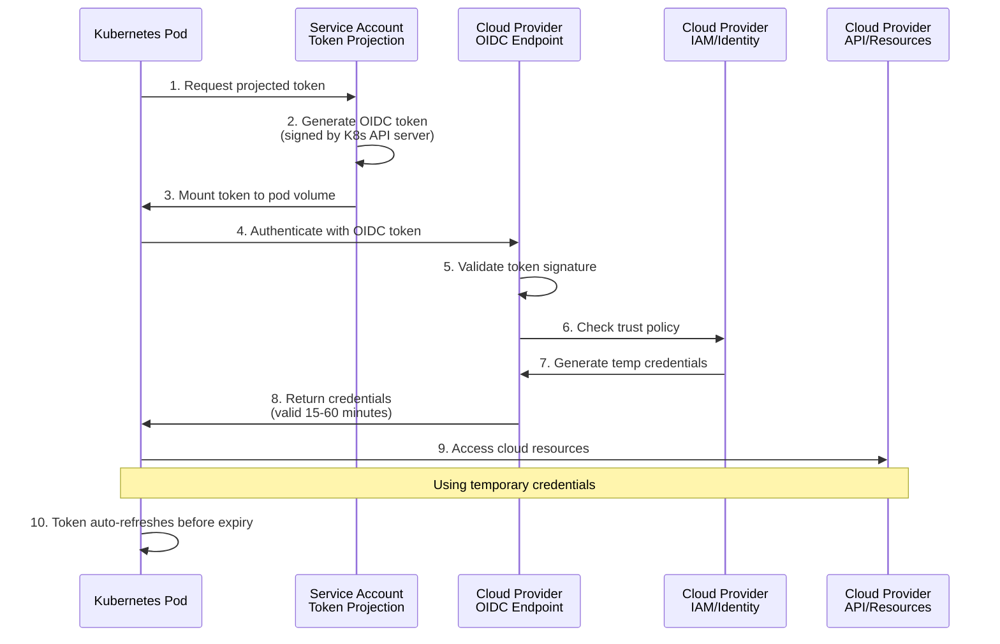

# Kubernetes Workload Identity

Kubernetes workloads can authenticate to external services using **Service Account Token Projection** and **Workload Identity**, generating OIDC-compliant tokens that eliminate the need to store static credentials in pods or secrets.

## Overview

Kubernetes provides multiple mechanisms for workloads to obtain identity tokens:

- **Service Account Token Projection**: Standard Kubernetes feature for projecting OIDC tokens into pods
- **AWS IRSA** (IAM Roles for Service Accounts): AWS-specific workload identity for EKS clusters
- **GKE Workload Identity**: Google Cloud-specific identity binding for GKE clusters
- **Azure Workload Identity**: Azure-specific pod identity for AKS clusters

These tokens can authenticate to cloud providers (AWS, GCP, Azure), secret managers (Vault, AWS Secrets Manager), and any OIDC-compliant service without storing long-lived credentials.

## How It Works

Kubernetes generates short-lived OIDC tokens bound to service accounts:

1. **Service Account Creation**: Create a Kubernetes ServiceAccount with annotations for cloud provider binding
2. **Token Projection**: Configure pods to project OIDC tokens into a volume mount
3. **Token Generation**: Kubernetes API server signs tokens with claims identifying the pod's service account
4. **Cloud Authentication**: Pods use projected tokens to authenticate with external services
5. **Credential Exchange**: Cloud providers validate tokens and return temporary credentials (e.g., AWS STS credentials)
6. **Automatic Refresh**: Tokens are automatically refreshed before expiration

### Authentication Flow



## Platform-Specific Implementations

### AWS - IAM Roles for Service Accounts (IRSA)

**EKS clusters** support native OIDC integration with AWS IAM:

**Setup Requirements:**
1. EKS cluster has an OIDC identity provider registered with AWS IAM
2. IAM role created with trust policy allowing the service account to assume it
3. ServiceAccount annotated with the IAM role ARN
4. Pod configured to use the ServiceAccount

**ServiceAccount Configuration:**

```yaml
apiVersion: v1
kind: ServiceAccount
metadata:
  name: my-app
  namespace: default
  annotations:
    eks.amazonaws.com/role-arn: arn:aws:iam::123456789012:role/my-app-role
```

**Pod Configuration:**

```yaml
apiVersion: v1
kind: Pod
metadata:
  name: my-app-pod
  namespace: default
spec:
  serviceAccountName: my-app
  containers:
  - name: app
    image: my-app:latest
    env:
    # These are automatically injected by EKS
    - name: AWS_ROLE_ARN
      value: arn:aws:iam::123456789012:role/my-app-role
    - name: AWS_WEB_IDENTITY_TOKEN_FILE
      value: /var/run/secrets/eks.amazonaws.com/serviceaccount/token
```

**How IRSA Works:**
- AWS SDK automatically reads `AWS_WEB_IDENTITY_TOKEN_FILE` environment variable
- SDK exchanges OIDC token for temporary AWS credentials via STS `AssumeRoleWithWebIdentity`
- Credentials are cached and auto-refreshed

**Token Claims (IRSA):**

| Claim | Example Value | Description |
|-------|---------------|-------------|
| `iss` | `https://oidc.eks.us-east-1.amazonaws.com/id/EXAMPLED539D4633E53DE1B71EXAMPLE` | EKS OIDC issuer |
| `sub` | `system:serviceaccount:default:my-app` | ServiceAccount identifier |
| `aud` | `sts.amazonaws.com` | Intended audience (AWS STS) |
| `exp` | `1735689600` | Expiration timestamp |
| `kubernetes.io/namespace` | `default` | Namespace |
| `kubernetes.io/serviceaccount/name` | `my-app` | ServiceAccount name |

### GCP - GKE Workload Identity

**GKE clusters** bind Kubernetes ServiceAccounts to Google Cloud Service Accounts:

**Setup Requirements:**
1. GKE cluster created with Workload Identity enabled
2. Google Cloud Service Account created
3. IAM binding allowing Kubernetes ServiceAccount to impersonate GCP Service Account
4. ServiceAccount annotated with GCP service account email

**ServiceAccount Configuration:**

```yaml
apiVersion: v1
kind: ServiceAccount
metadata:
  name: my-app
  namespace: default
  annotations:
    iam.gke.io/gcp-service-account: my-app@my-project.iam.gserviceaccount.com
```

**IAM Binding:**

```bash
gcloud iam service-accounts add-iam-policy-binding \
  my-app@my-project.iam.gserviceaccount.com \
  --role roles/iam.workloadIdentityUser \
  --member "serviceAccount:my-project.svc.id.goog[default/my-app]"
```

**Pod Configuration:**

```yaml
apiVersion: v1
kind: Pod
metadata:
  name: my-app-pod
  namespace: default
spec:
  serviceAccountName: my-app
  containers:
  - name: app
    image: my-app:latest
    # GCP SDKs automatically use Workload Identity
```

**How GKE Workload Identity Works:**
- GCP Metadata Server endpoint is available in pods
- Google Cloud SDKs query the metadata server for credentials
- Metadata server validates the pod's service account token
- Server returns short-lived OAuth 2.0 access tokens

### Azure - Azure Workload Identity

**AKS clusters** support workload identity federation with Azure AD:

**Setup Requirements:**
1. AKS cluster created with OIDC issuer and workload identity enabled
2. Azure Managed Identity or App Registration created
3. Federated credential configured on the Azure identity
4. ServiceAccount annotated with Azure client ID

**ServiceAccount Configuration:**

```yaml
apiVersion: v1
kind: ServiceAccount
metadata:
  name: my-app
  namespace: default
  annotations:
    azure.workload.identity/client-id: 12345678-1234-1234-1234-123456789012
```

**Federated Credential Configuration:**

```bash
az identity federated-credential create \
  --name my-app-credential \
  --identity-name my-app-identity \
  --resource-group my-resource-group \
  --issuer "$(az aks show -n my-cluster -g my-rg --query 'oidcIssuerProfile.issuerUrl' -o tsv)" \
  --subject system:serviceaccount:default:my-app \
  --audience api://AzureADTokenExchange
```

**Pod Configuration:**

```yaml
apiVersion: v1
kind: Pod
metadata:
  name: my-app-pod
  namespace: default
  labels:
    azure.workload.identity/use: "true"
spec:
  serviceAccountName: my-app
  containers:
  - name: app
    image: my-app:latest
    env:
    - name: AZURE_CLIENT_ID
      value: "12345678-1234-1234-1234-123456789012"
    - name: AZURE_TENANT_ID
      value: "87654321-4321-4321-4321-210987654321"
    - name: AZURE_FEDERATED_TOKEN_FILE
      value: /var/run/secrets/azure/tokens/azure-identity-token
```

**How Azure Workload Identity Works:**
- Mutating webhook injects environment variables and token volumes
- Azure SDK reads `AZURE_FEDERATED_TOKEN_FILE`
- SDK exchanges token for Azure AD access token
- Access token used to authenticate Azure API calls

## Service Account Token Projection (Generic)

For self-managed clusters or custom OIDC integrations:

### Configuration

**ServiceAccount:**

```yaml
apiVersion: v1
kind: ServiceAccount
metadata:
  name: my-app
  namespace: default
```

**Pod with Token Projection:**

```yaml
apiVersion: v1
kind: Pod
metadata:
  name: my-app-pod
spec:
  serviceAccountName: my-app
  containers:
  - name: app
    image: my-app:latest
    volumeMounts:
    - name: oidc-token
      mountPath: /var/run/secrets/tokens
      readOnly: true
  volumes:
  - name: oidc-token
    projected:
      sources:
      - serviceAccountToken:
          path: oidc-token
          expirationSeconds: 3600
          audience: https://my-cloud-provider.example.com
```

**Key Parameters:**

| Parameter | Description | Default | Recommendation |
|-----------|-------------|---------|----------------|
| `path` | Filename in the mount path | `token` | Use descriptive names like `oidc-token` |
| `expirationSeconds` | Token lifetime | `3600` (1 hour) | 3600-7200 for most use cases |
| `audience` | Token audience claim | API server URL | Set to cloud provider's expected audience |

### Accessing Projected Tokens

**Reading the Token:**

```bash
# Token is available as a file
cat /var/run/secrets/tokens/oidc-token

# Environment variable approach
export OIDC_TOKEN=$(cat /var/run/secrets/tokens/oidc-token)
```

**Using with SDKs:**

Most cloud SDKs support reading OIDC tokens from environment variables:

```bash
# AWS SDK
export AWS_WEB_IDENTITY_TOKEN_FILE=/var/run/secrets/tokens/oidc-token
export AWS_ROLE_ARN=arn:aws:iam::123456789012:role/my-role

# Google Cloud SDK
export GOOGLE_APPLICATION_CREDENTIALS=/var/run/secrets/tokens/oidc-token

# Azure SDK
export AZURE_FEDERATED_TOKEN_FILE=/var/run/secrets/tokens/oidc-token
```

## Token Claims

### Standard Service Account Token Claims

| Claim | Description | Example Value |
|-------|-------------|---------------|
| `iss` | Kubernetes API server issuer URL | `https://kubernetes.default.svc.cluster.local` |
| `sub` | Service account identifier | `system:serviceaccount:default:my-app` |
| `aud` | Intended audience | `https://provider.example.com` |
| `exp` | Expiration timestamp | `1735689600` |
| `iat` | Issued at timestamp | `1735686000` |
| `nbf` | Not before timestamp | `1735686000` |
| `kubernetes.io/namespace` | Namespace | `default` |
| `kubernetes.io/serviceaccount/name` | ServiceAccount name | `my-app` |
| `kubernetes.io/serviceaccount/uid` | ServiceAccount UID | `a1b2c3d4-e5f6-...` |

### Platform-Specific Claims

**AWS IRSA** includes standard claims plus namespace and service account info.

**GKE Workload Identity** uses the Kubernetes token internally but presents GCP credentials externally.

**Azure Workload Identity** includes Azure-specific audience (`api://AzureADTokenExchange`).

## Inspecting Tokens

Decode tokens to verify claims:

```bash
# Read token from projected volume
TOKEN=$(cat /var/run/secrets/tokens/oidc-token)

# Decode JWT payload (base64 decode the middle section)
echo $TOKEN | cut -d '.' -f2 | base64 -d 2>/dev/null | jq .

# Expected output:
# {
#   "aud": ["https://provider.example.com"],
#   "exp": 1735689600,
#   "iat": 1735686000,
#   "iss": "https://oidc.eks.us-east-1.amazonaws.com/id/...",
#   "kubernetes.io": {
#     "namespace": "default",
#     "pod": {
#       "name": "my-app-pod",
#       "uid": "..."
#     },
#     "serviceaccount": {
#       "name": "my-app",
#       "uid": "..."
#     }
#   },
#   "sub": "system:serviceaccount:default:my-app"
# }
```

:::tip Token Inspection
Use [jwt.io](https://jwt.io) to decode and inspect tokens. Never paste production tokens into third-party sites - use only for development with non-sensitive tokens.
:::

## Security Best Practices

### Principle of Least Privilege

1. **Separate ServiceAccounts**: Create dedicated ServiceAccounts per application
2. **Namespace Isolation**: Use namespaces to isolate workloads
3. **Minimal Cloud Permissions**: Grant only required IAM permissions to cloud roles
4. **Audience Validation**: Always specify and validate token audience

### Token Management

:::warning Security Considerations
- Tokens are bearer tokens - protect them like passwords
- Never log full token values
- Use short expiration times (1-2 hours recommended)
- Ensure automatic token rotation is enabled
:::

**Recommended Configurations:**

```yaml
# ✅ SECURE: Short expiration, specific audience
- serviceAccountToken:
    path: oidc-token
    expirationSeconds: 3600
    audience: https://sts.amazonaws.com

# ❌ INSECURE: Long expiration, generic audience
- serviceAccountToken:
    path: oidc-token
    expirationSeconds: 86400  # 24 hours is too long
    audience: api  # Too generic
```

### Trust Policy Validation

Always validate critical claims in cloud provider trust policies:

**AWS IAM Trust Policy Example:**

```json
{
  "Version": "2012-10-17",
  "Statement": [
    {
      "Effect": "Allow",
      "Principal": {
        "Federated": "arn:aws:iam::123456789012:oidc-provider/oidc.eks.us-east-1.amazonaws.com/id/EXAMPLE"
      },
      "Action": "sts:AssumeRoleWithWebIdentity",
      "Condition": {
        "StringEquals": {
          "oidc.eks.us-east-1.amazonaws.com/id/EXAMPLE:sub": "system:serviceaccount:default:my-app",
          "oidc.eks.us-east-1.amazonaws.com/id/EXAMPLE:aud": "sts.amazonaws.com"
        }
      }
    }
  ]
}
```

### Network Security

Combine workload identity with network policies:

```yaml
apiVersion: networking.k8s.io/v1
kind: NetworkPolicy
metadata:
  name: restrict-my-app
  namespace: default
spec:
  podSelector:
    matchLabels:
      app: my-app
  policyTypes:
  - Egress
  egress:
  - to:
    - podSelector: {}
  - to:
    - namespaceSelector: {}
    ports:
    - protocol: TCP
      port: 443  # Allow HTTPS for cloud API calls
```

## Use Cases

### 1. Accessing Cloud Resources

Pods can access cloud storage, databases, and APIs:

**AWS S3 Access:**

```yaml
apiVersion: v1
kind: Pod
metadata:
  name: s3-reader
spec:
  serviceAccountName: s3-access-sa
  containers:
  - name: app
    image: amazon/aws-cli
    command: ["aws", "s3", "ls", "s3://my-bucket/"]
    # No credentials needed - uses IRSA automatically
```

### 2. Secret Management Integration

Integrate with external secret managers:

**HashiCorp Vault:**

```yaml
apiVersion: v1
kind: Pod
metadata:
  name: vault-client
spec:
  serviceAccountName: vault-auth-sa
  containers:
  - name: app
    image: vault:latest
    command:
    - sh
    - -c
    - |
      vault login -method=jwt \
        role=my-app-role \
        jwt=$(cat /var/run/secrets/tokens/vault-token)
    volumeMounts:
    - name: vault-token
      mountPath: /var/run/secrets/tokens
  volumes:
  - name: vault-token
    projected:
      sources:
      - serviceAccountToken:
          path: vault-token
          expirationSeconds: 3600
          audience: https://vault.example.com
```

### 3. CI/CD Deployments

Authenticate deployment pipelines without kubeconfig files:

**External CI Tool to Kubernetes:**

```bash
# CI pipeline obtains OIDC token
CI_TOKEN=$(get_ci_oidc_token)

# Use token to authenticate to Kubernetes
kubectl --token=$CI_TOKEN apply -f deployment.yaml
```

### 4. Multi-Cloud Access

Single pod accessing multiple cloud providers:

```yaml
apiVersion: v1
kind: Pod
metadata:
  name: multi-cloud-app
spec:
  serviceAccountName: multi-cloud-sa
  containers:
  - name: app
    image: my-multi-cloud-app:latest
    volumeMounts:
    - name: aws-token
      mountPath: /var/run/secrets/aws
    - name: gcp-token
      mountPath: /var/run/secrets/gcp
    env:
    - name: AWS_WEB_IDENTITY_TOKEN_FILE
      value: /var/run/secrets/aws/token
    - name: GOOGLE_APPLICATION_CREDENTIALS
      value: /var/run/secrets/gcp/token
  volumes:
  - name: aws-token
    projected:
      sources:
      - serviceAccountToken:
          path: token
          expirationSeconds: 3600
          audience: sts.amazonaws.com
  - name: gcp-token
    projected:
      sources:
      - serviceAccountToken:
          path: token
          expirationSeconds: 3600
          audience: https://iam.googleapis.com/
```

## Troubleshooting

### Token Not Available in Pod

**Symptoms**: Token file doesn't exist or is empty

**Solutions**:
- Verify ServiceAccount exists and pod is using it
- Check projected volume configuration
- Ensure API server supports token projection (Kubernetes 1.12+)
- Verify `--service-account-issuer` flag is set on API server

### Authentication Failures

**Symptoms**: Cloud provider rejects token with 401/403 errors

**Causes & Solutions**:
- **Audience mismatch**: Verify token `aud` claim matches cloud provider's expected audience
- **Subject validation**: Check trust policy validates correct service account subject
- **Expired token**: Token expired (check `expirationSeconds` configuration)
- **Clock skew**: Ensure cluster time is synchronized
- **Issuer not trusted**: Verify OIDC provider is registered with cloud platform

### Platform-Specific Issues

**AWS IRSA:**
- Verify OIDC provider exists: `aws iam list-open-id-connect-providers`
- Check role trust policy allows service account
- Ensure `eks.amazonaws.com/role-arn` annotation is correct

**GKE Workload Identity:**
- Verify Workload Identity is enabled on cluster
- Check IAM binding: `gcloud iam service-accounts get-iam-policy ...`
- Ensure annotation uses correct GCP service account email

**Azure Workload Identity:**
- Verify workload identity webhook is running
- Check federated credential configuration
- Ensure pod has label `azure.workload.identity/use: "true"`

## Limitations

- **Cluster Requirements**: Requires Kubernetes 1.12+ for token projection, 1.20+ for stable features
- **API Server Configuration**: Self-managed clusters require `--service-account-issuer` and related flags
- **Platform-Specific**: AWS IRSA, GKE Workload Identity, and Azure Workload Identity only work on their respective platforms
- **Token Lifetime**: Maximum token lifetime limited by cluster configuration (typically 24 hours max)
- **Audience Restrictions**: Some cloud providers require specific audience values

## Related Integration Guides

Use Kubernetes workload identity to authenticate with:

### Cloud Providers
- [Kubernetes → AWS](../../guides/kubernetes-to-aws.md) (Coming Soon)
- [Kubernetes → GCP](../../guides/kubernetes-to-gcp.md) (Coming Soon)
- [Kubernetes → Azure](../../guides/kubernetes-to-azure.md) (Coming Soon)

### Secret Management
- [Kubernetes → HashiCorp Vault](../../guides/kubernetes-to-vault.md) (Coming Soon)

## Additional Resources

### Kubernetes Documentation
- [Service Account Token Projection](https://kubernetes.io/docs/tasks/configure-pod-container/configure-service-account/#service-account-token-volume-projection)
- [Configure Service Accounts](https://kubernetes.io/docs/tasks/configure-pod-container/configure-service-account/)

### Platform-Specific Documentation
- [AWS - EKS IAM Roles for Service Accounts](https://docs.aws.amazon.com/eks/latest/userguide/iam-roles-for-service-accounts.html)
- [Google Cloud - GKE Workload Identity](https://cloud.google.com/kubernetes-engine/docs/how-to/workload-identity)
- [Azure - AKS Workload Identity](https://learn.microsoft.com/en-us/azure/aks/workload-identity-overview)

### Specifications
- [JWT Specification (RFC 7519)](https://tools.ietf.org/html/rfc7519)
- [OIDC Core Specification](https://openid.net/specs/openid-connect-core-1_0.html)
