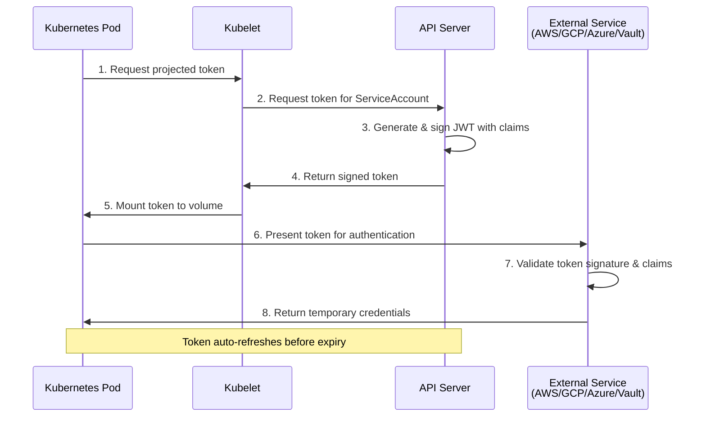

# Kubernetes Workload Identity

Kubernetes workloads can generate OIDC-compliant tokens using **Service Account Token Projection**, enabling pods to authenticate to external services without storing static credentials.

## Overview

Kubernetes provides a native mechanism for projecting short-lived, audience-bound OIDC tokens into pods. These tokens can be used to authenticate with:

- Cloud providers (AWS, GCP, Azure)
- Secret managers (HashiCorp Vault, AWS Secrets Manager)
- Internal services and APIs
- Any OIDC-compliant authentication system

## How It Works

Kubernetes generates and signs JWTs containing service account identity information:

1. **Token Projection Configuration**: Define projected ServiceAccount tokens in pod specifications
2. **API Server Signing**: Kubernetes API server generates and signs tokens with claims
3. **Automatic Mounting**: Tokens are mounted into pods at specified paths
4. **Auto-Refresh**: Kubernetes automatically refreshes tokens before expiration
5. **External Authentication**: External services validate tokens and issue credentials

### Token Generation Flow



## Token Generation

### Service Account Token Projection

The recommended method for generating OIDC tokens in Kubernetes:

```yaml
apiVersion: v1
kind: Pod
metadata:
  name: my-app-pod
  namespace: default
spec:
  serviceAccountName: my-app
  containers:
  - name: app
    image: my-app:latest
    volumeMounts:
    - name: oidc-token
      mountPath: /var/run/secrets/tokens
      readOnly: true
  volumes:
  - name: oidc-token
    projected:
      sources:
      - serviceAccountToken:
          path: token
          expirationSeconds: 3600
          audience: https://external-service.example.com
```

### Configuration Parameters

| Parameter | Description | Default | Recommended |
|-----------|-------------|---------|-------------|
| `path` | Filename for the token | `token` | Use descriptive names |
| `expirationSeconds` | Token lifetime in seconds | `3600` | 3600-7200 (1-2 hours) |
| `audience` | Token audience claim (`aud`) | Kubernetes API server | External service URL |

**Key Configuration Points:**

- **path**: The filename within the mount path where the token is written
- **expirationSeconds**: Balance between security (shorter is better) and operational needs
- **audience**: Must match what the external service expects in the `aud` claim

## Token Claims

### Standard JWT Claims

| Claim | Description | Example Value |
|-------|-------------|---------------|
| `iss` | Token issuer (Kubernetes API server) | `https://kubernetes.default.svc.cluster.local` |
| `sub` | Subject (ServiceAccount identifier) | `system:serviceaccount:default:my-app` |
| `aud` | Audience (intended recipient) | `https://external-service.example.com` |
| `exp` | Expiration time (Unix timestamp) | `1735689600` |
| `iat` | Issued at time (Unix timestamp) | `1735686000` |
| `nbf` | Not before time (Unix timestamp) | `1735686000` |

### Kubernetes-Specific Claims

| Claim | Description | Example Value |
|-------|-------------|---------------|
| `kubernetes.io/namespace` | Pod namespace | `default` |
| `kubernetes.io/serviceaccount/name` | ServiceAccount name | `my-app` |
| `kubernetes.io/serviceaccount/uid` | ServiceAccount UID | `a1b2c3d4-e5f6-...` |
| `kubernetes.io/pod/name` | Pod name (if included) | `my-app-pod-abc123` |
| `kubernetes.io/pod/uid` | Pod UID (if included) | `x1y2z3...` |

### Subject Claim Format

The `sub` claim follows the pattern:

```
system:serviceaccount:<namespace>:<serviceaccount-name>
```

Examples:
- `system:serviceaccount:default:my-app`
- `system:serviceaccount:production:backend-service`
- `system:serviceaccount:kube-system:metrics-server`

## Accessing Tokens

### Reading from Mounted Volume

```bash
# Token is available as a file
cat /var/run/secrets/tokens/token

# Store in environment variable
export TOKEN=$(cat /var/run/secrets/tokens/token)
```

### Using with SDKs

Most cloud SDKs automatically detect and use projected tokens:

**AWS SDK:**
```bash
export AWS_WEB_IDENTITY_TOKEN_FILE=/var/run/secrets/tokens/aws-token
export AWS_ROLE_ARN=arn:aws:iam::123456789012:role/my-role
# AWS SDK automatically uses these for authentication
```

**GCP SDK:**
```bash
export GOOGLE_APPLICATION_CREDENTIALS=/var/run/secrets/tokens/gcp-token
# GCP SDK automatically uses this
```

**Azure SDK:**
```bash
export AZURE_FEDERATED_TOKEN_FILE=/var/run/secrets/tokens/azure-token
export AZURE_CLIENT_ID=12345678-1234-1234-1234-123456789012
# Azure SDK automatically uses these
```

### Manual Token Usage

```bash
# Use token in HTTP Authorization header
curl -H "Authorization: Bearer $(cat /var/run/secrets/tokens/token)" \
  https://external-service.example.com/api
```

## Inspecting Tokens

Decode tokens to verify claims:

```bash
# Read token
TOKEN=$(cat /var/run/secrets/tokens/token)

# Decode JWT payload (base64 decode the middle section)
echo $TOKEN | cut -d '.' -f2 | base64 -d 2>/dev/null | jq .

# Expected output:
# {
#   "aud": ["https://external-service.example.com"],
#   "exp": 1735689600,
#   "iat": 1735686000,
#   "iss": "https://kubernetes.default.svc.cluster.local",
#   "kubernetes.io": {
#     "namespace": "default",
#     "pod": {
#       "name": "my-app-pod",
#       "uid": "..."
#     },
#     "serviceaccount": {
#       "name": "my-app",
#       "uid": "..."
#     }
#   },
#   "nbf": 1735686000,
#   "sub": "system:serviceaccount:default:my-app"
# }
```

:::tip Token Inspection
Use [jwt.io](https://jwt.io) to decode and inspect tokens. Never paste production tokens into third-party sites - use only for development with non-sensitive tokens.
:::

## Platform-Specific Implementations

Different Kubernetes platforms and cloud providers offer enhanced workload identity features:

### Amazon EKS - IAM Roles for Service Accounts (IRSA)

EKS provides native integration with AWS IAM for seamless AWS authentication.

**Key Features:**
- Automatic OIDC provider registration
- Pod identity webhook for environment variable injection
- Seamless AWS SDK integration

**See**: [Kubernetes → AWS Integration Guide](../../guides/kubernetes-to-aws.md)

### Google GKE - Workload Identity

GKE offers direct binding between Kubernetes ServiceAccounts and GCP Service Accounts.

**Key Features:**
- Built-in Workload Identity support
- GCP Metadata Server integration
- Automatic credential management

**See**: [Kubernetes → GCP Integration Guide](../../guides/kubernetes-to-gcp.md)

### Azure AKS - Workload Identity

AKS supports Azure AD Workload Identity for authenticating to Azure services.

**Key Features:**
- Federated credential configuration
- Azure Managed Identity integration
- Webhook-based token injection

**See**: [Kubernetes → Azure Integration Guide](../../guides/kubernetes-to-azure.md)

### Self-Managed Clusters

Self-managed Kubernetes clusters require additional configuration:

**Requirements:**
- API server flags: `--service-account-issuer`, `--service-account-signing-key-file`, `--service-account-api-audiences`
- Publicly accessible OIDC discovery endpoints
- JWKS (JSON Web Key Set) endpoint for token validation

**Configuration is cluster-specific.** Consult integration guides for external service setup.

## Configuration Examples

### Single Token for One Service

```yaml
apiVersion: v1
kind: Pod
metadata:
  name: app-pod
spec:
  serviceAccountName: my-app
  containers:
  - name: app
    image: my-app:latest
    volumeMounts:
    - name: service-token
      mountPath: /var/run/secrets/service
      readOnly: true
  volumes:
  - name: service-token
    projected:
      sources:
      - serviceAccountToken:
          path: token
          expirationSeconds: 3600
          audience: https://service.example.com
```

### Multiple Tokens for Different Services

```yaml
apiVersion: v1
kind: Pod
metadata:
  name: multi-service-pod
spec:
  serviceAccountName: my-app
  containers:
  - name: app
    image: my-app:latest
    volumeMounts:
    - name: aws-token
      mountPath: /var/run/secrets/aws
      readOnly: true
    - name: vault-token
      mountPath: /var/run/secrets/vault
      readOnly: true
    env:
    - name: AWS_WEB_IDENTITY_TOKEN_FILE
      value: /var/run/secrets/aws/token
    - name: VAULT_TOKEN_FILE
      value: /var/run/secrets/vault/token
  volumes:
  - name: aws-token
    projected:
      sources:
      - serviceAccountToken:
          path: token
          expirationSeconds: 3600
          audience: sts.amazonaws.com
  - name: vault-token
    projected:
      sources:
      - serviceAccountToken:
          path: token
          expirationSeconds: 7200
          audience: https://vault.example.com
```

### Using InitContainers for Bootstrap

```yaml
apiVersion: v1
kind: Pod
metadata:
  name: init-container-pod
spec:
  serviceAccountName: my-app
  initContainers:
  - name: fetch-secrets
    image: vault:latest
    command:
    - sh
    - -c
    - |
      export VAULT_TOKEN=$(cat /var/run/secrets/vault/token)
      vault read secret/data/app-config > /config/secrets.json
    volumeMounts:
    - name: vault-token
      mountPath: /var/run/secrets/vault
      readOnly: true
    - name: config
      mountPath: /config
  containers:
  - name: app
    image: my-app:latest
    volumeMounts:
    - name: config
      mountPath: /config
      readOnly: true
  volumes:
  - name: vault-token
    projected:
      sources:
      - serviceAccountToken:
          path: token
          expirationSeconds: 3600
          audience: https://vault.example.com
  - name: config
    emptyDir: {}
```

## Security Best Practices

### 1. Use Specific Audiences

**Don't do this:**
```yaml
audience: api  # Too generic
```

**Do this:**
```yaml
audience: https://service.example.com  # Specific service URL
```

### 2. Set Appropriate Token Lifetimes

```yaml
# ✅ GOOD: 1-2 hours for most use cases
expirationSeconds: 3600

# ⚠️ ACCEPTABLE: 2 hours for long-running operations
expirationSeconds: 7200

# ❌ BAD: 24 hours is too long
expirationSeconds: 86400
```

### 3. Implement Namespace Isolation

```yaml
apiVersion: v1
kind: Namespace
metadata:
  name: production
---
apiVersion: v1
kind: ServiceAccount
metadata:
  name: prod-app
  namespace: production  # Isolated from other namespaces
```

### 4. Protect Token Files

```yaml
volumeMounts:
- name: token-volume
  mountPath: /var/run/secrets/tokens
  readOnly: true  # Always mount as read-only
```

### 5. Use RBAC to Control ServiceAccount Usage

```yaml
apiVersion: rbac.authorization.k8s.io/v1
kind: Role
metadata:
  name: use-privileged-sa
  namespace: production
rules:
- apiGroups: [""]
  resources: ["serviceaccounts"]
  resourceNames: ["privileged-app"]
  verbs: ["use"]
---
apiVersion: rbac.authorization.k8s.io/v1
kind: RoleBinding
metadata:
  name: developers-use-sa
  namespace: production
roleRef:
  apiGroup: rbac.authorization.k8s.io
  kind: Role
  name: use-privileged-sa
subjects:
- kind: Group
  name: developers
  apiGroup: rbac.authorization.k8s.io
```

## Troubleshooting

### Issue: Token File Not Created

**Symptoms**: Token file doesn't exist in the mounted volume

**Solutions**:

1. **Check Kubernetes Version:**
   ```bash
   kubectl version --short
   # Requires 1.12+ for token projection
   ```

2. **Verify Pod Configuration:**
   ```bash
   kubectl get pod my-app-pod -o yaml | grep -A 10 "projected:"
   # Ensure projected volume is configured
   ```

3. **Check API Server Configuration:**
   ```bash
   # For self-managed clusters, verify API server flags
   kubectl cluster-info dump | grep service-account-issuer
   ```

### Issue: Token Rejected by External Service

**Symptoms**: External service returns "invalid token" or "unauthorized"

**Solutions**:

1. **Verify Audience Claim:**
   ```bash
   TOKEN=$(kubectl exec my-app-pod -- cat /var/run/secrets/tokens/token)
   echo $TOKEN | cut -d '.' -f2 | base64 -d 2>/dev/null | jq .aud
   # Must match what external service expects
   ```

2. **Check Token Expiration:**
   ```bash
   echo $TOKEN | cut -d '.' -f2 | base64 -d 2>/dev/null | jq '.exp,.iat' | \
     while read exp; read iat; do
       echo "Issued: $(date -d @$iat)"
       echo "Expires: $(date -d @$exp)"
     done
   ```

3. **Verify Issuer URL:**
   ```bash
   echo $TOKEN | cut -d '.' -f2 | base64 -d 2>/dev/null | jq .iss
   # External service must trust this issuer
   ```

4. **Check Subject Claim:**
   ```bash
   echo $TOKEN | cut -d '.' -f2 | base64 -d 2>/dev/null | jq .sub
   # Should match ServiceAccount: system:serviceaccount:NAMESPACE:SA_NAME
   ```

### Issue: Token Not Refreshing

**Symptoms**: Token expires and is not automatically renewed

**Solutions**:

1. **Verify Kubernetes Handles Refresh:**
   Kubernetes automatically refreshes projected tokens. If not working:
   ```bash
   kubectl describe pod my-app-pod
   # Check for kubelet errors
   ```

2. **Check SDK Configuration:**
   Most SDKs handle token refresh automatically. Verify SDK is configured to monitor the token file.

3. **Manual Refresh Logic (if needed):**
   ```bash
   # Watch token file for changes
   while inotifywait -e modify /var/run/secrets/tokens/token; do
     echo "Token refreshed"
     # Reload credentials
   done
   ```

## Limitations

- **Kubernetes 1.12+**: Token projection requires Kubernetes 1.12 or higher
- **API Server Configuration**: Self-managed clusters need specific API server flags
- **Public OIDC Endpoints**: External services need access to Kubernetes OIDC discovery endpoints
- **Maximum Token Lifetime**: Cluster configuration may impose maximum token lifetime limits
- **Audience Restrictions**: Some external services require specific audience values

## Best Practices

1. **Minimize Token Lifetime**: Use the shortest token lifetime that works for your use case (1-2 hours recommended)
2. **Specify Explicit Audiences**: Always set the `audience` parameter to the specific external service
3. **One ServiceAccount per Application**: Avoid sharing ServiceAccounts across multiple applications
4. **Document Token Requirements**: Clearly document which tokens your application needs and why
5. **Monitor Token Usage**: Log token requests and authentication events for audit purposes
6. **Test Token Claims**: Inspect tokens during development to verify claims match requirements
7. **Implement Graceful Failure**: Handle token expiration and refresh failures gracefully

## Related Integration Guides

Use Kubernetes workload identity to authenticate with:

### Cloud Providers
- [Kubernetes → AWS](../../guides/kubernetes-to-aws.md)
- [Kubernetes → GCP](../../guides/kubernetes-to-gcp.md)
- [Kubernetes → Azure](../../guides/kubernetes-to-azure.md)

## Additional Resources

### Kubernetes Documentation
- [Service Account Token Projection](https://kubernetes.io/docs/tasks/configure-pod-container/configure-service-account/#service-account-token-volume-projection)
- [Configure Service Accounts](https://kubernetes.io/docs/tasks/configure-pod-container/configure-service-account/)
- [Managing Service Accounts](https://kubernetes.io/docs/reference/access-authn-authz/service-accounts-admin/)

### Specifications
- [JWT Specification (RFC 7519)](https://tools.ietf.org/html/rfc7519)
- [OIDC Core Specification](https://openid.net/specs/openid-connect-core-1_0.html)
- [OAuth 2.0 Token Exchange (RFC 8693)](https://tools.ietf.org/html/rfc8693)
