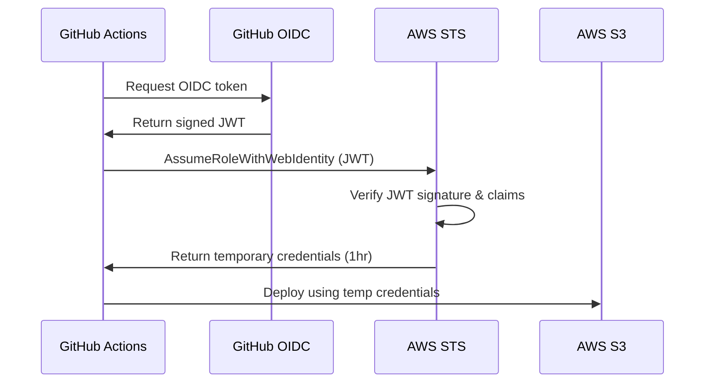

# Introduction to Secretless Workflows

Welcome to **secretless.org** - your guide to eliminating long-lived credentials from your infrastructure and adopting secure, modern authentication practices.

## What is Secretless Authentication?

Secretless authentication is an approach where systems authenticate using **short-lived, automatically-rotating credentials** instead of permanent secrets like API keys, access tokens, or service account credentials.

Traditional approaches store secrets like:
- AWS access keys and secret keys
- Service account JSON files
- API tokens
- Database passwords
- SSH keys

These long-lived credentials pose significant security risks:
- Can be accidentally committed to version control
- Difficult to rotate regularly
- If compromised, remain valid until manually revoked
- Hard to audit who has access
- Challenging to scope permissions appropriately

## How Secretless Authentication Works

Modern secretless workflows use protocols like **OpenID Connect (OIDC)** and **just-in-time authentication** to:

1. **Verify identity** using trusted identity providers
2. **Request temporary credentials** valid for minutes or hours
3. **Automatically rotate** credentials with each use
4. **Scope permissions** to exactly what's needed
5. **Audit all access** through centralized logging

### Example Flow: GitHub Actions to AWS

No AWS access keys needed - just configuration!

## Benefits of Going Secretless

### Security
- **No credential storage** - Nothing to leak or steal
- **Automatic rotation** - Credentials expire automatically
- **Fine-grained access** - Scope to specific resources and actions
- **Full audit trail** - Every access is logged

### Operations
- **Simplified onboarding** - No credential distribution
- **Easier compliance** - Meet security standards more easily
- **Reduced maintenance** - No manual rotation needed
- **Better visibility** - Centralized monitoring

### Developer Experience
- **Faster setup** - Configure once, use everywhere
- **Fewer secrets to manage** - Less cognitive overhead
- **Works locally and in CI** - Consistent authentication
- **Self-service** - Developers can configure without security team

## What You'll Learn

This site provides comprehensive guides for implementing secretless authentication across popular cloud providers and CI/CD tools.

### Providers

Learn how to configure **service providers** to accept secretless authentication:

- **[AWS](providers/aws/oidc-setup.md)** - IAM roles with OIDC
- **GCP** - Workload Identity Federation (coming soon)
- **Azure** - Managed Identities (coming soon)
- **Kubernetes** - Service Account Token Projection (coming soon)
- **Cloudflare** - API tokens with OIDC (coming soon)

### Initiators

Learn how to configure **services that initiate authentication**:

- **[GitHub Actions](initiators/ci-tools/github-actions.md)** - OIDC in workflows
- **GitLab CI** - ID tokens (coming soon)
- **CircleCI** - OIDC tokens (coming soon)
- **AWS ECS/EKS** - Task/Pod identities (coming soon)
- **Kubernetes** - Workload identities (coming soon)

### Integration Guides

Follow step-by-step guides for specific service combinations:

- **[GitHub Actions → AWS](guides/github-actions-to-aws.md)** - Complete setup guide
- **GitLab CI → GCP** (coming soon)
- **CircleCI → Azure** (coming soon)
- **And many more** (coming soon)

## Getting Started

### Quick Start

If you want to get started immediately with a common use case:

1. **[GitHub Actions to AWS](guides/github-actions-to-aws.md)** - Most popular combination
2. Follow the step-by-step guide (15-30 minutes)
3. Deploy without storing AWS credentials

### Learn the Concepts

Want to understand the fundamentals first?

1. Read about [AWS OIDC Provider Setup](providers/aws/oidc-setup.md)
2. Learn about [GitHub Actions OIDC](initiators/ci-tools/github-actions.md)
3. Then implement with the [integration guide](guides/github-actions-to-aws.md)

### Explore by Use Case

Looking for something specific?

- **CI/CD Deployments**: See [CI/CD Tools](initiators/ci-tools/github-actions.md)
- **Cloud Provider Access**: Browse [Providers](providers/aws/oidc-setup.md)
- **Complete Walkthroughs**: Check [Integration Guides](guides/github-actions-to-aws.md)

## Core Concepts

### OpenID Connect (OIDC)

OIDC is an identity layer built on OAuth 2.0 that allows services to verify user identity. In secretless workflows:

- **Identity Provider** (GitHub, GitLab, etc.) issues signed tokens
- **Service Provider** (AWS, GCP, Azure) verifies tokens
- **Trust relationship** is configured once
- **Temporary credentials** are issued per request

### Just-in-Time Authentication

Credentials are created exactly when needed and expire shortly after use:

- **Created on demand** - Only when authentication is needed
- **Short-lived** - Typically 15 minutes to 12 hours
- **Single-purpose** - Scoped to specific operations
- **Automatically cleaned up** - No manual revocation needed

### Trust Policies

Define which external identities can assume which roles:

- **Subject claims** - Identify the requesting entity (repo, branch, user)
- **Audience claims** - Specify the intended recipient
- **Condition expressions** - Add additional constraints
- **Least privilege** - Grant minimum necessary permissions

## Why This Matters

### Security Incidents

Many high-profile breaches involve compromised credentials:

- Hardcoded credentials in source code
- Credentials leaked through CI/CD logs
- Stolen credentials from compromised systems
- Credentials shared too broadly

Secretless authentication eliminates these risks.

### Compliance Requirements

Modern security frameworks increasingly require:

- Regular credential rotation
- Audit trails for all access
- Principle of least privilege
- Secure credential storage

Secretless authentication satisfies these requirements by design.

### Industry Adoption

Major platforms now support OIDC:

- GitHub Actions (since 2021)
- GitLab CI (since 2022)
- CircleCI (since 2022)
- AWS, GCP, Azure (all support OIDC)
- Kubernetes (native support via service accounts)

The ecosystem has matured - now is the time to adopt.

## Community and Support

This is a community-driven resource. We welcome:

- **Contributions** - Add guides for new services
- **Feedback** - Suggest improvements
- **Questions** - Ask in discussions
- **Real-world examples** - Share your implementations

## Next Steps

Ready to eliminate secrets from your infrastructure?

1. **Start with a guide**: [GitHub Actions to AWS](guides/github-actions-to-aws.md)
2. **Learn the details**: Browse [Providers](providers/aws/oidc-setup.md) and [Initiators](initiators/ci-tools/github-actions.md)
3. **Expand your setup**: Apply patterns to other services
4. **Share your experience**: Contribute back to the community

Let's build a more secure future - one without long-lived credentials.
