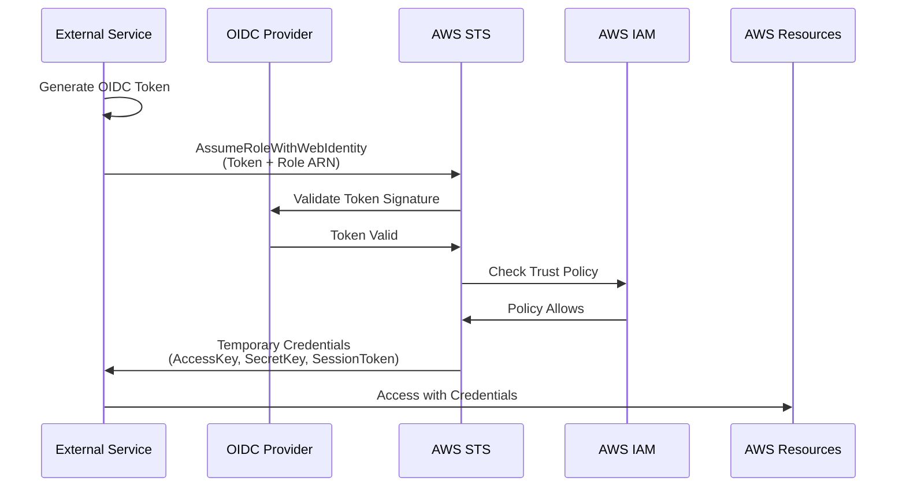

# AWS - Secretless Authentication

Configure AWS to accept OpenID Connect (OIDC) authentication from external services, enabling secretless workflows without storing long-lived credentials.

## Overview

OpenID Connect (OIDC) allows external services to authenticate with AWS using short-lived tokens instead of permanent access keys. AWS validates these tokens and issues temporary credentials with configurable permissions and duration.

**Benefits:**
- No static AWS credentials stored in external systems
- Automatic credential expiration (15 minutes to 12 hours)
- Fine-grained access control via trust policies
- Complete audit trail via CloudTrail
- Centralized credential management in AWS IAM

## How It Works



**Flow Steps:**
1. **Token Generation**: External service generates a JWT with identity claims
2. **Token Validation**: AWS validates the token signature against the OIDC provider's public keys
3. **Trust Policy Check**: AWS evaluates trust policy conditions against token claims
4. **Credential Issuance**: AWS STS returns temporary credentials (typically valid for 1 hour)

## Configuration Requirements

### Prerequisites

- AWS account with IAM permissions to create OIDC providers and roles
- OIDC provider URL from your external service
- Understanding of required token claims (issuer, subject, audience)

### Required Attributes

| Attribute | Description | Example | Required |
|-----------|-------------|---------|----------|
| **Provider URL** | OIDC issuer URL | `https://token.example.com` | Yes |
| **Audience** | Token audience claim | `sts.amazonaws.com` | Yes |
| **Thumbprint** | SSL certificate thumbprint | Auto-generated or manual | Optional* |
| **Role ARN** | IAM role to assume | `arn:aws:iam::123456789012:role/MyRole` | Yes |

*AWS now auto-validates many providers; thumbprint may not be required.

### Trust Policy Selectors

Available JWT claims for filtering in trust policies:

| Selector | Description | Example Value | Use Case |
|----------|-------------|---------------|----------|
| `{provider}:aud` | Token audience | `sts.amazonaws.com` | Validate intended recipient |
| `{provider}:sub` | Subject identifier | `system:serviceaccount:prod` | Filter by identity |
| `{provider}:iss` | Token issuer | `https://token.example.com` | Implicit (provider URL) |
| Custom claims | Provider-specific | `organization_id`, `project_path` | Fine-grained filtering |

**Note**: `{provider}` is the hostname of your OIDC provider (e.g., `token.example.com`).

## SDK and CLI Usage

### Environment Variables

AWS SDKs automatically detect web identity credentials via:

| Variable | Description | Example | SDK Support |
|----------|-------------|---------|-------------|
| `AWS_ROLE_ARN` | Role to assume | `arn:aws:iam::123456789012:role/MyRole` | All AWS SDKs |
| `AWS_WEB_IDENTITY_TOKEN_FILE` | Path to token file | `/tmp/token` | All AWS SDKs |
| `AWS_REGION` | AWS region | `us-east-1` | All AWS SDKs |
| `AWS_ROLE_SESSION_NAME` | Session identifier | `my-session` | Optional |

### SDK Configuration

SDKs automatically use web identity when these variables are set:

```python
# Python (boto3) - automatic
import boto3

# No explicit configuration needed
s3 = boto3.client('s3')
s3.list_buckets()
```

```javascript
// Node.js (AWS SDK v3) - automatic
import { S3Client, ListBucketsCommand } from '@aws-sdk/client-s3';

// No explicit configuration needed
const client = new S3Client({});
const response = await client.send(new ListBucketsCommand({}));
```

### CLI Configuration

```bash
# Set environment variables
export AWS_ROLE_ARN="arn:aws:iam::123456789012:role/MyRole"
export AWS_WEB_IDENTITY_TOKEN_FILE="/tmp/token"
export AWS_REGION="us-east-1"

# Use AWS CLI normally
aws sts get-caller-identity
aws s3 ls
```

Or use the CLI directly:

```bash
aws sts assume-role-with-web-identity \
  --role-arn arn:aws:iam::123456789012:role/MyRole \
  --role-session-name my-session \
  --web-identity-token file:///tmp/token \
  --duration-seconds 3600
```

## Setup Guide

### Step 1: Create OIDC Identity Provider

Register your external OIDC provider with AWS.

**Using AWS Console:**

1. Navigate to **IAM → Identity Providers → Add Provider**
2. Select **OpenID Connect**
3. **Provider URL**: Enter your OIDC issuer URL (e.g., `https://token.example.com`)
4. **Audience**: Enter the audience claim (typically `sts.amazonaws.com`)
5. Click **Get thumbprint** (AWS auto-validates)
6. Click **Add provider**

**Using AWS CLI:**

```bash
aws iam create-open-id-connect-provider \
  --url https://token.example.com \
  --client-id-list sts.amazonaws.com
```

**Using Terraform:**

```hcl
resource "aws_iam_openid_connect_provider" "oidc_provider" {
  url             = "https://token.example.com"
  client_id_list  = ["sts.amazonaws.com"]
  thumbprint_list = []  # AWS auto-validates most providers
}
```

### Step 2: Create IAM Role with Trust Policy

Create a role that trusts your OIDC provider.

**Basic Trust Policy:**

```json
{
  "Version": "2012-10-17",
  "Statement": [
    {
      "Effect": "Allow",
      "Principal": {
        "Federated": "arn:aws:iam::<ACCOUNT_ID>:oidc-provider/token.example.com"
      },
      "Action": "sts:AssumeRoleWithWebIdentity",
      "Condition": {
        "StringEquals": {
          "token.example.com:aud": "sts.amazonaws.com",
          "token.example.com:sub": "system:serviceaccount:production:app-deployer"
        }
      }
    }
  ]
}
```

**Subject Claim Patterns:**

Configure the `sub` condition to match your identity provider's format:

| Pattern Type | Example | Security Level |
|-------------|---------|----------------|
| Specific identity | `system:serviceaccount:prod:deployer` | Highest |
| Namespace scoped | `organization:myorg:project:myproject` | High |
| Wildcard (scoped) | `organization:myorg:project:*` | Medium |
| Wildcard (broad) | `organization:myorg:*` | Lower |

:::danger Critical Security
Always validate both `aud` and `sub` claims. Without subject filtering, any authenticated user of your OIDC provider could assume the role.
:::

**Create Role via CLI:**

```bash
# Save trust policy
cat > trust-policy.json <<EOF
{
  "Version": "2012-10-17",
  "Statement": [
    {
      "Effect": "Allow",
      "Principal": {
        "Federated": "arn:aws:iam::<ACCOUNT_ID>:oidc-provider/token.example.com"
      },
      "Action": "sts:AssumeRoleWithWebIdentity",
      "Condition": {
        "StringEquals": {
          "token.example.com:aud": "sts.amazonaws.com",
          "token.example.com:sub": "system:serviceaccount:production:deployer"
        }
      }
    }
  ]
}
EOF

# Create role
aws iam create-role \
  --role-name OIDCDeployRole \
  --assume-role-policy-document file://trust-policy.json \
  --description "Role for OIDC-based deployments" \
  --max-session-duration 3600
```

**Create Role via Terraform:**

```hcl
data "aws_iam_policy_document" "oidc_trust" {
  statement {
    effect  = "Allow"
    actions = ["sts:AssumeRoleWithWebIdentity"]

    principals {
      type        = "Federated"
      identifiers = [aws_iam_openid_connect_provider.oidc_provider.arn]
    }

    condition {
      test     = "StringEquals"
      variable = "token.example.com:aud"
      values   = ["sts.amazonaws.com"]
    }

    condition {
      test     = "StringEquals"
      variable = "token.example.com:sub"
      values   = ["system:serviceaccount:production:deployer"]
    }
  }
}

resource "aws_iam_role" "oidc_role" {
  name                 = "OIDCDeployRole"
  assume_role_policy   = data.aws_iam_policy_document.oidc_trust.json
  max_session_duration = 3600
}
```

### Step 3: Attach Permissions Policy

Grant the role permissions to access AWS resources.

**Example Permissions Policy:**

```json
{
  "Version": "2012-10-17",
  "Statement": [
    {
      "Effect": "Allow",
      "Action": [
        "s3:PutObject",
        "s3:GetObject",
        "s3:ListBucket"
      ],
      "Resource": [
        "arn:aws:s3:::my-deployment-bucket",
        "arn:aws:s3:::my-deployment-bucket/*"
      ]
    }
  ]
}
```

**Attach via CLI:**

```bash
# Create policy file
cat > permissions-policy.json <<EOF
{
  "Version": "2012-10-17",
  "Statement": [
    {
      "Effect": "Allow",
      "Action": ["s3:PutObject", "s3:GetObject", "s3:ListBucket"],
      "Resource": [
        "arn:aws:s3:::my-deployment-bucket",
        "arn:aws:s3:::my-deployment-bucket/*"
      ]
    }
  ]
}
EOF

# Attach inline policy
aws iam put-role-policy \
  --role-name OIDCDeployRole \
  --policy-name DeploymentPermissions \
  --policy-document file://permissions-policy.json
```

**Attach via Terraform:**

```hcl
resource "aws_iam_role_policy" "oidc_permissions" {
  name = "DeploymentPermissions"
  role = aws_iam_role.oidc_role.id

  policy = jsonencode({
    Version = "2012-10-17"
    Statement = [
      {
        Effect = "Allow"
        Action = [
          "s3:PutObject",
          "s3:GetObject",
          "s3:ListBucket"
        ]
        Resource = [
          "arn:aws:s3:::my-deployment-bucket",
          "arn:aws:s3:::my-deployment-bucket/*"
        ]
      }
    ]
  })
}
```

## Verification

Test the OIDC authentication:

```bash
# Assuming you have a token file at /tmp/token
aws sts assume-role-with-web-identity \
  --role-arn arn:aws:iam::123456789012:role/OIDCDeployRole \
  --role-session-name test-session \
  --web-identity-token file:///tmp/token

# Expected output:
# {
#   "Credentials": {
#     "AccessKeyId": "ASIA...",
#     "SecretAccessKey": "...",
#     "SessionToken": "...",
#     "Expiration": "2025-01-01T12:00:00Z"
#   },
#   "SubjectFromWebIdentityToken": "system:serviceaccount:production:deployer",
#   "AssumedRoleUser": {
#     "AssumedRoleId": "AROA...:test-session",
#     "Arn": "arn:aws:sts::123456789012:assumed-role/OIDCDeployRole/test-session"
#   }
# }
```

## Best Practices

### Least Privilege Permissions

Grant only the minimum required permissions:

```json
{
  "Version": "2012-10-17",
  "Statement": [
    {
      "Effect": "Allow",
      "Action": ["s3:PutObject"],
      "Resource": "arn:aws:s3:::my-bucket/deployments/*"
    }
  ]
}
```

**Avoid:**
- Wildcard actions (`s3:*`, `*`)
- Wildcard resources (`*`)
- Administrative policies (`AdministratorAccess`)

### Scope Trust Policies Tightly

**Don't do this** (allows anyone from the provider):
```json
{
  "Condition": {
    "StringEquals": {
      "token.example.com:aud": "sts.amazonaws.com"
    }
  }
}
```

**Do this** (specific identity):
```json
{
  "Condition": {
    "StringEquals": {
      "token.example.com:aud": "sts.amazonaws.com",
      "token.example.com:sub": "system:serviceaccount:prod:deployer"
    }
  }
}
```

### Separate Roles by Environment

Create different roles for dev, staging, and production:

- `OIDC-Dev-Role` - Scoped to development identities
- `OIDC-Staging-Role` - Scoped to staging identities
- `OIDC-Prod-Role` - Scoped to production with tighter permissions

### Session Duration Limits

Configure appropriate maximum session durations:

| Use Case | Duration | Setting |
|----------|----------|---------|
| Short operations | 15-30 minutes | `900-1800` |
| Standard deployments | 1 hour | `3600` (default) |
| Long-running tasks | 2-12 hours | `7200-43200` |

```bash
aws iam update-role \
  --role-name OIDCDeployRole \
  --max-session-duration 3600
```

### Enable CloudTrail Monitoring

Monitor all role assumptions and API calls:

```bash
# Query recent role assumptions
aws cloudtrail lookup-events \
  --lookup-attributes AttributeKey=EventName,AttributeValue=AssumeRoleWithWebIdentity \
  --max-results 10 \
  --query 'Events[].{Time:EventTime,Identity:Username,Role:Resources[0].ResourceName}'
```

### Use Resource Tags

Tag roles for easier management and cost allocation:

```bash
aws iam tag-role \
  --role-name OIDCDeployRole \
  --tags Key=Environment,Value=Production \
         Key=ManagedBy,Value=Terraform \
         Key=AuthMethod,Value=OIDC
```

## Security Considerations

:::danger Critical Security Settings

1. **Always Validate Audience**: Specify and validate the `aud` claim to prevent token reuse
2. **Use Specific Subject Filters**: Never use wildcard-only trust policies
3. **Enable MFA for Sensitive Operations**: Consider adding MFA conditions for destructive actions
4. **Rotate Provider Certificates**: Monitor and update OIDC provider certificates as needed

:::

### Trust Policy Security Levels

| Configuration | Security | When to Use |
|--------------|----------|-------------|
| `aud` + specific `sub` | ✓✓✓ Highest | Production environments |
| `aud` + scoped `sub` wildcard | ✓✓ High | Multiple identities in same namespace |
| `aud` + broad `sub` wildcard | ⚠️ Medium | Development/testing only |
| `aud` only | ❌ Insecure | Never use |

### Monitoring and Alerts

Set up CloudWatch alarms for:
- Failed `AssumeRoleWithWebIdentity` attempts
- Role assumptions from unexpected subjects
- High volume of role assumptions
- Permission denied errors

## AWS Partition-Specific Configuration

Different AWS partitions require different audience values:

| Partition | Regions | Audience Value | Provider ARN |
|-----------|---------|----------------|--------------|
| Standard AWS | us-east-1, eu-west-1, etc. | `sts.amazonaws.com` | `arn:aws:iam::...` |
| AWS China | cn-north-1, cn-northwest-1 | `sts.amazonaws.com.cn` | `arn:aws-cn:iam::...` |
| AWS GovCloud | us-gov-west-1, us-gov-east-1 | `sts.amazonaws-us-gov.com` | `arn:aws-us-gov:iam::...` |

## Troubleshooting

### Issue: Token Validation Failed

**Symptoms:**
- Error: "Invalid identity token"
- Error: "Token signature verification failed"

**Solutions:**
1. Verify the OIDC provider URL exactly matches the token issuer
2. Ensure the provider is registered in AWS IAM
3. Check that the provider's JWKS endpoint is accessible
4. Verify the token hasn't expired

### Issue: Access Denied

**Symptoms:**
- Error: "User is not authorized to perform: sts:AssumeRoleWithWebIdentity"
- Authentication succeeds but operations fail

**Solutions:**
1. Check trust policy `sub` claim matches your token
2. Verify `aud` claim matches trust policy
3. Review role permissions policy
4. Ensure no SCPs are blocking the action

### Issue: Provider Not Found

**Symptoms:**
- Error: "OIDC provider not found"
- Error: "Invalid provider ARN"

**Solutions:**
```bash
# List registered providers
aws iam list-open-id-connect-providers

# Check provider details
aws iam get-open-id-connect-provider \
  --open-id-connect-provider-arn arn:aws:iam::123456789012:oidc-provider/token.example.com
```

## Related Integration Guides

Use AWS with secretless authentication from:

### CI/CD Tools
- [GitHub Actions → AWS](../../../guides/github-actions-to-aws.md)
- [Buildkite → AWS](../../../guides/buildkite-to-aws.md)

### Infrastructure as Code
- [Terraform Cloud → AWS](../../../guides/terraform-cloud-to-aws.md)

## Additional Resources

- [AWS IAM OIDC Identity Providers Documentation](https://docs.aws.amazon.com/IAM/latest/UserGuide/id_roles_providers_create_oidc.html)
- [AWS STS AssumeRoleWithWebIdentity API](https://docs.aws.amazon.com/STS/latest/APIReference/API_AssumeRoleWithWebIdentity.html)
- [AWS Security Blog: OIDC Authentication](https://aws.amazon.com/blogs/security/)
- [OpenID Connect Specification](https://openid.net/specs/openid-connect-core-1_0.html)
