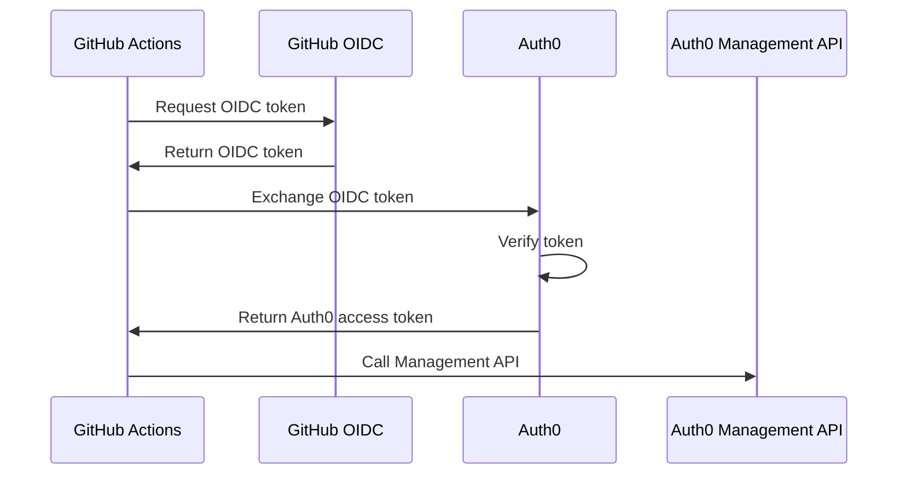

# Authenticating to Auth0 Management API

Learn how to authenticate to Auth0's Management API using OIDC tokens from GitHub Actions, GitLab CI, or other platforms - without storing Auth0 API credentials.

## Overview

Auth0's Management API can accept OIDC tokens for authentication, allowing you to manage Auth0 resources (users, applications, rules, etc.) from CI/CD pipelines without storing long-lived API tokens.

## Use Cases

### CI/CD Automation

Deploy Auth0 configuration from GitHub Actions:
```
GitHub Actions → OIDC token → Auth0 Management API
```

**Examples:**
- Deploy Auth0 rules and actions
- Update application settings
- Manage user roles and permissions
- Sync configuration across environments

### Infrastructure as Code

Use Terraform to manage Auth0:
```
Terraform Cloud → OIDC token → Auth0 Provider
```

### GitOps for Identity

Manage Auth0 configuration via GitLab:
```
GitLab CI → OIDC token → Auth0 Management API
```

## Coming Soon

This guide is under development. Topics will include:

- Configuring Auth0 to accept external OIDC tokens
- Creating Auth0 applications for OIDC authentication
- Setting up trust relationships with GitHub/GitLab
- Using OIDC tokens to call Management API
- Configuring permissions and scopes
- Integration examples with GitHub Actions
- Terraform provider configuration
- Best practices and security considerations

## Architecture



## Benefits

**No Stored Credentials**: No need to store Auth0 Management API tokens in CI/CD

**Automatic Rotation**: OIDC tokens expire automatically

**Fine-Grained Access**: Control which workflows can access which APIs

**Audit Trail**: Track which CI/CD jobs made which changes

## Related Guides

- GitHub Actions → Auth0 (Coming soon)
- GitLab CI → Auth0 (Coming soon)
- Terraform Cloud → Auth0 (Coming soon)

## Initiator Guides

- [GitHub Actions (Initiator)](../../initiators/ci-tools/github-actions.md)
- [GitLab CI (Initiator)](../../initiators/ci-tools/gitlab-ci.md)

## Resources

- [Auth0 Management API](https://auth0.com/docs/api/management/v2)
- [Auth0 Documentation](https://auth0.com/docs)

## Contributing

Want to help complete this guide? [Contribute on GitHub](https://github.com/yourorg/secretless.org).
