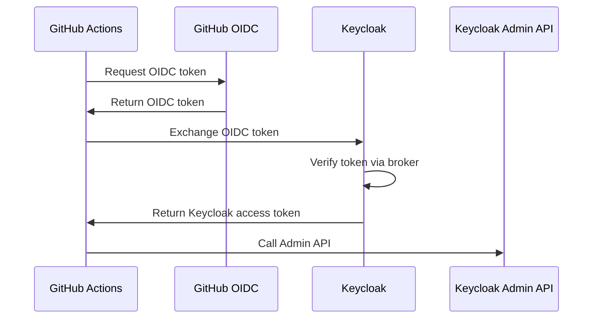

# Authenticating to Keycloak Admin API

Learn how to authenticate to Keycloak's Admin API using OIDC tokens from GitHub Actions, GitLab CI, or other platforms - without storing Keycloak admin credentials.

## Overview

Keycloak's Admin API can accept OIDC tokens for authentication, allowing you to manage Keycloak resources (realms, clients, users, roles) from CI/CD pipelines without storing long-lived admin credentials.

## Use Cases

### CI/CD Automation

Deploy Keycloak configuration from GitHub Actions:
```
GitHub Actions → OIDC token → Keycloak Admin API
```

**Examples:**
- Deploy client configurations
- Manage realm settings
- Update identity providers
- Configure authentication flows

### Infrastructure as Code

Use Terraform to manage Keycloak:
```
Terraform Cloud → OIDC token → Keycloak Provider
```

### GitOps for Identity

Manage Keycloak configuration via GitLab:
```
GitLab CI → OIDC token → Keycloak Admin API
```

## Coming Soon

This guide is under development. Topics will include:

- Configuring Keycloak to accept external OIDC tokens
- Creating service accounts for API access
- Setting up identity brokering for GitHub/GitLab
- Using OIDC tokens to call Admin API
- Configuring roles and permissions
- Integration examples with GitHub Actions
- Terraform provider configuration
- Best practices and security

## Architecture



## Benefits

**No Stored Credentials**: No need to store Keycloak admin passwords in CI/CD

**Automatic Rotation**: OIDC tokens expire automatically

**Fine-Grained Access**: Control which workflows can access which APIs

**Self-Hosted Control**: Keep all identity data on-premises

## Related Guides

- GitHub Actions → Keycloak (Coming soon)
- GitLab CI → Keycloak (Coming soon)
- Terraform Cloud → Keycloak (Coming soon)

## Initiator Guides

- [GitHub Actions (Initiator)](../../initiators/ci-tools/github-actions.md)
- [GitLab CI (Initiator)](../../initiators/ci-tools/gitlab-ci.md)

## Resources

- [Keycloak Admin REST API](https://www.keycloak.org/docs-api/latest/rest-api/index.html)
- [Keycloak Identity Brokering](https://www.keycloak.org/docs/latest/server_admin/#_identity_broker)

## Contributing

Want to help complete this guide? [Contribute on GitHub](https://github.com/yourorg/secretless.org).
