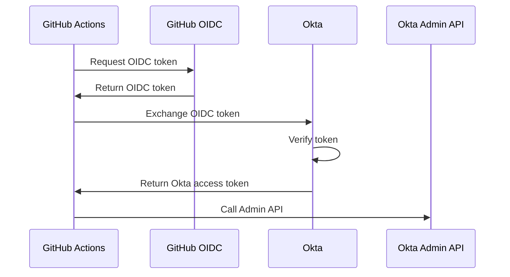

# Authenticating to Okta Admin API

Learn how to authenticate to Okta's Admin API using OIDC tokens from GitHub Actions, GitLab CI, or other platforms - without storing Okta API tokens.

## Overview

Okta's Admin API can accept OAuth2 tokens for authentication, allowing you to manage Okta resources (users, groups, applications, policies) from CI/CD pipelines without storing long-lived API tokens.

## Use Cases

### CI/CD Automation

Deploy Okta configuration from GitHub Actions:
```
GitHub Actions → OIDC token → Okta Admin API
```

**Examples:**
- Deploy application configurations
- Manage user lifecycle
- Update authorization policies
- Configure authentication policies

### Infrastructure as Code

Use Terraform to manage Okta:
```
Terraform Cloud → OIDC token → Okta Provider
```

### GitOps for Identity

Manage Okta configuration via GitLab:
```
GitLab CI → OIDC token → Okta Admin API
```

## Coming Soon

This guide is under development. Topics will include:

- Configuring Okta to accept external OIDC tokens
- Creating OAuth2 applications for API access
- Setting up trusted origins
- Using OIDC tokens to call Admin API
- Configuring administrator roles
- Integration examples with GitHub Actions
- Terraform provider configuration
- Best practices and security

## Architecture



## Benefits

**No Stored Credentials**: No need to store Okta API tokens in CI/CD

**Automatic Rotation**: OIDC tokens expire automatically

**Fine-Grained Access**: Control which workflows can access which APIs

**Enterprise Features**: Leverage Okta's enterprise identity capabilities

## Related Guides

- GitHub Actions → Okta (Coming soon)
- GitLab CI → Okta (Coming soon)
- Terraform Cloud → Okta (Coming soon)

## Initiator Guides

- [GitHub Actions (Initiator)](../../initiators/ci-tools/github-actions.md)
- [GitLab CI (Initiator)](../../initiators/ci-tools/gitlab-ci.md)

## Resources

- [Okta Admin API](https://developer.okta.com/docs/reference/core-okta-api/)
- [Okta OAuth 2.0](https://developer.okta.com/docs/guides/implement-oauth-for-okta/)

## Contributing

Want to help complete this guide? [Contribute on GitHub](https://github.com/yourorg/secretless.org).
